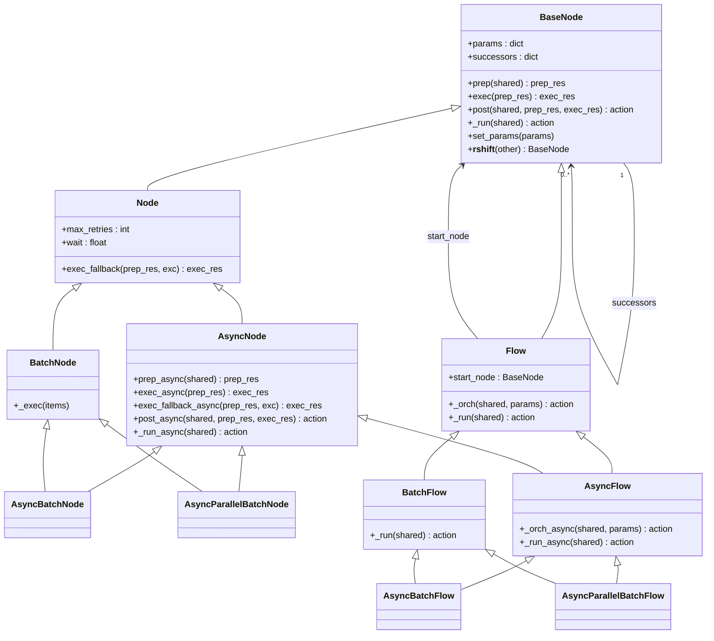
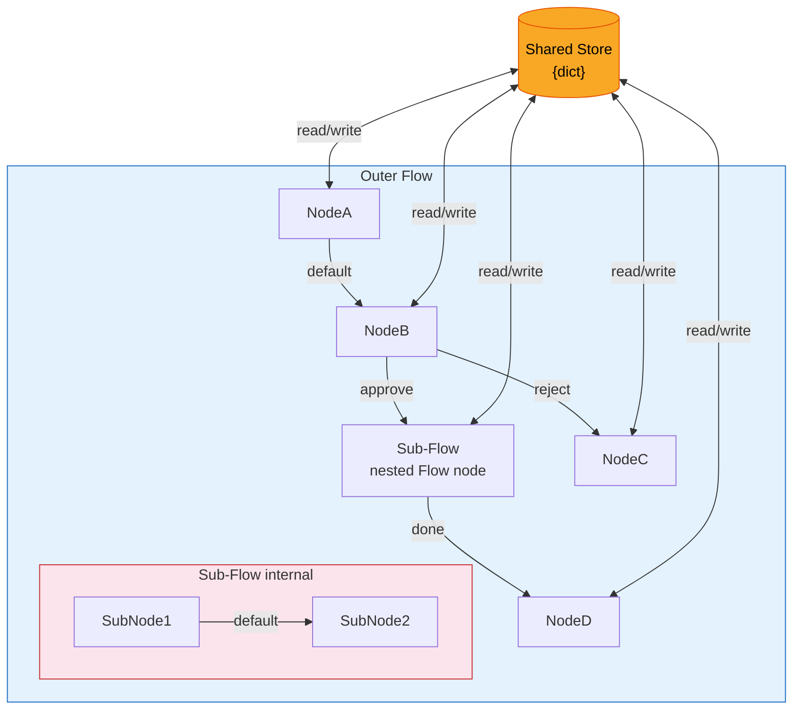
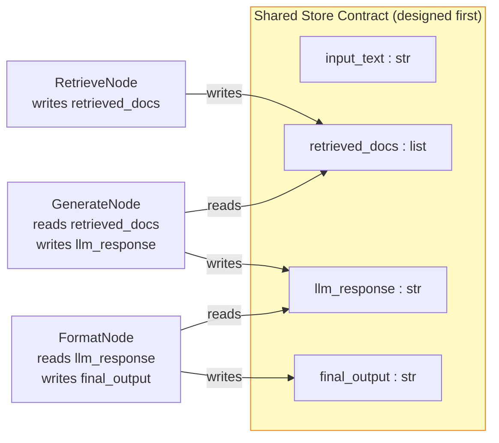
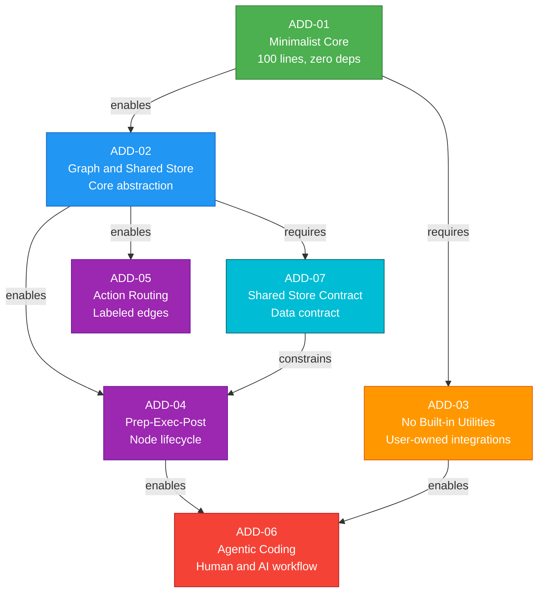
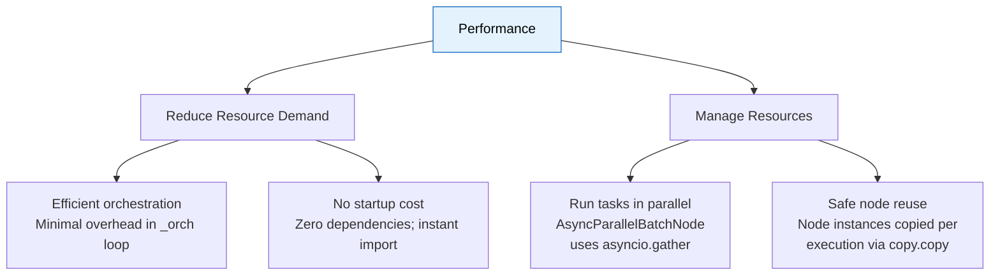
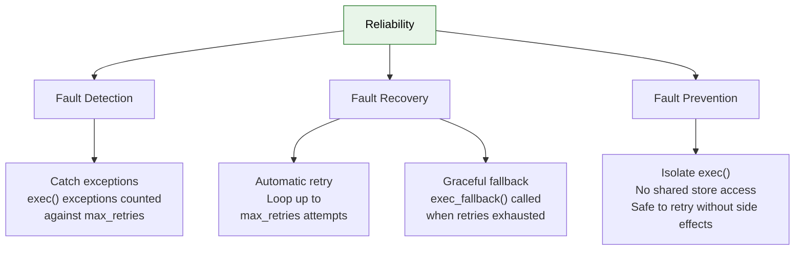
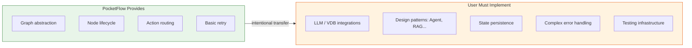

# PocketFlow — Software Architecture Recovery

> **Course:** Modern Software Architecture — Wuhan University, 2026<br>
> **Instructor:** Prof. Peng Liang<br>
> **Target System:** [PocketFlow](https://github.com/The-Pocket/PocketFlow)<br>
> **Frameworks:** [DESOSA 2019](https://se.ewi.tudelft.nl/desosa2019/) · Rozanski & Woods (2012) · Kruchten 4+1 (1995) · ISO/IEC/IEEE 42010:2011

---

## Table of Contents

1. [Introduction](#1-introduction)
2. [Stakeholder Analysis](#2-stakeholder-analysis)
3. [Context View](#3-context-view)
4. [Logical View](#4-logical-view)
5. [Development View](#5-development-view)
6. [Process View](#6-process-view)
7. [Deployment View](#7-deployment-view)
8. [Architecture Design Decisions](#8-architecture-design-decisions)
9. [Design Patterns](#9-design-patterns)
10. [Quality Attribute Scenarios & Tactics](#10-quality-attribute-scenarios--tactics)
11. [Technical Debt Analysis](#11-technical-debt-analysis)
12. [Conclusion](#12-conclusion)
13. [Weekly Progress Log](#13-weekly-progress-log)
14. [References](#14-references)

---

## 1. Introduction

### 1.1 What is PocketFlow?


PocketFlow is a **100-line minimalist LLM (Large Language Model) orchestration framework** written in Python. It was created as a direct counter-argument to frameworks like LangChain and CrewAI, which the author argues are over-engineered for the problem they solve. Its central thesis is that the entire core abstraction needed for LLM application development — Nodes, Flows, and a Shared Store — can be expressed in exactly 100 lines of code, with zero external dependencies and zero vendor lock-in.

Despite its minimal size, PocketFlow is expressive enough to implement the full spectrum of modern LLM application patterns, including Agents, Workflows, Retrieval-Augmented Generation (RAG), MapReduce, Multi-Agent systems, and Structured Output. It models LLM workflows as a **Graph + Shared Store**, where:

- **Node** handles a single (LLM) task via a `prep → exec → post` lifecycle
- **Flow** connects Nodes through labeled edges called Actions
- **Shared Store** is a shared dictionary enabling communication between Nodes within a Flow

The framework is available as a Python package (`pip install pocketflow`) or by directly copying the 100-line source. It has since been ported to TypeScript, Java, C++, Go, Rust, and PHP by the community. As of 2026, the repository has over 10,000 GitHub stars, 1,200+ forks, and 200+ dependent projects.

| Framework | Abstraction | Lines of Code | Package Size |
|---|---|---|---|
| LangChain | Agent, Chain | 405K | +166 MB |
| CrewAI | Agent, Chain | 18K | +173 MB |
| LangGraph | Agent, Graph | 37K | +51 MB |
| AutoGen | Agent | 7K | +26 MB |
| **PocketFlow** | **Graph** | **100** | **+56 KB** |

### 1.2 Why PocketFlow is Architecturally Interesting

PocketFlow is architecturally interesting not despite its minimalism, but **because** of it. It forces a fundamental question: *what is the irreducible core abstraction for LLM orchestration?*

- **Radical minimalism as a design principle.** The 100-line constraint is not a limitation but an explicit architectural goal, making every line of code an intentional decision.
- **Intentional exclusion as architecture.** PocketFlow explicitly does not provide LLM vendor wrappers or app-specific utilities. This boundary decision — what the framework *refuses* to do — is as architecturally significant as what it provides.
- **Cross-language portability.** The same abstraction has been faithfully reproduced in six programming languages, evidencing the abstraction's structural soundness and language-independence.
- **Agentic coding philosophy.** PocketFlow is designed to be intuitive enough for AI agents themselves to build LLM applications on top of it.

### 1.3 Scope and Methodology

This document recovers and describes the software architecture of PocketFlow as of 2026. The analysis is grounded in three complementary theoretical frameworks:

| Framework | Source | Application in This Document |
|---|---|---|
| **4+1 View Model** | Kruchten (1995) | Organises §3–§7 into Logical, Process, Development, Deployment, and Context views |
| **Viewpoint Catalog** | Rozanski & Woods (2012) | Provides Stakeholder, Context, Functional, Information, Concurrency, and Deployment viewpoints |
| **Architecture Description Standard** | ISO/IEC/IEEE 42010:2011 | Maps stakeholder concerns → viewpoints → views → models |

#### Viewpoint Specification (ISO 42010)

| Viewpoint | Stakeholders Addressed | Concerns Addressed | Section | Notation |
|---|---|---|---|---|
| **Context** | All stakeholders | System boundaries, external interfaces, responsibilities | §3 | Box-and-line diagram |
| **Logical / Functional** | LLM Developers, AI Researchers | Key abstractions, class hierarchy, data flow | §4 | UML Class Diagram |
| **Development** | Contributors, Port Maintainers | Module structure, build conventions, code organisation | §5 | Package structure, tables |
| **Process / Concurrency** | LLM Developers, Integrators | Runtime execution model, concurrency, fault tolerance | §6 | Sequence diagram, flowchart |
| **Deployment** | LLM Developers, PyPI users | Installation, distribution, cross-language portability | §7 | Deployment diagram |

The analysis covers the Python core package (`pocketflow/__init__.py`), the cookbook of 40+ example applications, the multi-language port ecosystem, and the project's community infrastructure. LLM provider SDKs, vector databases, and third-party applications built on top of PocketFlow are outside the system boundary.

---

## 2. Stakeholder Analysis

### 2.1 Stakeholder Identification

Stakeholders were identified through analysis of the GitHub repository (contributors, issues, pull requests) and the official documentation, following the stakeholder taxonomy of ISO/IEC/IEEE 42010 and Rozanski & Woods.

| Stakeholder | Type | Role | Key Concerns |
|---|---|---|---|
| **Zachary Huang (@zachary62)** | Creator & Lead Maintainer | Defines architectural vision, authors core code and tutorials | Minimalism, correctness of core abstraction, community growth |
| **22 contributors** | Developers | Submit bug fixes, cookbook examples, documentation | Ease of contribution, API stability, clear guidelines |
| **LLM Application Developers** | Primary Users | Build agents, workflows, RAG systems on PocketFlow | Expressiveness, ease of use, quality of cookbook examples |
| **AI Researchers & Educators** | Secondary Users | Use as a teaching tool or research substrate | Transparency, simplicity, auditability of 100-line core |
| **Agentic Coding Practitioners** | Emerging Users | Use PocketFlow as a target for AI-assisted development | Intuitive structure that AI agents can reason about |
| **Multi-language Port Maintainers** | Downstream Developers | Maintain TypeScript, Java, C++, Go, Rust, PHP ports | Stability of core abstraction, clear semantics |
| **214+ Dependent Projects** | Downstream Integrators | Build production systems depending on PocketFlow | API stability, backward compatibility, release management |
| **Competitor Frameworks** | Indirect Influence | LangChain, CrewAI, LangGraph define the design space | N/A — indirect architectural influence by opposition |
| **Discord Community** | Community | Provide support, feedback, share use cases | Responsiveness, tutorials, examples |
| **LLM Providers (OpenAI, Anthropic…)** | External Systems | Supply the LLM APIs that PocketFlow apps call | N/A — PocketFlow excludes all vendor-specific wrappers |

### 2.2 Power / Interest Grid


**Key observations:**
- The lead maintainer holds almost all architectural power, consistent with a solo-founded OSS project.
- LLM App Developers are the highest-interest group but have low direct power — their influence operates through GitHub issues, Discord feedback, and community cookbook contributions.
- Competitor frameworks have high *indirect* power: PocketFlow's entire architecture is a deliberate reaction to their complexity.

### 2.3 Stakeholder Concerns Mapping

| Stakeholder | Primary Concern | Quality Attribute | Driven ADD |
|---|---|---|---|
| Lead Maintainer | Core must be auditable and minimal | Maintainability | ADD-01 |
| LLM App Developers | No vendor lock-in; easy vendor switching | Modifiability | ADD-03 |
| LLM App Developers | Complex patterns from simple primitives | Expressiveness | ADD-02 |
| AI Researchers | Entire framework readable in minutes | Understandability | ADD-01 |
| Port Maintainers | Abstraction must be language-agnostic | Portability | ADD-02 |
| Agentic Coding Practitioners | AI agents must understand the framework | Learnability | ADD-06 |
| Dependent Projects | API must not break unexpectedly | Stability | ADD-04 |

### 2.4 Key Architectural Decisions Driven by Stakeholders

| Architectural Decision | Driven By | Rationale |
|---|---|---|
| **Zero external dependencies** | LLM App Developers frustrated by LangChain dependency conflicts | Eliminates version hell and supply chain risk |
| **No vendor-specific wrappers** | Lead Maintainer; LLM Providers' API volatility | Frequent API changes make hardcoded wrappers a maintenance burden |
| **100-line constraint** | Lead Maintainer; AI Researchers | Forces ruthless prioritisation; any developer or AI agent can read the entire framework in minutes |
| **Cookbook-based documentation** | LLM App Developers requesting concrete examples | Formal API docs alone are insufficient for LLM orchestration |
| **Multi-language ports** | Community requests from non-Python developers | The Graph + Shared Store abstraction is language-agnostic |
| **Agentic coding support (.cursorrules)** | Agentic Coding Practitioners | PocketFlow's simplicity makes it uniquely suited for AI-generated application code |

---

## 3. Context View

### 3.1 System Scope

**PocketFlow** is a lightweight workflow and orchestration core for building LLM applications. Its scope is to provide the minimal abstractions needed to structure application logic as **nodes** and **flows**, while leaving integrations with LLMs, tools, storage, and external services to user-defined code.

#### Responsibilities

PocketFlow **is responsible for:**
- Providing core workflow abstractions: `Node`, `Flow`, `BatchNode`, async variants
- Defining how steps in an LLM application are connected and executed
- Supporting reusable graph-like workflows for agents, RAG pipelines, batch jobs, and MapReduce
- Managing shared state between workflow steps through a simple shared store

PocketFlow **is NOT responsible for:**
- Hosting or providing LLM models
- Implementing provider-specific APIs (OpenAI, Claude, Gemini, Ollama, DeepSeek)
- Managing external tools (web search, file systems, REST APIs, MCP servers)
- Managing vector databases (ChromaDB, FAISS, Pinecone)
- Authentication, billing, monitoring, deployment, or production infrastructure

### 3.2 Context Diagram


### 3.3 External Interface Summary

| External System | Relationship | Interface Type | Owned By |
|---|---|---|---|
| **LLM Providers** (OpenAI, Anthropic…) | Apps call via user-defined `call_llm()` | HTTP/SDK (user-implemented) | User |
| **Vector Databases** (ChromaDB, FAISS…) | Apps call for RAG retrieval | Python SDK (user-implemented) | User |
| **Tool APIs** (Search, Files, MCP…) | Apps call as action nodes | HTTP/SDK (user-implemented) | User |
| **Python Standard Library** | Only true framework dependency | `typing`, `abc`, `asyncio` | Python |
| **PyPI** | Package distribution | `pip install pocketflow` | Maintainer |
| **GitHub** | Source, issues, CI, cookbook | Git/GitHub Actions | Maintainer |

---

## 4. Logical View

The **Logical View** (Kruchten, 1995; Rozanski & Woods' *Functional Viewpoint*) reveals the system's key abstractions, their responsibilities, and their structural relationships. This view is addressed primarily at **LLM Application Developers** and **AI Researchers**.

### 4.1 Key Abstractions: Class Hierarchy

PocketFlow's core abstraction hierarchy is defined entirely within `pocketflow/__init__.py`. The complete type hierarchy is shown below.



| Class | Role | Key Responsibility |
|---|---|---|
| `BaseNode` | Abstract base | Defines `prep → exec → post` template; manages successor routing |
| `Node` | Standard node | Adds retry logic (`max_retries`, `wait`, `exec_fallback`) |
| `BatchNode` | Batch processor | Iterates `_exec()` over each item returned by `prep()` |
| `AsyncNode` | Async node | Provides `*_async` variants of all lifecycle methods |
| `AsyncBatchNode` | Sequential async batch | Multiple inheritance from `AsyncNode` + `BatchNode`; async sequential iteration |
| `AsyncParallelBatchNode` | Parallel async batch | Multiple inheritance from `AsyncNode` + `BatchNode`; concurrent execution via `asyncio.gather` |
| `Flow` | Orchestrator | Runs the `_orch` loop; is itself a `BaseNode`, enabling nesting |
| `BatchFlow` | Batch flow orchestrator | Executes the flow multiple times with different parameter sets returned by `prep()` |
| `AsyncFlow` | Async orchestrator | Multiple inheritance from `Flow` + `AsyncNode`; async `_orch_async` loop |
| `AsyncBatchFlow` | Async batch flow | Multiple inheritance from `AsyncFlow` + `BatchFlow`; async batch orchestration |
| `AsyncParallelBatchFlow` | Parallel async batch flow | Multiple inheritance from `AsyncFlow` + `BatchFlow`; parallel async batch orchestration |

### 4.2 Core Abstraction: Nested Directed Graph

The fundamental architectural abstraction is a **nested directed graph with a shared store**:



### 4.3 Information View: Shared Store Data Contract

The **Shared Store** is PocketFlow's central data-exchange mechanism — a plain Python dictionary designed upfront as an explicit **data contract**. This corresponds to the *Information Viewpoint* in Rozanski & Woods.



The shared store schema is designed *before* implementing any node. This "schema-first" approach prevents runtime key errors and is a direct consequence of ADD-07 (Shared Store as Data Contract).

---

## 5. Development View

The **Development View** (Kruchten, 1995; Rozanski & Woods' *Development Viewpoint*) describes the organisation of the software for development. Relevant to **contributors** and **port maintainers**.

### 5.1 Repository Structure

Applications built with PocketFlow follow a strict project convention:

```
my_project/
├── main.py              # Entry point; initialises shared store and runs flow
├── nodes.py             # All Node class definitions
├── flow.py              # Flow creation and node wiring
├── utils/               # User-defined utility functions (LLM calls, APIs)
│   └── call_llm.py      # Example: wraps vendor LLM SDK
└── docs/
    └── design.md        # Design document — source of truth for data schema and flow
```

### 5.2 Module Structure

| Class | Responsibility |
|---|---|
| `BaseNode` | Template lifecycle; edge routing via successor dict |
| `Node` | Standard node with retry logic and fallback mechanisms |
| `BatchNode` | Sequential batch processing over collections |
| `AsyncNode` | Non-blocking async operations via `*_async` lifecycle methods |
| `AsyncBatchNode` / `AsyncParallelBatchNode` | Sequential and parallel async batch variants |
| `Flow` / `AsyncFlow` | Graph orchestration loop (`_orch`) |

### 5.3 Node Lifecycle

Every node follows a strict three-phase lifecycle defined by `BaseNode`:

1. **`prep(shared)`** — Read and serialize data from the shared store. Returns `prep_res`.
2. **`exec(prep_res)`** — Perform the core computation in **isolation** from the shared store. **Idempotent** by design, enabling safe retries. Returns `exec_res`.
3. **`post(shared, prep_res, exec_res)`** — Write results back to the shared store and return an **action string** routing to the next node.

### 5.4 Dependencies and Technology Stack

**Core Framework Dependencies:** Zero. Imports only Python standard library:

```python
import asyncio, warnings, copy, time
```

**Application Dependencies:** Fully user-controlled. Typical `requirements.txt`:

```
pocketflow
openai          # or anthropic, google-generativeai — user's choice
PyYAML
```

### 5.5 Development Process: Agentic Coding Methodology

| Step | Activity | Human | AI Agent | Primary Artifact |
|------|----------|:------:|:--------:|-----------------|
| 1 | Requirements | ★★★ | ★☆☆ | `docs/design.md` |
| 2 | Flow Design | ★★☆ | ★★☆ | `docs/design.md` |
| 3 | Utility Functions | ★★☆ | ★★☆ | `utils/*.py` |
| 4 | Data Contract Design | ★☆☆ | ★★★ | `docs/design.md` |
| 5 | Node Design | ★☆☆ | ★★★ | `docs/design.md` |
| 6 | Implementation | ★☆☆ | ★★★ | `flow.py`, `nodes.py`, `main.py` |
| 7 | Optimisation | ★★☆ | ★★☆ | Prompt refinement |
| 8 | Reliability | ★☆☆ | ★★★ | Test cases, retry config |


### 5.6 Key Development Constraints: The Three Zeros


This diagram presents the “Three Zeros Philosophy” as a set of development constraints focused on keeping Pocketflow lightweight, safe, and flexible. It highlights three principles: Zero Bloat, meaning the core stays minimal and intentional; Zero Dependencies, meaning the project relies only on Python’s standard library to avoid conflicts and supply-chain risk; and Zero Vendor Lock-in, meaning users retain control of their utilities and can switch LLM providers freely.

---

## 6. Process View

The **Process View** (Kruchten, 1995; Rozanski & Woods' *Concurrency Viewpoint*) describes the system's runtime execution model, concurrency structure, and fault-tolerance mechanisms.

### 6.1 Runtime Architecture Overview


### 6.2 Node Execution Lifecycle: Phase Isolation and Fault Tolerance


### 6.3 Flow Orchestration and Action-Based Routing

The `Flow` class manages runtime execution through an internal orchestrator (`_orch`):

```python
def _orch(self, shared, params=None):
    curr, p, last_action = copy.copy(self.start_node), (params or {**self.params}), None
    while curr:
        curr.set_params(p)
        last_action = curr._run(shared)
        curr = copy.copy(self.get_next_node(curr, last_action))
    return last_action
```

| Routing Type | Syntax | Trigger |
|---|---|---|
| **Default transition** | `node_a >> node_b` | `post()` returns `None` or `"default"` |
| **Named action** | `node_a - "approve" >> node_b` | `post()` returns `"approve"` |
| **Loop** | `node_a - "retry" >> node_a` | `post()` returns `"retry"` |
| **Terminal** | No successor defined | Any unmatched action string |

### 6.4 Communication Patterns

| Mechanism | Scope | Use Case |
|---|---|---|
| **Shared Store** | Global, persistent across all nodes | LLM results, large content, intermediate state |
| **Params** | Local, scoped per node execution | Task identifiers in batch mode; flow-level metadata |

### 6.5 Concurrency Patterns


### 6.6 Error Handling and Fault Tolerance

| Parameter | Description | Default |
|---|---|---|
| `max_retries` | Maximum execution attempts | `1` |
| `wait` | Seconds between retry attempts | `0` |
| `exec_fallback(prep_res, exc)` | Called when all retries are exhausted | Raises exception |

### 6.7 Nested Flow Composition

Flows can act as Nodes, enabling hierarchical composition:
- Sub-flows can be embedded as nodes within parent flows
- Node params merge from all parent flows in the hierarchy
- Flows execute `prep()` and `post()` but not `exec()` — their internal logic *is* the orchestration

---

## 7. Deployment View

The **Deployment View** (Kruchten, 1995; Rozanski & Woods' *Deployment Viewpoint*) describes how the software is distributed, installed, and deployed. Because PocketFlow is a library rather than a deployed service, this view focuses on **distribution mechanisms** and **cross-language portability**.

### 7.1 Distribution and Installation Model


The deployment boundary enforced by ADD-03 (No Built-in Utilities) means PocketFlow's installation footprint is 56 KB. All heavyweight dependencies live in the user's zone.

### 7.2 Cross-Language Portability

| Language Port | Paradigm | Evidence of Abstraction Fidelity |
|---|---|---|
| **TypeScript** | Object-oriented, typed | Same `prep/exec/post` lifecycle |
| **Java** | Object-oriented, typed | Same `prep/exec/post` lifecycle |
| **C++** | Systems, performance-critical | Same graph traversal model |
| **Go** | Concurrent, compiled | Same action-based routing |
| **Rust** | Memory-safe, systems | Same ownership model applied to shared store |
| **PHP** | Web-focused | Same data contract pattern |

Consistent re-implementation across six language paradigms is strong evidence that the core abstraction is **architecturally sound and genuinely language-independent**.

---

## 8. Architecture Design Decisions

This section documents the key design decisions that shaped PocketFlow. Each decision is described using a structured template (Tyree & Ackerman, 2005): what problem it addresses, why it matters, what was decided, what alternatives were considered, the trade-offs involved, and what could go wrong.

### 8.1 Decision Overview

| ID | Decision | Primary Quality Drivers |
|---|---|---|
| ADD-01 | Keep core to exactly 100 lines with zero dependencies | Maintainability, understandability, portability |
| ADD-02 | Model workflows as Graph + Shared Store | Modifiability, expressiveness, simplicity |
| ADD-03 | Provide no built-in utilities; use examples instead | Portability, maintainability, vendor independence |
| ADD-04 | Three-phase lifecycle: Prep → Exec → Post | Testability, reliability, separation of concerns |
| ADD-05 | Nodes return string "actions" as routing keys | Extensibility, composability, understandability |
| ADD-06 | Humans design flows; AI agents implement nodes | Usability, learnability, productivity |
| ADD-07 | Shared dictionary as explicit data contract | Modifiability, loose coupling, state management |

### 8.2 ADD-01: Minimalist Core Framework

| Template Item | Description |
|---|---|
| **Issue** | What should be the size and scope of the core framework? |
| **Importance** | High — affects maintainability, learning curve, and portability |
| **Decision** | Keep core to exactly 100 lines with zero external dependencies |
| **Status** | Accepted |
| **Group** | Core Architecture |
| **Assumptions** | Complex patterns can be built from simple building blocks; developers value flexibility over built-in convenience |
| **Alternatives** | Full-featured frameworks: LangChain (405K lines), CrewAI (18K lines) |
| **Arguments** | **Pros:** No vendor lock-in; the entire framework can be read and understood in minutes; forces focus on what truly matters; easy for AI coding tools to work with.<br>**Cons:** Fewer out-of-the-box features; more setup work for users; steeper initial learning curve.<br>**Summary:** Minimalism wins on auditability and portability, but shifts implementation work onto users. |
| **Implications** | Users must write their own helper functions; the cookbook examples become the main form of documentation |
| **Possible negative quality impact** | Higher barrier to entry for beginners; more repetitive code for simple use cases |

### 8.3 ADD-02: Graph + Shared Store Abstraction

| Template Item | Description |
|---|---|
| **Issue** | What should be the fundamental abstraction for LLM workflows? |
| **Importance** | High — this is the core conceptual model everything else builds upon |
| **Decision** | Model workflows as a directed graph (nodes + labeled edges) + Shared Store (central state) |
| **Status** | Accepted |
| **Group** | Core Architecture |
| **Assumptions** | Most LLM workflows can be drawn as a diagram of steps and decisions; shared state needs to be accessible to all steps |
| **Alternatives** | Chain-based (linear only), pure agent-based, pipeline-based |
| **Arguments** | **Pros:** More flexible than a simple chain; simpler than a full agent system; naturally supports loops, branching, and decisions.<br>**Cons:** Requires thinking through the workflow design upfront; complex workflows need good diagrams.<br>**Summary:** The graph model strikes the right balance between flexibility and simplicity, at the cost of requiring upfront design work. |
| **Implications** | All workflows must be expressible as a graph of nodes; the shared store schema is a critical design artifact that must be planned first |
| **Possible negative quality impact** | Some workflows that don't map cleanly to a graph may feel forced |

### 8.4 ADD-03: No Built-in Utility Functions

| Template Item | Description |
|---|---|
| **Issue** | Should the framework include built-in utilities for LLM calls, embeddings, tool use? |
| **Importance** | High — directly determines the developer experience |
| **Decision** | No built-in utilities; provide cookbook examples and let users implement their own |
| **Status** | Accepted |
| **Group** | Framework Philosophy |
| **Assumptions** | LLM provider APIs change frequently; performance optimisations like prompt caching and streaming are specific to each project |
| **Alternatives** | Build a comprehensive utility library (like LangChain); provide basic utilities with extension points |
| **Arguments** | **Pros:** Not tied to any LLM vendor; no maintenance burden when provider APIs change; each project can optimise its own integrations.<br>**Cons:** More setup work; less guidance for beginners; each team may solve the same problems differently.<br>**Summary:** Trading built-in convenience for long-term flexibility and freedom from vendor churn. |
| **Implications** | Developers create their own `utils/` folder for LLM calls and tools; initial setup takes more time than frameworks with built-ins |
| **Possible negative quality impact** | Higher barrier to entry; beginners may write poor utility code without examples to follow |

### 8.5 ADD-04: Node Lifecycle Pattern (Prep–Exec–Post)

| Template Item | Description |
|---|---|
| **Issue** | How should individual nodes structure their execution logic? |
| **Importance** | High — defines the fundamental unit of work |
| **Decision** | Three-phase lifecycle: `prep()` (read from shared), `exec()` (compute, isolated), `post()` (write + route) |
| **Status** | Accepted |
| **Group** | Node Architecture |
| **Assumptions** | Splitting data access from computation makes code easier to test; keeping `exec()` isolated from shared state makes retries safe |
| **Alternatives** | A single `execute()` method with direct access to shared state; event-driven pattern; functional composition |
| **Arguments** | **Pros:** Retrying a failed LLM call is safe because `exec()` doesn't touch shared state; each phase is independently testable; clear boundaries reduce bugs.<br>**Cons:** Adds a bit of boilerplate even for simple nodes; developers need to learn which logic belongs in which phase.<br>**Summary:** The three-phase split is what makes reliable retries and clean testing possible — a small boilerplate cost for a significant reliability gain. |
| **Implications** | Every node must follow this three-phase structure; even very simple nodes require all three methods |
| **Possible negative quality impact** | Can feel overly structured for trivial one-step operations |

### 8.6 ADD-05: Action-Based Routing

| Template Item | Description |
|---|---|
| **Issue** | How should nodes connect and determine execution flow? |
| **Importance** | High — enables dynamic workflows and conditional branching |
| **Decision** | Nodes return string "actions" as routing keys to determine successor nodes |
| **Status** | Accepted |
| **Group** | Flow Control |
| **Assumptions** | Plain strings are sufficient for routing; decision logic belongs inside nodes, not in the flow wiring |
| **Alternatives** | Hard-coded next-node references; boolean true/false conditions; a dedicated routing language |
| **Arguments** | **Pros:** Nodes can make dynamic routing decisions at runtime; supports loops, branching, and complex control flows; easy to read and write.<br>**Cons:** No way to catch routing errors at build time; teams need to agree on naming conventions for action strings.<br>**Summary:** String-based routing gives maximum flexibility at the cost of moving error detection from build-time to runtime. |
| **Implications** | Each node decides where the flow goes next; consistent action string naming must be agreed on across the project |
| **Possible negative quality impact** | A typo in an action string causes the flow to silently stop instead of failing loudly |

### 8.7 ADD-06: Agentic Coding Methodology

| Template Item | Description |
|---|---|
| **Issue** | How should humans and AI agents collaborate in building LLM applications? |
| **Importance** | Medium — affects development process and team workflow |
| **Decision** | Humans design high-level flows and data schemas; AI agents implement specific nodes and utilities |
| **Status** | Accepted |
| **Group** | Development Process |
| **Assumptions** | Humans are better at high-level design decisions; AI agents are better at writing repetitive implementation code; the framework must be simple enough for AI tools to fully understand |
| **Alternatives** | Fully human-written code; fully AI-generated code; traditional pair programming |
| **Arguments** | **Pros:** Plays to the strengths of both humans and AI; speeds up development; reduces repetitive coding work.<br>**Cons:** AI-generated code still needs careful human review; requires clear design documents upfront; not suitable for regulated environments where all code must be human-authored.<br>**Summary:** This approach works specifically because PocketFlow's 100-line core is simple enough for AI tools to fully understand and reason about. |
| **Implications** | Teams must write good design documentation before coding; developers need a solid understanding of the framework to review AI-generated code |
| **Possible negative quality impact** | If the design document is vague or incomplete, AI agents may generate code that looks correct but has subtle logical errors |

### 8.8 ADD-07: Shared Store as Data Contract

| Template Item | Description |
|---|---|
| **Issue** | How should nodes communicate and share state? |
| **Importance** | High — fundamental to the architecture's data flow |
| **Decision** | Use a shared dictionary designed upfront as an explicit data contract between all nodes |
| **Status** | Accepted |
| **Group** | State Management |
| **Assumptions** | A plain dictionary is flexible enough to handle all inter-node data sharing; agreeing on a schema upfront prevents most runtime errors |
| **Alternatives** | Message passing between nodes; passing data as function arguments; an event bus; a database |
| **Arguments** | **Pros:** Simple and easy to understand; nodes are loosely coupled since they only share a dictionary; works both in-memory and with persistent storage.<br>**Cons:** No automatic enforcement of the schema; if a node writes the wrong key or type, the error only appears at runtime; requires disciplined documentation.<br>**Summary:** A plain dictionary is the simplest shared state mechanism possible; the lack of enforcement is acceptable as long as the schema is planned carefully upfront. |
| **Implications** | Designing the shared store schema is the first step of every project; `docs/design.md` is the single source of truth for what data flows between nodes |
| **Possible negative quality impact** | Accessing a missing key (`KeyError`) or wrong data type are the most common runtime bugs when the data contract is not followed |

### 8.9 Decision Relationships

Design decisions don't exist in isolation — they depend on and shape each other (Kruchten, Lago & van Vliet, 2006). The diagram below shows how PocketFlow's seven decisions connect, using three relationship types: **enables** (makes another decision possible), **requires** (forces another decision to follow), and **constrains** (limits what another decision can do):



| Relationship | Type | Explanation |
|---|---|---|
| ADD-01 → ADD-02 | *enables* | The 100-line constraint forced adoption of the simplest abstraction that could still support complex patterns |
| ADD-01 → ADD-03 | *requires* | Staying within 100 lines necessitates excluding all utility code |
| ADD-02 → ADD-04 | *enables* | The graph model requires a consistent node interface; Prep–Exec–Post provides it |
| ADD-02 → ADD-05 | *enables* | The graph model needs labeled edges; action strings are that mechanism |
| ADD-02 → ADD-07 | *requires* | Nodes in a graph must communicate; the shared store is the only mechanism |
| ADD-03 → ADD-06 | *enables* | Without built-in utilities, developers rely on AI agents to implement project-specific code |
| ADD-04 → ADD-06 | *enables* | The consistent lifecycle pattern makes it tractable for AI to implement nodes correctly |
| ADD-07 → ADD-04 | *constrains* | The data contract defines what `prep()` reads and `post()` writes, constraining lifecycle behaviour |


---

## 9. Design Patterns

PocketFlow's architecture exhibits patterns at three levels: architectural style, GoF design patterns, and application-level patterns. Each is described using the formal description format from the course slides on *Software Architecture Patterns* (Buschmann et al., 1996; Bass et al., 2022).

### 9.1 Architectural Style: Blackboard Pattern

PocketFlow's Shared Store is an instance of the **Blackboard** architectural pattern — a data-centred style where independent processing units communicate exclusively through a shared data space, with no direct coupling between transformers.

| Property | Blackboard Pattern | PocketFlow Implementation |
|---|---|---|
| **Concepts** | Data-centred; concurrent transformations on shared data | Nodes transform data via a central dictionary |
| **Components** | Blackboard (data space) + Transformers (processing units) | `Shared Store` (dict) + `Node` instances |
| **Connectors** | Shared data space | `prep()` (read) and `post()` (write) |
| **Interfaces** | Asynchronous put/get | `shared["key"]` dictionary access |
| **Topology** | Star (all transformers connect to blackboard) | All nodes access one shared store per flow |
| **Constraint** | No direct communication between transformers | Nodes never call each other; only via shared store |

**Quality attribute impact:**

| Quality Attribute | Impact | Rationale |
|---|---|---|
| **Modularity** | ✅ High | Nodes are fully independent; no inter-node coupling |
| **Scalability** | ✅ High | New nodes added without modifying existing nodes |
| **Adaptability** | ✅ High | Node behaviour can be changed in isolation |
| **Testability** | ✅ High | `exec()` isolated from blackboard; unit-testable independently |
| **Consistency** | ⚠️ Risk | No built-in transactions; data contract must be maintained manually |
| **Performance** | ⚠️ Risk | Shared mutable state can bottleneck concurrent scenarios |

### 9.2 GoF Pattern: Template Method (Node Lifecycle)

The Prep–Exec–Post lifecycle is an instance of the **Template Method** pattern (GoF). `BaseNode._run()` defines the fixed algorithm skeleton; concrete subclasses override the individual steps.


### 9.3 GoF Pattern: Mediator (Flow Orchestration)

The `Flow` class implements the **Mediator** pattern — it centralises coordination so nodes never communicate directly. The `_orch` loop is the sole routing authority.


### 9.4 Application-Level Patterns (Cookbook)

| Pattern | Core Mechanism | Key Node Types | Primary Use Case |
|---|---|---|---|
| **Agent** | `DecideAction` routes to tool nodes via action strings; tool nodes loop back via `"decide"` | `DecideAction`, `SearchWeb`, `DirectAnswer` | Q&A with tool use |
| **Workflow** | Linear `>>` chain of task nodes | Sequential `Node` chain | Multi-step document processing |
| **RAG** | Offline `BatchNode` indexing + online sequential query flow | `BatchNode` (chunk/embed), `Node` (retrieve/generate) | Document Q&A with vector search |
| **Map-Reduce** | `BatchNode` maps `exec()` over each item; aggregation node reduces `exec_res_list` | `BatchNode`, `ReduceNode` | Summarising many documents in parallel |
| **Structured Output** | `assert`/Pydantic in `exec()` raises exception to trigger internal `max_retries` | Single `Node(max_retries=N)` | Extracting typed data from text |
| **Multi-Agent** | `AsyncNode`s with self-loops communicate via `asyncio.Queue` in shared store; run concurrently via `asyncio.gather()` | `AsyncNode` | Concurrent agent collaboration |
| **Chain-of-Thought** | Single node self-loops (`"continue"`), accumulating reasoning steps in `shared["thoughts"]` until `"end"` | Single `Node` with self-loop | Complex multi-step reasoning |
| **Memory Management** | Sliding window for short-term (`shared["messages"]`); FAISS vector index for long-term (`shared["vector_index"]`) | `RetrieveNode`, `AnswerNode`, `EmbedNode` | Long-running conversational agents |

#### Agent

A central **DecideAction** node calls the LLM to decide the next step and returns a routing action string. Tool nodes execute the action and return `"decide"` to loop back. The flow halts when `DecideAction` returns `"answer"`.


#### Workflow

A sequential chain of specialised nodes, each reading from and writing to the shared store. No branching — ideal for deterministic multi-step pipelines.


#### RAG (Retrieval-Augmented Generation)

Two separate flows: an **offline indexing flow** that builds the vector index using `BatchNode`s for chunking and embedding, and an **online query flow** that retrieves context and generates an answer.


#### Map-Reduce

A `BatchNode` iterates `exec()` sequentially over each item returned by `prep()`, then a dedicated **ReduceNode** aggregates all results into a single output. For parallel execution, `AsyncParallelBatchNode` is used instead.


#### Structured Output

Validation happens **inside** a single node's `exec()` using `assert` or Pydantic. A raised exception triggers the node's internal retry mechanism (`max_retries`) — there is no flow-level routing loop between nodes.


#### Multi-Agent

Each agent is an `AsyncNode` with a **self-loop** (`"continue" >> self`). Agents communicate exclusively through `asyncio.Queue` objects stored in the shared store. Both agents run concurrently via `asyncio.gather()` — there is no central coordinator.


#### Chain-of-Thought

A single node accumulates reasoning steps in `shared["thoughts"]` and self-loops via `"continue"` until the LLM signals completion with `"end"`. Each iteration reads prior thoughts, queries the LLM for the next step, and appends the result.


#### Memory Management

Combines a **sliding window** for short-term memory (`shared["messages"]`, ~6 messages) with a **FAISS vector index** for long-term memory (`shared["vector_index"]`). The `EmbedNode` archives oldest messages when the window overflows; `RetrieveNode` injects relevant past context at the start of each turn.


### 9.5 Pattern Summary


---

## 10. Quality Attribute Scenarios & Tactics

This section examines how well PocketFlow meets key quality goals like performance, reliability, and maintainability. The analysis uses two tools: **Quality Attribute Scenarios** describe how the system should behave in specific real situations; **Architecture Tactics** explain which design choices make that behaviour possible (Bass et al., 2022).

### 10.1 Quality Attribute Scenarios

Each scenario answers six questions — **who** triggers it, **what** happens, **under what conditions**, **which part** of the system is involved, **how the system responds**, and **how success is measured**:

| ID | Quality | Source | Stimulus | Environment | Artifact | Response | Measure |
|---|---|---|---|---|---|---|---|
| **QAS-01** | Performance | LLM Developer | 10 documents need simultaneous summarisation | Normal operation | `AsyncParallelBatchNode` | Executes all 10 `exec_async()` calls concurrently via `asyncio.gather` | ≥3× speedup vs. sequential; latency = slowest single call |
| **QAS-02** | Reliability | LLM Provider API | Rate limit exception raised during `exec()` | Normal operation | `Node(max_retries=3, wait=10)` | Automatically retries with configured wait; calls `exec_fallback` if exhausted | Succeeds within 3 attempts or degrades gracefully without crash |
| **QAS-03** | Modifiability | LLM Developer | Switch from OpenAI to Anthropic | Development phase | `utils/call_llm.py` | Only `call_llm.py` is replaced; no node or flow code changes | Change confined to `utils/` directory; zero core modifications required |
| **QAS-04** | Usability | AI Coding Agent (Cursor) | Developer provides natural-language specification | Development phase | 100-line core + `.cursorrules` | AI agent generates complete working flow, nodes, and utilities | Full application produced in one session; human reviews only high-level design |
| **QAS-05** | Portability | Enterprise Team | Need same workflow in TypeScript stack | Deployment phase | Core Graph abstraction | TypeScript port replicates identical semantics | Identical behaviour confirmed across 6 language ports |
| **QAS-06** | Maintainability | Developer | Diagnose incorrect output from `exec()` | Maintenance phase | Prep–Exec–Post lifecycle | `exec()` is isolated from shared state; unit-testable with mock inputs | Debug scope isolated to one phase; no side effects on store or other nodes |
| **QAS-07** | Availability | Critical LLM service | Service becomes unavailable mid-workflow | Production | `exec_fallback` mechanism | Returns fallback result instead of propagating exception | Workflow continues with degraded output; no crash, no data loss |

### 10.2 Architecture Tactics

**Tactics** are the specific design choices that make quality goals achievable. The subsections below show how PocketFlow addresses performance, reliability, and modifiability — and which parts of the code deliver each.

#### Performance Tactics



#### Reliability Tactics



#### Modifiability Tactics

| Goal | Approach | How PocketFlow does it |
|---|---|---|
| **Keep changes local** | Group related code together | All vendor-specific code lives in `utils/` — changing LLM providers only touches that folder |
| **Keep changes local** | Plan for expected changes upfront | Shared Store schema is designed first, so adding new data fields doesn't break existing nodes |
| **Avoid ripple effects** | Hide internals | Nodes only expose `prep/exec/post` — callers don't depend on internal implementation details |
| **Avoid ripple effects** | Stable interfaces | Flow's `_orch` method stays the same regardless of what nodes do internally |

#### Tactic-to-Pattern Mapping

| Architectural Pattern | Quality Driver | Tactics Implemented |
|---|---|---|
| **Blackboard (Shared Store)** | Modifiability | Localise changes; information hiding; prevent ripple effects |
| **Template Method (Prep–Exec–Post)** | Reliability, Testability | Fault prevention via exec isolation; modular components |
| **Mediator (Flow._orch)** | Modifiability | Localise routing changes; prevent ripple effects |
| **AsyncParallelBatchNode** | Performance | Increase concurrency; manage event rate |

#### Summary: Quality Attribute → Tactic → Framework Mechanism

| Quality Attribute | Tactic | PocketFlow Mechanism | QAS |
|---|---|---|---|
| Performance | Increase concurrency | `AsyncParallelBatchNode` + `asyncio.gather` | QAS-01 |
| Reliability | Fault recovery | Node retry + `exec_fallback` | QAS-02 |
| Reliability | Fault prevention | `exec()` isolated from Shared Store | QAS-06 |
| Modifiability | Localise changes | `utils/` directory isolation | QAS-03 |
| Modifiability | Anticipate change | Shared Store data contract design | QAS-07 |
| Portability | Portability layer | Language-agnostic Graph abstraction | QAS-05 |
| Usability | Minimise expertise required | 100-line core + agentic coding methodology | QAS-04 |

---

## 11. Technical Debt Analysis

In software, **technical debt** refers to shortcuts or limitations accepted now that may require extra work later. PocketFlow's debt is mostly **intentional** — conscious trade-offs made in favour of keeping the core small and simple. Many responsibilities are deliberately left to users rather than built into the framework itself.

### 11.1 Design Debt

| Debt Item | What it means | Why it exists | What was gained |
|---|---|---|---|
| **100-line constraint** | No room for type annotations, detailed error messages, or built-in validation | Deliberate size limit (ADD-01) | The entire framework can be read and understood in minutes |
| **No built-in utilities** | Users write all their own LLM and tool integrations | LLM provider APIs change too often to bundle safely (ADD-03) | No vendor lock-in; users own their integrations |
| **Zero external dependencies** | Can't use popular libraries like Pydantic or tenacity | Eliminating dependency conflicts (ADD-01) | Installs without version conflicts; no supply chain risk |
| **No high-level helpers** | No built-in Agent, RAG, or QA classes | Keeps the core small and general-purpose | Users can implement exactly what they need |
| **In-memory shared store** | No transaction support; no protection against race conditions in async code | Simplicity (ADD-07) | Easy to understand and use; works for most use cases |
| **Weak type safety** | Core uses generic `Any` types; no runtime schema checks | 100-line limit leaves no room for type machinery | Flexible and portable; works across Python versions |

### 11.2 Documentation Debt

| Debt Item | What it means | Why it exists | Risk |
|---|---|---|---|
| **Documentation-first requirement** | AI coding tools need a design document before writing any code | Required for the agentic coding approach to work (ADD-06) | Documentation can fall out of sync with the actual code over time |
| **Cookbook as the main docs** | Example projects serve as the primary documentation; there is no formal API reference | Hands-on examples teach LLM app patterns better than API docs alone | Examples may become outdated; edge cases may not be covered |

### 11.3 Test Debt

| Debt Item | What it means | Why it exists | Risk |
|---|---|---|---|
| **No testing utilities** | No built-in helpers for mocking nodes, running test flows, or asserting on shared store state | Can't add external test libraries without breaking the zero-dependency rule (ADD-01) | Each project invents its own testing patterns; quality varies |
| **Async testing is complex** | Testing `AsyncParallelBatchNode` under load or rate-limiting conditions requires custom setup | Async edge cases are too complex to handle within 100 lines | Concurrency bugs may only surface in production |

### 11.4 Project Debt Overview



**Summary:** None of these debt items are accidents — each is a direct consequence of a deliberate design decision. The biggest practical risk is that users write poor utility code without good examples to follow. The cookbook partially addresses this, but can't cover every case.

---

## 12. Conclusion

This document has recovered PocketFlow's software architecture through five views — Context, Logical, Development, Process, and Deployment — using Kruchten's 4+1 model, Rozanski & Woods' viewpoints, and the ISO/IEC/IEEE 42010 standard.

**The most important finding is that PocketFlow's architecture is defined as much by what it deliberately leaves out as by what it includes.** The 100-line size limit isn't a bug — it's the constraint that forces every other decision into place. It requires the Graph + Shared Store abstraction (the simplest model that still covers all LLM patterns), which in turn requires action-based routing (how nodes hand off to each other) and the Prep–Exec–Post lifecycle (how individual nodes stay testable and retriable). All of this together makes the framework simple enough for AI coding tools to understand and use — which is the whole point of the Agentic Coding methodology.

**How PocketFlow meets quality goals:**
- **Reliability** — `exec()` is isolated from shared state, so retrying a failed LLM call never corrupts data. The `exec_fallback()` method handles unrecoverable failures gracefully.
- **Modifiability** — Switching LLM providers only touches `utils/call_llm.py`. The Shared Store data contract keeps nodes independent of each other.
- **Performance** — `AsyncParallelBatchNode` runs multiple LLM calls at once using `asyncio.gather`, so batch jobs run as fast as the slowest single call rather than the sum of all.
- **Portability** — The Graph + Shared Store abstraction has been re-implemented in six other languages, proving the core idea is language-independent.

**Biggest risk and recommendation:** The Shared Store has no built-in schema validation. If a node writes the wrong key or data type, the error only appears at runtime — potentially deep in a long workflow. The most practical fix would be an optional Pydantic-based validator delivered as a separate package, keeping the 100-line core intact.

Overall, PocketFlow is a well-reasoned, internally consistent framework. Its minimalism is a deliberate strength — not a limitation — and every architectural decision can be traced back to a clear reason.

---

## 13. Weekly Progress Log

### Week 1
- [x] Table of Contents
- [x] Introduction

### Week 2
- [x] Stakeholder Analysis
- [x] Context View

### Week 3
- [x] Architecture Design Decisions
- [x] Decision Relationship Graph
- [x] Development View

### Week 4
- [x] Process View

### Week 5
- [x] Design Patterns

### Week 6 — Midterm
- [x] Quality Attribute Scenarios

### Week 7
- [x] Technical Debt Analysis

### Week 8 — Final
- [x] Logical View (4+1 model — new)
- [x] Deployment View (4+1 model — new)
- [x] Architecture Tactics
- [x] Viewpoint Specification (ISO 42010)
- [x] Decision Relationships Network
- [x] Conclusion

---

## 14. References

### Primary Sources
- PocketFlow GitHub: https://github.com/The-Pocket/PocketFlow
- PocketFlow Python Core (100 lines): https://raw.githubusercontent.com/The-Pocket/PocketFlow/main/pocketflow/__init__.py
- PocketFlow Documentation: https://the-pocket.github.io/PocketFlow/
- PocketFlow Core Abstraction: https://the-pocket.github.io/PocketFlow/core_abstraction/node.html
- PocketFlow Flow Documentation: https://the-pocket.github.io/PocketFlow/core_abstraction/flow.html

### Course Materials
- Prof. Peng Liang — *软件体系结构描述* (Architecture Description), Wuhan University, 2026
- Prof. Peng Liang — *软件体系结构设计* (Architecture Design), Wuhan University, 2026
- Prof. Peng Liang — *软件体系结构模式* (Architecture Patterns), Wuhan University, 2026

### Reference Architecture Projects
- DESOSA 2019 — Delft Students on Software Architecture: https://se.ewi.tudelft.nl/desosa2019/

### Books and Standards
- Rozanski, N. & Woods, E. (2012). *Software Systems Architecture: Working with Stakeholders Using Viewpoints and Perspectives*, 2nd Ed. Addison-Wesley.
- Bass, L., Clements, P. & Kazman, R. (2022). *Software Architecture in Practice*, 4th Ed. Addison-Wesley.
- Kruchten, P. (1995). The 4+1 View Model of Architecture. *IEEE Software*, 12(6), 42–50.
- Tyree, J. & Ackerman, A. (2005). Architecture Decisions: Demystifying Architecture. *IEEE Software*, 22(2), 19–27.
- Kruchten, P., Lago, P. & van Vliet, H. (2006). Building Up and Reasoning about Architectural Knowledge. *QoSA 2006*.
- Buschmann, F. et al. (1996). *Pattern-Oriented Software Architecture: A System of Patterns*. Wiley.
- ISO/IEC/IEEE 42010:2011 — *Systems and Software Engineering — Architecture Description*.
