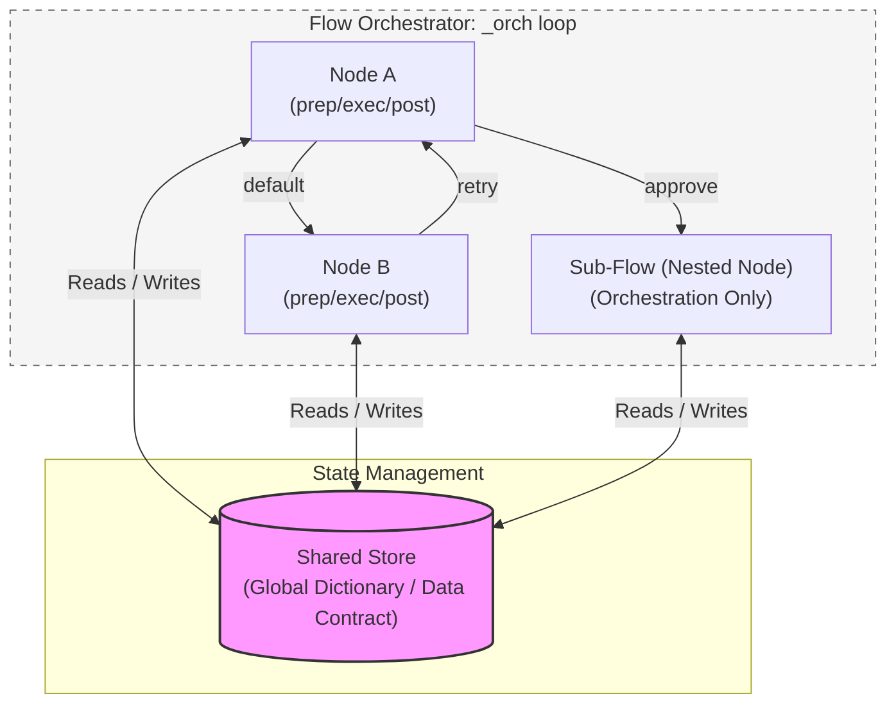
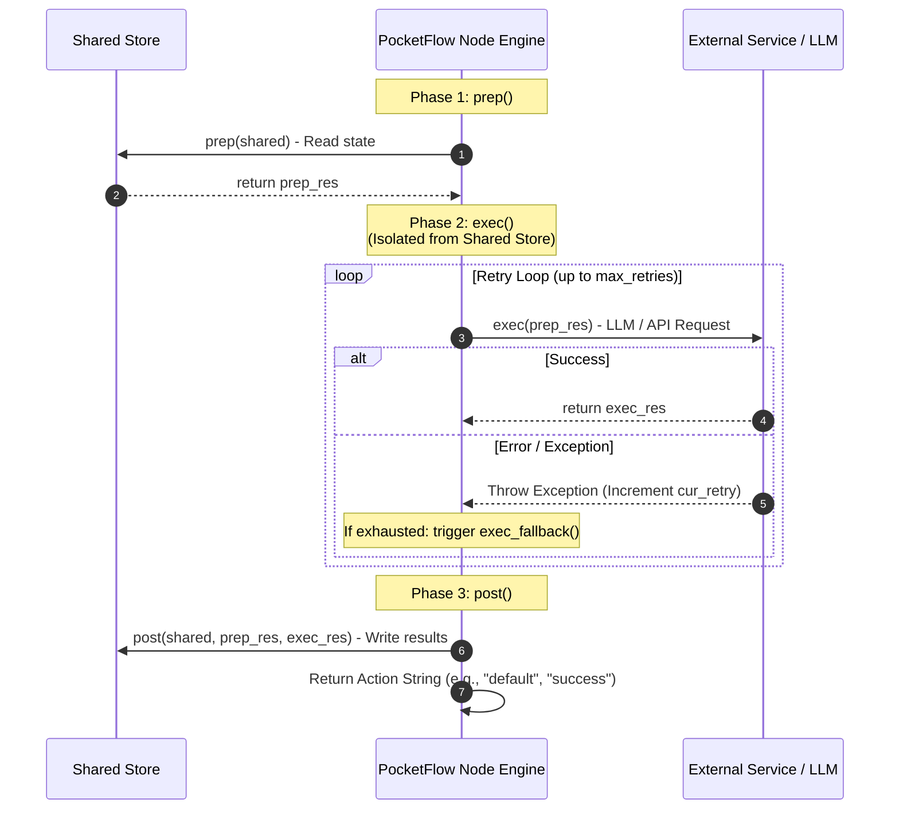
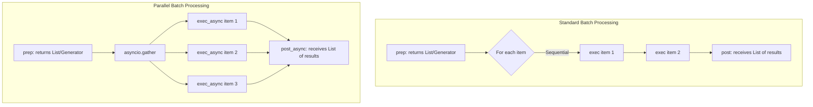

# PocketFlow — Software Architecture Recovery

> **Course:** Modern Software Architecture — Wuhan University, 2026  
> **Instructor:** Prof. Peng Liang  
> **Target System:** [PocketFlow](https://github.com/The-Pocket/PocketFlow)  
> **Reference:** [DESOSA 2019](https://se.ewi.tudelft.nl/desosa2019/)

---

## Table of Contents

1. [Introduction](#1-introduction)
2. [Stakeholder Analysis](#2-stakeholder-analysis)
3. [Context View](#3-context-view)
4. [Development View](#4-development-view)
5. [Process View](#5-process-view)
6. [Architecture Design Decisions](#6-architecture-design-decisions)
7. [Design Patterns](#7-design-patterns)
8. [Quality Attribute Scenarios](#8-quality-attribute-scenarios)
9. [Technical Debt Analysis](#9-technical-debt-analysis)
10. [Conclusion](#10-conclusion)
11. [Weekly Progress Log](#11-weekly-progress-log)
12. [References](#12-references)

---

## 1. Introduction

### 1.1 What is PocketFlow?


PocketFlow is a **100-line minimalist LLM (Large Language Model) orchestration framework** written in Python. It was created as a direct counter-argument to frameworks like LangChain and CrewAI, which the author argues are over-engineered for the problem they solve. Its central thesis is that the entire core abstraction needed for LLM application development — Nodes, Flows, and a Shared Store — can be expressed in exactly 100 lines of code, with zero external dependencies and zero vendor lock-in.

Despite its minimal size, PocketFlow is expressive enough to implement the full spectrum of modern LLM application patterns, including Agents, Workflows, Retrieval-Augmented Generation (RAG), MapReduce, Multi-Agent systems, and Structured Output. It models LLM workflows as a **Graph + Shared Store**, where:

- **Node** handles a single (LLM) task via a `prep → exec → post` lifecycle
- **Flow** connects Nodes through labeled edges called Actions
- **Shared Store** is a shared dictionary enabling communication between Nodes within a Flow

The framework is available as a Python package (`pip install pocketflow`) or by directly copying the 100-line source. It has since been ported to TypeScript, Java, C++, Go, Rust, and PHP by the community. As of 2026, the repository has over 10,000 GitHub stars, 1,100+ forks, and 200+ dependent projects.

The table below compares PocketFlow to other popular LLM frameworks:

| Framework | Abstraction | Lines | Size |
|---|---|---|---|
| LangChain | Agent, Chain | 405K | +166 MB |
| CrewAI | Agent, Chain | 18K | +173 MB |
| LangGraph | Agent, Graph | 37K | +51 MB |
| AutoGen | Agent | 7K | +26 MB |
| **PocketFlow** | **Graph** | **100** | **+56 KB** |

### 1.2 Why PocketFlow is Architecturally Interesting

PocketFlow is architecturally interesting not despite its minimalism, but because of it. It forces a fundamental question: **what is the irreducible core abstraction for LLM orchestration?** The project's answer — a nested directed graph with a shared store — is a deliberate and defensible architectural decision that warrants careful study.

Several properties make PocketFlow a rich subject for architecture recovery:

- **Radical minimalism as a design principle.** The 100-line constraint is not a limitation but an explicit architectural goal, making every line of code an intentional decision.
- **Intentional exclusion as architecture.** PocketFlow explicitly does not provide LLM vendor wrappers or app-specific utilities. This boundary decision — what the framework refuses to do — is as architecturally significant as what it provides.
- **Cross-language portability.** The same abstraction has been faithfully reproduced in six programming languages, which serves as evidence of the abstraction's structural soundness and language-independence.
- **Agentic coding philosophy.** PocketFlow is designed to be intuitive enough for AI agents themselves to build LLM applications on top of it, representing a forward-looking architectural stance on human-AI collaborative development.

### 1.3 Scope of This Document

This document recovers and describes the software architecture of PocketFlow as of 2026. The analysis covers the Python core package (`pocketflow/__init__.py`), the cookbook of 26+ example applications, the multi-language port ecosystem (TypeScript, Java, C++, Go, Rust, and PHP), and the project's community and documentation infrastructure.

The analysis does **not** cover LLM provider SDKs (OpenAI, Anthropic, etc.), vector databases, or third-party applications built on top of PocketFlow — these are external to the system boundary.

The document is organized around the 4+1 view model: a stakeholder and context view, a development view, a process view, an architecture decision analysis, a design pattern analysis, and a quality attributes and technical debt assessment. Together, these views argue that PocketFlow's architecture is defined as much by what it **deliberately excludes** as by what it includes — and that this boundary decision is its central architectural contribution.

---

## 2. Stakeholder Analysis

### 2.1 Stakeholder Identification

Stakeholders were identified through analysis of the GitHub repository (contributors list, issues, pull requests) and the official documentation of PocketFlow.

| Stakeholder | Type | Role | Key Concerns |
|---|---|---|---|
| **Zachary Huang (@zachary62)** | Creator & Lead Maintainer | Defines architectural vision, authors core code and tutorials, drives the agentic coding philosophy | Minimalism, correctness of core abstraction, community growth, long-term positioning against LangChain |
| **22 contributors** | Developers | Submit bug fixes, cookbook examples, documentation improvements, and new features | Ease of contribution, stability of core API, clear contribution guidelines |
| **LLM Application Developers** | Primary Users | Build agents, workflows, RAG systems, and multi-agent applications on top of PocketFlow | Expressiveness, ease of use, quality of cookbook examples, LLM vendor flexibility |
| **AI Researchers & Educators** | Secondary Users | Use PocketFlow as a teaching tool or research substrate due to its readable, minimal codebase | Transparency, simplicity, ability to fork and audit all 100 lines |
| **Agentic Coding Practitioners** | Emerging Users | Use PocketFlow as the target framework for AI-assisted (e.g., Cursor AI) LLM app development | Intuitive structure that AI agents can reason about and generate code for |
| **Multi-language Port Maintainers** | Downstream Developers | Maintain TypeScript, Java, C++, Go, Rust, and PHP ports of the core abstraction | Stability of the Python core abstraction, clear semantics, documentation accuracy |
| **214+ Dependent Projects** | Downstream Integrators | Build production systems that depend on PocketFlow as an upstream library | API stability, backward compatibility, release management |
| **LangChain / LangGraph / CrewAI** | Competitor Frameworks | Define the design space that PocketFlow explicitly reacts against | N/A — indirect influence on PocketFlow's architectural positioning |
| **Discord Community** | Community | Provide user support, share use cases, give feedback on pain points | Responsiveness of maintainers, growing library of tutorials and examples |
| **LLM Providers (OpenAI, Anthropic, etc.)** | External Systems | Supply the LLM APIs that PocketFlow applications call | N/A — PocketFlow deliberately excludes all vendor-specific wrappers |

### 2.2 Power / Interest Grid

Stakeholders are mapped by their ability to influence PocketFlow's architecture (power) and their degree of ongoing engagement with the project (interest).


**Key observations:**
- The lead maintainer holds almost all architectural power, consistent with a solo-founded OSS project.
- LLM App Developers are the highest-interest group but have low direct power — their influence operates through GitHub issues, Discord feedback, and community cookbook contributions.
- Competitor frameworks have high indirect power: PocketFlow's entire architecture is a deliberate reaction to their complexity, meaning LangChain's design decisions effectively shaped PocketFlow's by opposition.

### 2.3 Key Architectural Decisions Driven by Stakeholders

Each of PocketFlow's most significant architectural decisions can be traced back to a specific stakeholder concern:

| Architectural Decision | Driven By | Rationale |
|---|---|---|
| **Zero external dependencies** | LLM App Developers frustrated with dependency conflicts in LangChain | Eliminates version hell and supply chain risk; users control their own dependency graph |
| **No vendor-specific wrappers** | Lead Maintainer's philosophy; LLM Providers' API volatility | Frequent LLM API changes make hardcoded wrappers a maintenance burden; users implement their own `call_llm()` |
| **100-line constraint** | Lead Maintainer; AI Researchers needing an auditable codebase | Forces ruthless prioritization; any developer (or AI agent) can read and understand the entire framework in minutes |
| **Cookbook-based documentation** | LLM App Developers requesting concrete examples | Formal API docs alone are insufficient for LLM orchestration; runnable examples are more instructive |
| **Multi-language ports** | Community requests from non-Python developers | The Graph + Shared Store abstraction is language-agnostic; ports validate this claim |
| **Agentic coding support (.cursorrules)** | Agentic Coding Practitioners using Cursor AI | PocketFlow's simplicity makes it uniquely suited for AI agents to generate application code on top of it |

---

## 3. Context View

### PocketFlow System Scope and Responsibilities

#### 3.1 System Scope

**PocketFlow** is a lightweight workflow and orchestration core for building LLM applications.

Its scope is to provide the minimal abstractions needed to structure application logic as **nodes** and **flows**, while leaving integrations with LLMs, tools, storage, and external services to user-defined code.

PocketFlow sits between the developer’s application code and external systems such as **LLM providers**, **tool APIs**, and **vector databases**.

#### Responsibilities

PocketFlow is responsible for:

- Providing core workflow abstractions such as `Node`, `Flow`, `BatchNode`, and async flow variants.
- Defining how steps in an LLM application are connected and executed.
- Supporting reusable graph-like workflows for:
  - agents
  - RAG pipelines
  - batch jobs
  - workflows
  - MapReduce-style applications
- Managing shared state between workflow steps through a simple shared store.
- Allowing developers to subclass and compose nodes and flows to build custom application behavior.
- Keeping the core lightweight and dependency-minimal, relying only on the Python standard library.
- Providing a stable abstraction that can be reused by cookbook examples, language ports, and ecosystem tooling.

#### Outside the System Scope

PocketFlow is not responsible for:

- Hosting or providing LLM models.
- Implementing provider-specific APIs for OpenAI, Claude, Gemini, Ollama, or DeepSeek.
- Owning external tools such as web search, file systems, REST APIs, MCP servers, or text-to-speech services.
- Managing vector databases such as ChromaDB, FAISS, or Pinecone.
- Providing authentication, billing, monitoring, deployment, or production infrastructure.
- Storing long-term application data beyond the workflow’s shared runtime state.
- Deciding application-specific prompts, business rules, retrieval logic, or tool behavior.

The diagram below illustrates the full context of PocketFlow, showing the system at the centre surrounded by the external actors and systems it interacts with.


### 3.2 Context Diagram Description

This PocketFlow Context View shows PocketFlow as the central system and the external people, tools, platforms, and dependencies around it. PocketFlow Core is the main system in the center. It provides a minimal workflow/orchestration layer for building LLM applications using nodes and flows.

- **LLM App Developers** are the primary users. They build applications by subclassing PocketFlow’s Node and Flow abstractions.

- **User Space** represents the developer’s own application code. This is where custom utility functions such as call_llm() and tool wrappers are implemented.

- **LLM Providers** are external model services such as OpenAI, Claude, Gemini, Ollama, and DeepSeek. PocketFlow reaches them through user-defined LLM call functions.

- **External Tool APIs** are services or systems used by PocketFlow apps, such as web search, file systems, REST APIs, MCP servers, and text-to-speech tools.

- **Vector Databases** support embedding search and retrieval workflows, commonly used in RAG applications. Examples include ChromaDB, FAISS, and Pinecone.

- **Python Standard Library** is shown as the only true dependency, meaning PocketFlow is designed to stay lightweight and avoid requiring heavy external packages.

- **Cookbook Examples**, **Language Ports**, and **Dev Infrastructure** represent the surrounding ecosystem: sample apps, implementations in other languages, and project support tools such as GitHub, PyPI, MkDocs, and Discord.

## 4. Development View

### 4.1 Repository Structure

Applications built with PocketFlow follow a strict convention:

```
my_project/
├── main.py              # Entry point, initializes shared store
├── nodes.py             # All Node class definitions
├── flow.py              # Flow creation and orchestration
├── utils/               # External utility functions (LLM, APIs)
└── docs/
    └── design.md        # Design document (source of truth)
```

The `docs/design.md` file serves as the central source of truth for the application's data schemas, flow design, and node specifications. This convention is intentionally lightweight to match the framework's minimalist philosophy.

### 4.2 Module Structure

The PocketFlow framework follows an ultra-minimalist architecture with the core contained entirely within a single 100-line file `pocketflow/__init__.py`. The core consists of five main classes:

| Class | Responsibility |
|---|---|
| **BaseNode** | Defines the three-phase lifecycle pattern (`prep → exec → post`) |
| **Node** | Standard node with retry logic and fallback mechanisms |
| **BatchNode** | For data-intensive collection processing |
| **AsyncNode** | For non-blocking asynchronous operations |
| **Flow** | Orchestrates nodes through action-based routing using the `>>` operator |

All nodes communicate through a **Shared Store** — a shared dictionary that serves as the data contract between nodes within a Flow.

### 4.3 Core Abstraction

PocketFlow's core abstraction is a **nested directed graph with a shared store**. This means:

- **Nodes** are the vertices of the graph. Each node encapsulates a single unit of work.
- **Actions** are the labeled edges. A node returns a string action that determines which successor node runs next.
- **Flows** are themselves nodes, enabling nested graph structures.
- The **Shared Store** is a plain Python dictionary passed between nodes, enabling loose coupling.

This graph model is sufficiently expressive to implement agents, workflows, RAG pipelines, MapReduce patterns, and multi-agent systems — all without extending the 100-line core.

### 4.4 Node Lifecycle

Every node in PocketFlow follows a strict three-phase lifecycle defined by `BaseNode`:

1. **Prep** — Read and serialize data from the shared store. Prepare inputs for execution.
2. **Exec** — Perform the core computation in isolation from the shared store. This phase is designed to be idempotent, enabling safe retries.
3. **Post** — Write results back to the shared store and return an action string that determines the next node in the flow.

This separation of concerns improves testability: the `exec` method can be unit-tested independently because it does not depend on global state.

### 4.5 Dependencies and Technology Stack

**Core Framework Dependencies:** Zero external dependencies. The framework imports only Python standard library modules (`typing`, `abc`, `asyncio`).

**Application Dependencies:** Users control their own dependencies through utility functions. For example, a typical `requirements.txt` might include:

```
PyYAML
pocketflow
```

Vendor-specific integrations (OpenAI, Anthropic, vector databases) are implemented by users in the `utils/` directory rather than being bundled with the framework.

### 4.6 Development Process: Agentic Coding Methodology

PocketFlow employs a distinctive eight-step development process that divides responsibilities between humans and AI agents:

| Step | Human Involvement | AI Involvement | Primary Artifact |
|------|------------------|----------------|------------------|
| 1. Requirements | ★★★ High | ★☆☆ Low | `docs/design.md` |
| 2. Flow Design | ★★☆ Medium | ★★☆ Medium | `docs/design.md` |
| 3. Utilities | ★★☆ Medium | ★★☆ Medium | `utils/*.py` |
| 4. Data Design | ★☆☆ Low | ★★★ High | `docs/design.md` |
| 5. Node Design | ★☆☆ Low | ★★★ High | `docs/design.md` |
| 6. Implementation | ★☆☆ Low | ★★★ High | `flow.py`, `nodes.py`, `main.py` |
| 7. Optimization | ★★☆ Medium | ★★☆ Medium | Prompt refinement, flow redesign |
| 8. Reliability | ★☆☆ Low | ★★★ High | Test cases, retry configuration |

The methodology is built on the principle that *"If Humans can't specify the flow, AI Agents can't automate it!"*

This division is enabled by the framework's minimal abstractions, which are simple enough for AI agents to understand completely.

### 4.7 Key Development Constraints and Principles

**Three Zeros Philosophy**:

- **Zero Bloat**: Core framework limited to exactly 100 lines
- **Zero Dependencies**: No external Python packages required
- **Zero Vendor Lock-in**: Users implement their own utility functions

**Documentation-First Policy**: AI agents are instructed to always request and review MDC documentation files before writing code.

**Shared Store Contract**: All nodes communicate through a well-designed shared dictionary that serves as a data contract.

### 4.8 Build and Deployment

The framework has minimal build requirements:

- Simple `pip` installation from the package
- No complex build processes or compilation steps
- Designed for portability across programming languages (TypeScript, Java, C++, etc.)

---

## 5. Process View

### 5.1 Runtime Structure and Execution Model

PocketFlow operates as a graph-based execution engine where Nodes are the fundamental units of work and Flows orchestrate their execution through action-based routing. The system follows a strict three-phase lifecycle for each node.

The Shared Store serves as the central state management mechanism, functioning like a heap that all nodes can access. This separates data schema from compute logic, enabling nodes to communicate without direct coupling.

#### System Architecture Overview



### 5.2 Node Execution Lifecycle

Each node executes through three distinct phases:

1. **`prep(shared)`** — Reads and preprocesses data from the shared store, returning `prep_res` for the next phase.
2. **`exec(prep_res)`** — Performs compute logic (LLM calls, API requests) with optional retry logic, isolated from the shared store.
3. **`post(shared, prep_res, exec_res)`** — Writes results back to the shared store and returns an Action string for routing.

This separation ensures idempotency for retries and clean separation between data access and computation.

#### Phase Isolation & Fault Tolerance Sequence



### 5.3 Flow Orchestration and Control Flow

The `Flow` class manages runtime execution through an internal orchestrator (`_orch`) that loops through nodes based on returned actions:

```python
def _orch(self, shared, params=None):
    curr, p, last_action = copy.copy(self.start_node), (params or {**self.params}), None
    while curr:
        curr.set_params(p)
        last_action = curr._run(shared)
        curr = copy.copy(self.get_next_node(curr, last_action))
    return last_action
```

Action-based routing enables dynamic control flow:

- **Default transition:** `node_a >> node_b` (if `post()` returns `"default"`)
- **Named action:** `node_a - "action_name" >> node_b` (if `post()` returns `"action_name"`)

This supports branching, looping, and complex workflows like expense approval with multiple outcomes.

### 5.4 Communication Patterns

Nodes communicate through two primary mechanisms:

- **Shared Store** — Global dictionary for data results, large content, and state shared across nodes.
- **Params** — Local, ephemeral dictionaries passed by parent Flows, used as task identifiers in Batch mode.

The shared store acts as a data contract that all nodes agree upon, designed ahead of time based on application requirements.

### 5.5 Concurrency Patterns

PocketFlow provides multiple concurrency models for different use cases.

#### Async Execution

`AsyncNode` implements async versions of the lifecycle methods (`prep_async`, `exec_async`, `post_async`) for I/O-bound tasks. This is useful for:

- Fetching/reading data asynchronously
- Async LLM calls
- Awaiting user feedback or multi-agent coordination

#### Batch Processing & Parallel Execution

- **BatchNode:** Processes collections by iterating over items returned from `prep()`. `exec(item)` is called once per item, and `post()` receives a combined list of results.
- **AsyncParallelBatchNode:** Uses `asyncio.gather` to execute multiple `exec_async` calls concurrently. This optimizes I/O-bound tasks like simultaneous LLM requests but requires careful handling of rate limits.



### 5.6 Error Handling and Fault Tolerance

Nodes implement built-in retry logic with configurable parameters:

| Parameter | Description | Default |
|---|---|---|
| `max_retries` | Maximum number of execution attempts | `1` |
| `wait` | Seconds to wait between retries | `0` |
| `exec_fallback` | Called when all retries are exhausted | — |

The retry mechanism automatically handles exceptions in `exec()`, with the current retry count accessible via `self.cur_retry`.

### 5.7 Nested Flow Composition

Flows can act as Nodes, enabling powerful composition patterns:

- Sub-flows can be used as nodes within parent flows.
- Node params merge from all parent flows.
- Flows run `prep()` and `post()` but not `exec()` (their internal logic *is* orchestration).

This enables hierarchical workflows like order processing pipelines with separate payment, inventory, and shipping sub-flows.

---

## 6. Architecture Design Decisions

This section documents PocketFlow's key architecture design decisions using the course template from the lecture slides on architectural decisions: **Issue, Importance, Decision, Status, Group, Assumptions, Alternatives, Arguments, Implications, and Possible negative impact on quality**. 

### 6.1 Decision Overview

| ID | Decision | Primary quality drivers |
|---|---|---|
| ADD-01 | Keep core implementation to exactly 100 lines with zero dependencies | Maintainability, learning curve, flexibility |
| ADD-02 | Model workflows as Graph + Shared Store | Modifiability, simplicity, expressiveness |
| ADD-03 | Do not provide built-in utilities; instead provide examples | Portability, maintainability, vendor independence |
| ADD-04 | Three-phase lifecycle: Prep, Exec, Post | Separation of concerns, testability, reliability |
| ADD-05 | Nodes return string "actions" as routing keys | Extensibility, composability, understandability |
| ADD-06 | Humans design high-level flows; AI agents implement nodes | Learnability, ecosystem growth, controlled core scope |
| ADD-07 | Use a shared dictionary as a data contract | Modifiability, loose coupling, state management |

### 6.2 ADD-01: Minimalist Core Framework

| Template Item | Description |
|---|---|
| Issue | What should be the size and scope of the core framework? |
| Importance | High - affects maintainability, learning curve, and flexibility |
| Decision | Keep core implementation to exactly 100 lines with zero dependencies |
| Status | Accepted |
| Group | Core Architecture |
| Assumptions | Complex patterns can be built from simple primitives; developers prefer flexibility over convenience |
| Alternatives | Full-featured frameworks like LangChain (405K lines), CrewAI (18K lines) |
| Arguments | **Pros:** Reduces bloat, makes the framework easier to understand, eliminates vendor lock-in, and forces developers to understand the fundamentals.<br>**Cons:** Provides fewer ready-made features, shifts more responsibility to application developers, and can slow down early prototyping. |
| Implications | Users must implement their own utility functions; steeper initial learning curve |
| Possible negative impact on quality | More initial setup work compared to batteries-included frameworks |

### 6.3 ADD-02: Graph + Shared Store Abstraction

| Template Item | Description |
|---|---|
| Issue | What should be the fundamental abstraction for LLM workflows? |
| Importance | High - this is the core conceptual model that everything else builds upon |
| Decision | Model workflows as Graph (nodes connected by labeled edges called Actions) + Shared Store (central state management) |
| Status | Accepted |
| Group | Core Architecture |
| Assumptions | Most LLM workflows can be modeled as directed graphs with shared state; state management is a cross-cutting concern |
| Alternatives | Chain-based (linear sequences only), Agent-based only, Pipeline-based |
| Arguments | **Pros:** More flexible than chains, simpler than full agent systems, and supports complex patterns such as loops, branching, and conditional execution.<br>**Cons:** Requires users to model work explicitly as graph nodes and edges, and can make large workflows harder to visualize without supporting documentation or diagrams. |
| Implications | All workflows must be expressible as graphs; state management is explicit rather than implicit |
| Possible negative impact on quality | May be limiting for workflows that don't fit graph model well |

### 6.4 ADD-03: No Built-in Utility Functions

| Template Item | Description |
|---|---|
| Issue | Should the framework include built-in utility functions for common tasks (LLM calls, embeddings, etc.)? |
| Importance | High - affects developer experience and framework flexibility |
| Decision | Do not provide built-in utilities; instead provide examples and let users implement their own |
| Status | Accepted |
| Group | Framework Philosophy |
| Assumptions | Vendor APIs change frequently; developers need flexibility to switch providers; optimizations are easier without lock-in |
| Alternatives | Include comprehensive utility library like LangChain, include basic utilities with extension points |
| Arguments | **Pros:** Avoids vendor lock-in, reduces maintenance burden, allows project-specific optimizations such as prompt caching and streaming, and enables switching between providers.<br>**Cons:** Increases boilerplate, gives beginners less out-of-the-box help, and may lead to inconsistent utility implementations across projects. |
| Implications | Developers must implement their own utilities; more initial setup but long-term flexibility |
| Possible negative impact on quality | Higher barrier to entry; more boilerplate code for simple applications |

### 6.5 ADD-04: Node Lifecycle Pattern (Prep-Exec-Post)

| Template Item | Description |
|---|---|
| Issue | How should individual nodes structure their execution logic? |
| Importance | High - defines the fundamental unit of work pattern |
| Decision | Three-phase lifecycle: Prep (read/serialize from shared), Exec (perform computation isolated from shared), Post (write results to shared and return action) |
| Status | Accepted |
| Group | Node Architecture |
| Assumptions | Separation of concerns improves testability and retry logic; isolation enables portability |
| Alternatives | Single execute method with direct shared access, event-driven pattern, functional composition |
| Arguments | **Pros:** Enables safer retries when `exec` is idempotent, separates data preparation from computation and state updates, improves testability, and supports async operations.<br>**Cons:** Adds structure and boilerplate to simple nodes, and developers must learn where each responsibility belongs. |
| Implications | All nodes must follow this pattern; some boilerplate required for simple operations |
| Possible negative impact on quality | May feel verbose for simple operations; learning curve for the pattern |

### 6.6 ADD-05: Action-Based Routing

| Template Item | Description |
|---|---|
| Issue | How should nodes connect and determine execution flow? |
| Importance | High - enables dynamic workflows and conditional branching |
| Decision | Nodes return string "actions" that serve as routing keys to determine successor nodes |
| Status | Accepted |
| Group | Flow Control |
| Assumptions | String-based routing is sufficient for most workflows; conditional logic belongs in nodes not in flow definition |
| Alternatives | Hard-coded successor chains, boolean conditions, complex routing DSL |
| Arguments | **Pros:** Enables dynamic decision-making, supports loops and branching, and stays simple to implement and understand.<br>**Cons:** Relies on consistent action names, provides no compile-time validation of routes, and can make execution paths harder to debug in complex flows. |
| Implications | Flow control is decentralized to individual nodes; action naming becomes important |
| Possible negative impact on quality | Action naming conventions must be consistent; debugging flow paths may be complex |

### 6.7 ADD-06: Agentic Coding Methodology

| Template Item | Description |
|---|---|
| Issue | How should humans and AI agents collaborate in building LLM applications? |
| Importance | Medium - affects development process and team workflow |
| Decision | Humans design high-level flows and data schemas; AI agents implement specific nodes and utility functions |
| Status | Accepted |
| Group | Development Process |
| Assumptions | Humans are better at system design; AI is better at implementation details; iterative refinement is necessary |
| Alternatives | Fully human-driven development, fully AI-driven development, pair programming approach |
| Arguments | **Pros:** Leverages human strengths in architecture and AI strengths in implementation, enables rapid iteration, and reduces repetitive coding effort.<br>**Cons:** Depends on the quality of AI-generated code, requires careful human review, and may not fit teams that need fully deterministic or compliance-heavy development processes. |
| Implications | Requires clear design documentation; humans must understand framework well enough to design effectively |
| Possible negative impact on quality | Dependency on AI quality; may not work for all team structures |

### 6.8 ADD-07: Shared Store as Data Contract

| Template Item | Description |
|---|---|
| Issue | How should nodes communicate and share state? |
| Importance | High - fundamental to the architecture's data flow |
| Decision | Use a shared dictionary (shared store) as a data contract that all nodes agree upon for retrieving and storing data |
| Status | Accepted |
| Group | State Management |
| Assumptions | Dictionary-based state is sufficient for most use cases; explicit data contracts improve maintainability |
| Alternatives | Message passing, function parameters, event bus, database-backed state |
| Arguments | **Pros:** Simple and flexible, enables loose coupling between nodes, and supports both in-memory and persistent implementations.<br>**Cons:** Lacks compile-time schema enforcement, can produce runtime errors when keys are missing or misused, and requires disciplined data contract documentation. |
| Implications | Data schema design becomes critical; potential for data inconsistency if contract not followed |
| Possible negative impact on quality | No compile-time checking of data contracts; runtime errors possible |


### 6.10 Key Relationships

| Relationship | Explanation |
|---|---|
| Minimalist Core → Graph + Shared Store | The 100-line constraint forced the framework to adopt the simplest possible abstraction that could still support complex patterns |
| Graph + Shared Store → Node Lifecycle Pattern | The graph abstraction requires a consistent node interface, leading to the Prep-Exec-Post pattern |
| Graph + Shared Store → Action-Based Routing | The graph model needs a mechanism for edges, implemented as string actions returned by nodes |
| Graph + Shared Store → Shared Store as Data Contract | The shared store is the communication mechanism between nodes in the graph |
| No Built-in Utilities → Agentic Coding Methodology | Without built-in utilities, the framework relies on AI agents to implement project-specific utilities, making agentic coding essential |
| Node Lifecycle Pattern → Agentic Coding | The consistent node pattern makes it easier for AI agents to implement nodes correctly |

---

## 7. Design Patterns

PocketFlow uses a Graph-based core abstraction as its foundational architecture pattern, with several higher-level design patterns built on top of it.

### 7.1 Core Architecture Pattern: Graph + Shared Store

The fundamental architecture pattern is a directed graph where:

- **Nodes** represent units of work (LLM tasks, API calls)
- **Flows** orchestrate nodes through action-based routing
- **Shared Store** enables communication between nodes without direct coupling

This pattern enforces separation of concerns through a three-phase node lifecycle (`prep` → `exec` → `post`) that separates data access from compute logic.

### 7.2 Agent Pattern

Nodes can take dynamic actions based on context, using branching to connect action nodes to an agent node that decides the next action. The agent node provides a prompt to decide actions from a defined action space.

### 7.3 Workflow Pattern

Chains multiple tasks into sequential pipelines, useful for multi-step processes like writing workflows that outline, write content, and apply styling.

### 7.4 RAG Pattern

Integrates data retrieval with generation, typically involving offline (indexing) and online (retrieval) workflows.

### 7.5 Map-Reduce Pattern

Splits data tasks into Map (processing items in parallel/sequence) and Reduce (aggregating results) steps.

### 7.6 Structured Output Pattern

Formats outputs consistently, useful for extracting structured data from unstructured inputs.

### 7.7 Multi-Agent Pattern

Coordinates multiple agents for complex tasks requiring specialized roles.

### 7.8 Concurrency Patterns

PocketFlow provides multiple concurrency models for different use cases.

#### Batch Processing

`BatchNode` processes collections by iterating over items, with `prep()` returning an iterable and `exec()` called once per item.

#### Async Processing

`AsyncNode` implements async versions of lifecycle methods for I/O-bound tasks like async LLM calls.

#### Parallel Processing

`AsyncParallelBatchNode` uses `asyncio.gather` to execute multiple `exec_async` calls concurrently for I/O-bound tasks.

---

## 8. Quality Attribute Scenarios

### 8.1 Performance — Parallel LLM Execution

**Scenario:** When a user needs to process multiple documents simultaneously (stimulus), during normal operation (environment), the `AsyncParallelBatchNode` (artifact) executes multiple LLM calls concurrently using `asyncio.gather` (response), achieving up to 3x speedup compared to sequential processing (response measure).

### 8.2 Reliability — Transient API Failures

**Scenario:** When an LLM API call fails due to rate limits or network issues (stimulus), during normal operation (environment), a `Node` with `max_retries=3` and `wait=10` (artifact) automatically retries the operation with exponential backoff (response), succeeding within 3 attempts or calling `exec_fallback` (response measure).

### 8.3 Modifiability — Vendor Switching

**Scenario:** When a developer wants to switch from OpenAI to Anthropic (stimulus), during development (environment), the utility function architecture (artifact) allows replacing `call_llm.py` without modifying core framework code (response), requiring changes only in the `utils/` directory (response measure).

### 8.4 Usability — AI-Assisted Development

**Scenario:** When a developer uses Cursor AI to implement a workflow (stimulus), during development (environment), the Agentic Coding methodology and 100-line core (artifact) enables the AI to understand and implement the complete flow from natural language specification (response), achieving a 10x productivity boost (response measure).

### 8.5 Portability — Cross-Language Deployment

**Scenario:** When a team needs to deploy the same workflow in different technology stacks (stimulus), during deployment (environment), the core Graph abstraction (artifact) has been ported to TypeScript, Java, C++, Go, Rust, and PHP (response), maintaining identical behavior across languages (response measure).

### 8.6 Maintainability — Separation of Concerns

**Scenario:** When a developer needs to debug a data processing issue (stimulus), during maintenance (environment), the three-phase node lifecycle (artifact) isolates data access in `prep()`/`post()` from compute logic in `exec()` (response), allowing debugging without affecting other phases (response measure).

### 8.7 Availability — Graceful Degradation

**Scenario:** When a critical LLM service becomes unavailable (stimulus), during production operation (environment), the `exec_fallback` mechanism (artifact) returns a fallback result instead of crashing (response), allowing the workflow to continue with degraded functionality (response measure).

PocketFlow's quality attributes are deliberately designed around its minimalist philosophy. The framework prioritizes modifiability and usability through zero vendor lock-in and the Agentic Coding methodology, while providing reliability through built-in retry mechanisms. Performance is addressed through async/parallel patterns for I/O-bound tasks rather than CPU optimization. The separation of concerns in the node lifecycle enhances maintainability, and the simple core abstraction enables portability across multiple programming languages.

---

## 9. Technical Debt Analysis

PocketFlow's technical debt is primarily intentional design trade-offs that align with its minimalist philosophy. The framework deliberately transfers implementation burden to users (**Project Debt**) in exchange for simplicity, flexibility, and zero vendor lock-in. **Design Debt** represents architectural constraints that enable portability and AI-assisted development. **Documentation Debt** is the cost of the Documentation First Policy that enables Agentic Coding. **Test Debt** reflects the framework's opinionated stance on not providing built-in testing utilities.

### 9.1 Design Debt

**100-Line Core Constraint:** The framework is constrained to exactly 100 lines in `pocketflow/__init__.py`, limiting comprehensive type annotations, advanced error handling, built-in validation, and extensive inline documentation. This is an intentional architectural constraint for portability.

**No Built-in Utilities:** Users must implement all vendor-specific integrations (LLM wrappers, web search, vector databases) themselves, creating implementation burden and potential for inconsistent patterns. This avoids vendor lock-in and API volatility maintenance.

**Zero External Dependencies:** The framework imports only Python standard library modules, limiting use of established libraries, ecosystem integration, and optimized implementations. This eliminates dependency hell and supply chain vulnerabilities.

**Minimal Abstraction Layer:** Only provides Graph abstraction without high-level patterns like Agent, Chain, or QA helpers, requiring users to compose design patterns themselves. This keeps the core minimal and flexible.

**Shared Store Scalability:** The shared store pattern uses a simple in-memory dictionary for inter-node communication, which may lead to inconsistent data access patterns, no built-in transaction support, and potential race conditions in concurrent scenarios.

**Type Safety Limitations:** The 100-line constraint likely limits comprehensive type hints in the core implementation, potentially lacking runtime type checking, generic type constraints, and comprehensive IDE support.

**Error Handling Complexity:** Built-in retry mechanism is basic (`max_retries`, `wait`, `exec_fallback`), requiring custom fallback implementations, manual circuit breaker patterns, and no built-in dead letter queues for complex scenarios.

### 9.2 Documentation Debt

**Documentation Maintenance:** The "Documentation First Policy" requires AI agents to request and review MDC files before coding, creating documentation overhead, potential drift between docs and implementation, and maintenance burden for keeping MDC files synchronized. This is intentional to support the Agentic Coding methodology.

### 9.3 Test Debt

**No Built-in Testing Framework:** The framework provides no built-in testing framework or mocking utilities. Users must implement their own test strategies, which could lead to inconsistent testing patterns, no standardized way to test flows, and difficulty testing async/parallel scenarios. The Agentic Coding methodology includes AI writing test cases as a reliability step.

### 9.4 Project Debt

**Vendor Integrations:** Users must implement LLM, vector DB, and search APIs themselves, transferring implementation burden to avoid vendor lock-in.

**Design Patterns:** Users must compose Agent, RAG, and Workflow patterns themselves rather than using built-in features, transferring implementation burden to keep the core minimal.

**State Management:** Users must design shared store schema and persistence themselves, transferring implementation burden for flexibility across different use cases.

**Error Handling:** Users must implement complex fallback strategies themselves, transferring implementation burden while the framework provides basic retry mechanisms.

**Testing Infrastructure:** Users must implement test infrastructure themselves, transferring implementation burden as the framework takes no opinionated testing approach.

---

## 10. Conclusion

Using the Rozanski and Woods framework, PocketFlow's architecture is best understood through what it deliberately excludes rather than what it provides. Its stakeholders—ranging from the solo lead maintainer and contributors to LLM developers and AI researchers—are served by a minimal orchestration core that avoids vendor wrappers, external APIs, and heavy dependencies, relying solely on the Python standard library. The development view reveals this minimalism in a single 100-line file, strict project conventions, and an agentic coding methodology that splits design between humans and AI. However, this stance creates intentional technical debt: users must build their own utilities, testing infrastructure, and error-handling strategies. Despite this, the architecture delivers strong modifiability, reliability, performance, and portability. In conclusion, PocketFlow is an elegant and coherent framework for LLM orchestration, but it would benefit from clearer guidance on testing and shared-store schema management to reduce the burden on users.

---

## 11. Weekly Progress Log

### Week 1
- [ Table of Contents ] 
- [ Introduction ] 

### Week 2
- [ Stakeholder Analysis ] 
- [ Context View ] 

### Week 3
- [ Architecture Design Decisions ]
- [ Design Decision Relationship Graph ]
- [ Development View ]

### Week 4
- [ Process View ]

### Week 5
- [ Design Patterns ]

### Week 6 — Midterm
- [ Quality Attribute Scenarios ]

### Week 7
- [ Technical Debt Analysis ]

### Week 8 — Final
- [ Conclusion ] 

---

## 12. References

- PocketFlow GitHub: https://github.com/The-Pocket/PocketFlow
- PocketFlow 100-line Python core: https://raw.githubusercontent.com/The-Pocket/PocketFlow/main/pocketflow/__init__.py
- PocketFlow Docs: https://the-pocket.github.io/PocketFlow/
- PocketFlow Core Abstraction: https://the-pocket.github.io/PocketFlow/core_abstraction/node.html
- PocketFlow Flow Documentation: https://the-pocket.github.io/PocketFlow/core_abstraction/flow.html
- PocketFlow Communication Documentation: https://the-pocket.github.io/PocketFlow/core_abstraction/communication.html
- PocketFlow Batch Documentation: https://the-pocket.github.io/PocketFlow/core_abstraction/batch.html
- PocketFlow Async Documentation: https://the-pocket.github.io/PocketFlow/core_abstraction/async.html
- PocketFlow Parallel Documentation: https://the-pocket.github.io/PocketFlow/core_abstraction/parallel.html
- Course slides: `pdfs/03-软件体系结构设计-01.pdf`
- Course slides: `pdfs/03-软件体系结构设计-02.pdf`
- DESOSA 2019: https://se.ewi.tudelft.nl/desosa2019/
- Bass, L., Clements, P., & Kazman, R. *Software Architecture in Practice*, 4th Ed.
- Kruchten, P. (1995). The 4+1 View Model of Architecture. *IEEE Software*.
- ISO/IEC/IEEE 42010:2011 — Architecture Description
