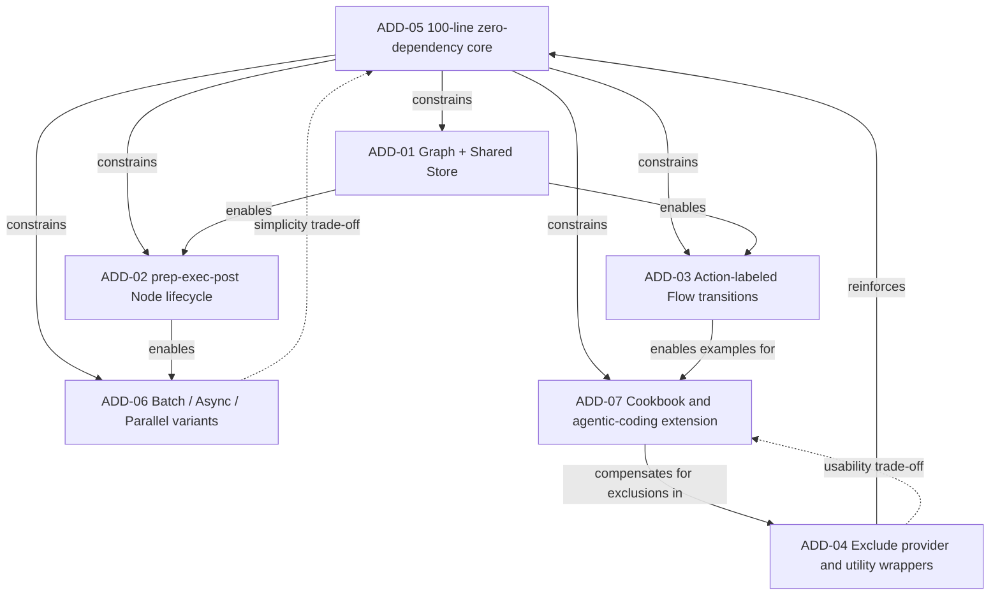

# PocketFlow — Software Architecture Recovery

> **Course:** Modern Software Architecture — Wuhan University, 2026  
> **Instructor:** Prof. Peng Liang  
> **Target System:** [PocketFlow](https://github.com/The-Pocket/PocketFlow)  
> **Reference:** [DESOSA 2019](https://se.ewi.tudelft.nl/desosa2019/)

---

## Table of Contents

1. [Introduction](#1-introduction)
2. [Stakeholder Analysis](#2-stakeholder-analysis)
3. [Context View](#3-context-view)
4. [Development View](#4-development-view)
5. [Process View](#5-process-view)
6. [Architecture Design Decisions](#6-architecture-design-decisions)
7. [Design Patterns](#7-design-patterns)
8. [Quality Attribute Scenarios](#8-quality-attribute-scenarios)
9. [Technical Debt Analysis](#9-technical-debt-analysis)
10. [Conclusion](#10-conclusion)
11. [Weekly Progress Log](#11-weekly-progress-log)
12. [References](#12-references)

---

## 1. Introduction

### 1.1 What is PocketFlow?

PocketFlow is a **100-line minimalist LLM (Large Language Model) orchestration framework** written in Python. It was created as a direct counter-argument to frameworks like LangChain and CrewAI, which the author argues are over-engineered for the problem they solve. Its central thesis is that the entire core abstraction needed for LLM application development — Nodes, Flows, and a Shared Store — can be expressed in exactly 100 lines of code, with zero external dependencies and zero vendor lock-in.

Despite its minimal size, PocketFlow is expressive enough to implement the full spectrum of modern LLM application patterns, including Agents, Workflows, Retrieval-Augmented Generation (RAG), MapReduce, Multi-Agent systems, and Structured Output. It models LLM workflows as a **Graph + Shared Store**, where:

- **Node** handles a single (LLM) task via a `prep → exec → post` lifecycle
- **Flow** connects Nodes through labeled edges called Actions
- **Shared Store** is a shared dictionary enabling communication between Nodes within a Flow

The framework is available as a Python package (`pip install pocketflow`) or by directly copying the 100-line source. It has since been ported to TypeScript, Java, C++, Go, Rust, and PHP by the community. As of 2026, the repository has over 10,000 GitHub stars, 1,100+ forks, and 200+ dependent projects.

The table below compares PocketFlow to other popular LLM frameworks:

| Framework | Abstraction | Lines | Size |
|---|---|---|---|
| LangChain | Agent, Chain | 405K | +166 MB |
| CrewAI | Agent, Chain | 18K | +173 MB |
| LangGraph | Agent, Graph | 37K | +51 MB |
| AutoGen | Agent | 7K | +26 MB |
| **PocketFlow** | **Graph** | **100** | **+56 KB** |

### 1.2 Why PocketFlow is Architecturally Interesting

PocketFlow is architecturally interesting not despite its minimalism, but because of it. It forces a fundamental question: **what is the irreducible core abstraction for LLM orchestration?** The project's answer — a nested directed graph with a shared store — is a deliberate and defensible architectural decision that warrants careful study.

Several properties make PocketFlow a rich subject for architecture recovery:

- **Radical minimalism as a design principle.** The 100-line constraint is not a limitation but an explicit architectural goal, making every line of code an intentional decision.
- **Intentional exclusion as architecture.** PocketFlow explicitly does not provide LLM vendor wrappers or app-specific utilities. This boundary decision — what the framework refuses to do — is as architecturally significant as what it provides.
- **Cross-language portability.** The same abstraction has been faithfully reproduced in six programming languages, which serves as evidence of the abstraction's structural soundness and language-independence.
- **Agentic coding philosophy.** PocketFlow is designed to be intuitive enough for AI agents themselves to build LLM applications on top of it, representing a forward-looking architectural stance on human-AI collaborative development.

### 1.3 Scope of This Document

This document recovers and describes the software architecture of PocketFlow as of 2026. The analysis covers the Python core package (`pocketflow/__init__.py`), the cookbook of 26+ example applications, the multi-language port ecosystem (TypeScript, Java, C++, Go, Rust, and PHP), and the project's community and documentation infrastructure.

The analysis does **not** cover LLM provider SDKs (OpenAI, Anthropic, etc.), vector databases, or third-party applications built on top of PocketFlow — these are external to the system boundary.

The document is organized around the 4+1 view model: a stakeholder and context view, a development view, a process view, an architecture decision analysis, a design pattern analysis, and a quality attributes and technical debt assessment. Together, these views argue that PocketFlow's architecture is defined as much by what it **deliberately excludes** as by what it includes — and that this boundary decision is its central architectural contribution.

---

## 2. Stakeholder Analysis

### 2.1 Stakeholder Identification

Stakeholders were identified through analysis of the GitHub repository (contributors list, issues, pull requests) and the official documentation of PocketFlow.

| Stakeholder | Type | Role | Key Concerns |
|---|---|---|---|
| **Zachary Huang (@zachary62)** | Creator & Lead Maintainer | Defines architectural vision, authors core code and tutorials, drives the agentic coding philosophy | Minimalism, correctness of core abstraction, community growth, long-term positioning against LangChain |
| **22 contributors** | Developers | Submit bug fixes, cookbook examples, documentation improvements, and new features | Ease of contribution, stability of core API, clear contribution guidelines |
| **LLM Application Developers** | Primary Users | Build agents, workflows, RAG systems, and multi-agent applications on top of PocketFlow | Expressiveness, ease of use, quality of cookbook examples, LLM vendor flexibility |
| **AI Researchers & Educators** | Secondary Users | Use PocketFlow as a teaching tool or research substrate due to its readable, minimal codebase | Transparency, simplicity, ability to fork and audit all 100 lines |
| **Agentic Coding Practitioners** | Emerging Users | Use PocketFlow as the target framework for AI-assisted (e.g., Cursor AI) LLM app development | Intuitive structure that AI agents can reason about and generate code for |
| **Multi-language Port Maintainers** | Downstream Developers | Maintain TypeScript, Java, C++, Go, Rust, and PHP ports of the core abstraction | Stability of the Python core abstraction, clear semantics, documentation accuracy |
| **214+ Dependent Projects** | Downstream Integrators | Build production systems that depend on PocketFlow as an upstream library | API stability, backward compatibility, release management |
| **LangChain / LangGraph / CrewAI** | Competitor Frameworks | Define the design space that PocketFlow explicitly reacts against | N/A — indirect influence on PocketFlow's architectural positioning |
| **Discord Community** | Community | Provide user support, share use cases, give feedback on pain points | Responsiveness of maintainers, growing library of tutorials and examples |
| **LLM Providers (OpenAI, Anthropic, etc.)** | External Systems | Supply the LLM APIs that PocketFlow applications call | N/A — PocketFlow deliberately excludes all vendor-specific wrappers |

### 2.2 Power / Interest Grid

Stakeholders are mapped by their ability to influence PocketFlow's architecture (power) and their degree of ongoing engagement with the project (interest).

**Key observations:**
- The lead maintainer holds almost all architectural power, consistent with a solo-founded OSS project.
- LLM App Developers are the highest-interest group but have low direct power — their influence operates through GitHub issues, Discord feedback, and community cookbook contributions.
- Competitor frameworks have high indirect power: PocketFlow's entire architecture is a deliberate reaction to their complexity, meaning LangChain's design decisions effectively shaped PocketFlow's by opposition.

### 2.3 Key Architectural Decisions Driven by Stakeholders

Each of PocketFlow's most significant architectural decisions can be traced back to a specific stakeholder concern:

| Architectural Decision | Driven By | Rationale |
|---|---|---|
| **Zero external dependencies** | LLM App Developers frustrated with dependency conflicts in LangChain | Eliminates version hell and supply chain risk; users control their own dependency graph |
| **No vendor-specific wrappers** | Lead Maintainer's philosophy; LLM Providers' API volatility | Frequent LLM API changes make hardcoded wrappers a maintenance burden; users implement their own `call_llm()` |
| **100-line constraint** | Lead Maintainer; AI Researchers needing an auditable codebase | Forces ruthless prioritization; any developer (or AI agent) can read and understand the entire framework in minutes |
| **Cookbook-based documentation** | LLM App Developers requesting concrete examples | Formal API docs alone are insufficient for LLM orchestration; runnable examples are more instructive |
| **Multi-language ports** | Community requests from non-Python developers | The Graph + Shared Store abstraction is language-agnostic; ports validate this claim |
| **Agentic coding support (.cursorrules)** | Agentic Coding Practitioners using Cursor AI | PocketFlow's simplicity makes it uniquely suited for AI agents to generate application code on top of it |

---

## 3. Context View

### PocketFlow System Scope and Responsibilities

#### 3.1 System Scope

**PocketFlow** is a lightweight workflow and orchestration core for building LLM applications.

Its scope is to provide the minimal abstractions needed to structure application logic as **nodes** and **flows**, while leaving integrations with LLMs, tools, storage, and external services to user-defined code.

PocketFlow sits between the developer’s application code and external systems such as **LLM providers**, **tool APIs**, and **vector databases**.

#### Responsibilities

PocketFlow is responsible for:

- Providing core workflow abstractions such as `Node`, `Flow`, `BatchNode`, and async flow variants.
- Defining how steps in an LLM application are connected and executed.
- Supporting reusable graph-like workflows for:
  - agents
  - RAG pipelines
  - batch jobs
  - workflows
  - MapReduce-style applications
- Managing shared state between workflow steps through a simple shared store.
- Allowing developers to subclass and compose nodes and flows to build custom application behavior.
- Keeping the core lightweight and dependency-minimal, relying only on the Python standard library.
- Providing a stable abstraction that can be reused by cookbook examples, language ports, and ecosystem tooling.

#### Outside the System Scope

PocketFlow is not responsible for:

- Hosting or providing LLM models.
- Implementing provider-specific APIs for OpenAI, Claude, Gemini, Ollama, or DeepSeek.
- Owning external tools such as web search, file systems, REST APIs, MCP servers, or text-to-speech services.
- Managing vector databases such as ChromaDB, FAISS, or Pinecone.
- Providing authentication, billing, monitoring, deployment, or production infrastructure.
- Storing long-term application data beyond the workflow’s shared runtime state.
- Deciding application-specific prompts, business rules, retrieval logic, or tool behavior.

The diagram below illustrates the full context of PocketFlow, showing the system at the centre surrounded by the external actors and systems it interacts with.

### 3.2 Context Diagram Description

This PocketFlow Context View shows PocketFlow as the central system and the external people, tools, platforms, and dependencies around it. PocketFlow Core is the main system in the center. It provides a minimal workflow/orchestration layer for building LLM applications using nodes and flows.

- **LLM App Developers** are the primary users. They build applications by subclassing PocketFlow’s Node and Flow abstractions.

- **User Space** represents the developer’s own application code. This is where custom utility functions such as call_llm() and tool wrappers are implemented.

- **LLM Providers** are external model services such as OpenAI, Claude, Gemini, Ollama, and DeepSeek. PocketFlow reaches them through user-defined LLM call functions.

- **External Tool APIs** are services or systems used by PocketFlow apps, such as web search, file systems, REST APIs, MCP servers, and text-to-speech tools.

- **Vector Databases** support embedding search and retrieval workflows, commonly used in RAG applications. Examples include ChromaDB, FAISS, and Pinecone.

- **Python Standard Library** is shown as the only true dependency, meaning PocketFlow is designed to stay lightweight and avoid requiring heavy external packages.

- **Cookbook Examples**, **Language Ports**, and **Dev Infrastructure** represent the surrounding ecosystem: sample apps, implementations in other languages, and project support tools such as GitHub, PyPI, MkDocs, and Discord.

## 4. Development View

### 4.1 Repository Structure

> _To be completed — Week 3_

### 4.2 Module Structure

> _To be completed — Week 3_

### 4.3 Core Abstraction

> _To be completed — Week 3_

### 4.4 Node Lifecycle

> _To be completed — Week 3_

---

## 5. Process View

### 5.1 Synchronous Execution

> _To be completed — Week 4_

### 5.2 Asynchronous Execution

> _To be completed — Week 4_

### 5.3 Batch Execution

> _To be completed — Week 4_

---

## 6. Architecture Design Decisions

This section documents PocketFlow's key architecture design decisions using the course template from the lecture slides on architectural decisions: **Issue, Importance, Decision, Status, Group, Assumptions, Alternatives, Arguments, Implications, and Possible negative impact on quality**. The decisions below are recovered from the official PocketFlow repository and documentation, including its GitHub README, core documentation, and the 100-line Python implementation.

### 6.1 Decision Overview

| ID | Decision | Primary quality drivers |
|---|---|---|
| ADD-01 | Model LLM applications as a Graph + Shared Store | Modifiability, simplicity, expressiveness |
| ADD-02 | Represent computation as Nodes with a `prep -> exec -> post` lifecycle | Separation of concerns, testability, reliability |
| ADD-03 | Use Action-labeled Flow transitions for sequencing, branching, looping, and nesting | Extensibility, composability, understandability |
| ADD-04 | Keep LLM providers, vector databases, tools, and other utilities outside the core | Portability, maintainability, vendor independence |
| ADD-05 | Maintain a 100-line, zero-dependency Python core | Auditability, portability, deployability |
| ADD-06 | Provide batch, async, and parallel behavior as minimal core variants | Performance, scalability, expressiveness |
| ADD-07 | Treat examples, cookbook projects, and agentic-coding guidance as the main extension mechanism | Learnability, ecosystem growth, controlled core scope |

### 6.2 ADD-01: Model LLM Applications as a Graph + Shared Store

| Template Item | Description |
|---|---|
| Issue | What is the irreducible core abstraction for building LLM workflows, agents, RAG pipelines, and multi-step applications? |
| Importance | Very high. This decision defines the system's conceptual model and all later implementation choices. |
| Decision | PocketFlow models an LLM application as a directed graph of Nodes connected by Flows, with communication through a Shared Store. |
| Status | Accepted. This is the central abstraction described in the official documentation and implemented in `pocketflow/__init__.py`. |
| Group | Core abstraction. |
| Assumptions | LLM applications can be decomposed into discrete steps; graph composition is expressive enough for workflows, agents, RAG, MapReduce, and multi-agent systems; a shared dictionary is sufficient as the default communication mechanism. |
| Alternatives | Linear chains; monolithic agent loop; full-featured workflow engine; actor model; strongly typed DAG with explicit data ports. |
| Arguments | A graph supports sequencing, branching, looping, and recursion while remaining small. A shared store avoids heavy interface machinery and keeps node signatures stable. The same abstraction also appears in community ports, suggesting language-independent structure. |
| Implications | Most application logic is written as custom nodes and connected through flows. Developers must design the shared data schema themselves. |
| Possible negative impact on quality | Modifiability can suffer if the shared store becomes an implicit global object. Testability and reliability depend on disciplined key naming and schema documentation. |

### 6.3 ADD-02: Represent Computation as Nodes with `prep -> exec -> post`

| Template Item | Description |
|---|---|
| Issue | How should a single workflow step separate data access, computation, state update, and transition selection? |
| Importance | High. Node behavior is the framework's smallest reusable unit. |
| Decision | Each Node follows a three-step lifecycle: `prep(shared)` reads and prepares data, `exec(prep_res)` performs computation, and `post(shared, prep_res, exec_res)` writes results and returns the next Action. |
| Status | Accepted. This lifecycle is documented as the Node contract. |
| Group | Core execution model. |
| Assumptions | Separating data movement from computation improves clarity; most LLM calls and tool calls can be isolated inside `exec`; retries are safer when `exec` is idempotent. |
| Alternatives | A single `run()` method; event-handler callbacks; middleware pipeline; explicit input/output port objects. |
| Arguments | The lifecycle keeps shared-state access out of the compute step and gives a natural place for retry and fallback handling. It also makes individual nodes easier to test. |
| Implications | Node authors must understand which responsibilities belong in each method. Retry logic is concentrated around `exec`, while state mutation is concentrated in `post`. |
| Possible negative impact on quality | Simple nodes may feel verbose. If developers ignore the intended separation, hidden side effects can reduce reliability and testability. |

### 6.4 ADD-03: Use Action-Labeled Flow Transitions

| Template Item | Description |
|---|---|
| Issue | How should PocketFlow express control flow without adding a large orchestration language? |
| Importance | High. This decision determines whether the framework can support both simple chains and agentic branching. |
| Decision | A Node's `post()` returns an Action string. Flow transitions map Actions to successor nodes using concise operators such as `node_a >> node_b` and `node_a - "approved" >> node_b`. |
| Status | Accepted. This mechanism is documented for default transitions, named transitions, branching, loops, and nested flows. |
| Group | Flow orchestration. |
| Assumptions | String-labeled edges are understandable to Python developers; most workflows can choose the next step from a small set of labels; ending a flow when no successor matches is acceptable. |
| Alternatives | Declarative YAML workflow definitions; explicit transition tables; state-machine library; hardcoded `if/else` orchestration in application code. |
| Arguments | Action-labeled edges keep orchestration close to Python code while still making the graph structure visible. The same mechanism supports workflow, agent, and approval-loop patterns. |
| Implications | Flow logic is lightweight and composable. A Flow can also act like a Node, enabling nested flows and reuse. |
| Possible negative impact on quality | String Actions are not type-checked. Misspelled labels may only appear at runtime, and complex graphs can become difficult to inspect without visualization. |

### 6.5 ADD-04: Exclude Provider and Utility Wrappers from the Core

| Template Item | Description |
|---|---|
| Issue | Should the framework include built-in wrappers for LLM providers, vector databases, search APIs, text-to-speech, and other tools? |
| Importance | Very high. This is PocketFlow's main boundary decision and its clearest contrast with larger LLM frameworks. |
| Decision | PocketFlow does not provide built-in utilities. Developers implement their own functions, such as `call_llm()`, and connect them through Nodes. |
| Status | Accepted. The official documentation explicitly says utilities are examples rather than framework features. |
| Group | System boundary and dependency policy. |
| Assumptions | Provider APIs change frequently; users need flexibility to switch vendors, use fine-tuned models, or run local models; a general framework should not own app-specific integration code. |
| Alternatives | Include first-party wrappers for OpenAI, Anthropic, Gemini, vector databases, web search, and common tools; provide plugin packages; adopt optional extras. |
| Arguments | Exclusion reduces maintenance burden, dependency conflicts, and vendor lock-in. It also keeps the core abstraction stable while LLM APIs evolve. |
| Implications | The framework remains small and vendor-neutral. Application repositories carry more integration responsibility. |
| Possible negative impact on quality | Usability and time-to-first-app can suffer because beginners must write or copy utility functions. Different projects may duplicate wrapper code and error handling. |

### 6.6 ADD-05: Maintain a 100-Line, Zero-Dependency Core

| Template Item | Description |
|---|---|
| Issue | How much implementation should belong in the core package? |
| Importance | Very high. The 100-line constraint is both a technical decision and a product identity. |
| Decision | Keep the Python core in approximately 100 lines with no external runtime dependencies beyond the standard library. |
| Status | Accepted. The GitHub README, docs, and package description all foreground the 100-line, zero-dependency property. |
| Group | Implementation structure and release policy. |
| Assumptions | Minimal code is easier to audit, port, copy, and reason about; advanced capabilities can be expressed by composing the small core rather than expanding it. |
| Alternatives | Larger batteries-included framework; modular package with optional dependencies; plugin system inside the core; separate packages for integrations. |
| Arguments | Small size improves transparency, portability, and agentic-coding friendliness. It also reduces supply-chain risk and installation friction. |
| Implications | Every new feature faces a high inclusion bar. Documentation and examples must carry much of the educational load. |
| Possible negative impact on quality | Observability, validation, schema management, debugging support, and production operations are limited unless users add them externally. |

### 6.7 ADD-06: Provide Batch, Async, and Parallel Variants

| Template Item | Description |
|---|---|
| Issue | How can the framework support data-intensive and I/O-bound LLM applications while staying minimal? |
| Importance | Medium to high. Many LLM systems need to process collections, wait for remote APIs, or overlap independent calls. |
| Decision | Provide small variants such as `BatchNode`, `BatchFlow`, `AsyncNode`, `AsyncFlow`, `AsyncBatchNode`, `AsyncParallelBatchNode`, and parallel batch flows. |
| Status | Accepted. These variants are part of the 100-line implementation and official core documentation. |
| Group | Execution scalability. |
| Assumptions | Batch and async behavior can be modeled as specialized forms of the same Node/Flow lifecycle; I/O-bound work benefits from async concurrency; CPU-bound parallelism is outside the core. |
| Alternatives | Leave batching and async entirely to application code; integrate a task queue; use multiprocessing; depend on a full workflow scheduler. |
| Arguments | These variants preserve the core abstraction while covering common LLM use cases such as chunk processing, MapReduce, async API calls, and parallel requests. |
| Implications | Developers can scale common patterns without learning a second framework. Parallel behavior remains intentionally lightweight and cooperative. |
| Possible negative impact on quality | Parallel calls can trigger provider rate limits. Shared-store mutation during concurrent work can create ordering or consistency risks if tasks are not independent. |

### 6.8 ADD-07: Use Cookbook Examples and Agentic-Coding Guidance as the Extension Mechanism

| Template Item | Description |
|---|---|
| Issue | How should PocketFlow teach and distribute higher-level capabilities without expanding the core? |
| Importance | Medium. The project depends on examples to show that the small abstraction is expressive enough. |
| Decision | Keep higher-level patterns, integrations, and application templates in documentation, cookbook examples, and agentic-coding guidance rather than adding them as core APIs. |
| Status | Accepted. The official README lists many tutorials and complex application examples, while the core remains minimal. |
| Group | Documentation and ecosystem architecture. |
| Assumptions | Developers and AI coding agents can adapt examples into their own projects; examples are easier to change than core APIs; cookbook breadth compensates for the small core. |
| Alternatives | Add first-class modules for agents, RAG, MapReduce, tools, memory, and observability; create a plugin marketplace; maintain separate official extension packages. |
| Arguments | Examples preserve minimalism while proving expressiveness. They also support education and agentic coding, where a human designs the flow and AI helps generate code. |
| Implications | The architectural center of gravity is the stable core plus evolving examples. Pattern knowledge lives mostly outside the runtime package. |
| Possible negative impact on quality | Example-driven reuse can lead to inconsistent production implementations. Important behavior may be copied rather than shared, increasing maintenance effort across applications. |

### 6.9 Relationships Between Architecture Design Decisions

The decisions form a graph rather than a flat list. In the course terminology, issues and options are not independent; one decision can constrain, enable, exclude, subsume, conflict with, or reinforce another decision.

| Relationship | Explanation |
|---|---|
| ADD-05 constrains ADD-01 to ADD-07 | The 100-line, zero-dependency constraint limits how elaborate the graph model, lifecycle, utilities, execution variants, and documentation strategy can become. |
| ADD-01 enables ADD-02 and ADD-03 | Once the system is modeled as Graph + Shared Store, Nodes become the units of graph behavior and Flows become the control structure between them. |
| ADD-02 enables ADD-06 | The stable lifecycle makes it possible to define batch and async variants by changing execution behavior while preserving the same conceptual contract. |
| ADD-03 enables ADD-07 | Action-labeled transitions make cookbook patterns such as agents, workflows, RAG, and MapReduce easy to express as examples. |
| ADD-04 reinforces ADD-05 | Excluding provider and utility wrappers is necessary to keep the core small and dependency-free. |
| ADD-04 conflicts with usability | Vendor independence and low maintenance are gained at the cost of more setup work for first-time users. |
| ADD-06 conflicts with simplicity | Batch, async, and parallel variants increase expressiveness and performance but add more classes and concurrency concerns. |
| ADD-07 compensates for ADD-04 and ADD-05 | Because the core excludes many conveniences, examples and agentic-coding guidance become the main way to transfer practical implementation knowledge. |

---

## 7. Design Patterns

### 7.1 Agent Pattern

> _To be completed — Week 5_

### 7.2 Workflow Pattern

> _To be completed — Week 5_

### 7.3 RAG Pattern

> _To be completed — Week 5_

### 7.4 MapReduce Pattern

> _To be completed — Week 5_

---

## 8. Quality Attribute Scenarios

### 8.1 Modifiability

> _To be completed — Week 6_

### 8.2 Performance

> _To be completed — Week 6_

### 8.3 Portability

> _To be completed — Week 6_

### 8.4 Testability

> _To be completed — Week 6_

### 8.5 Extensibility

> _To be completed — Week 6_

---

## 9. Technical Debt Analysis

### 9.1 Intentional Trade-offs

> _To be completed — Week 7_

### 9.2 Identified Structural Risks

> _To be completed — Week 7_

### 9.3 Comparison to Competitors

> _To be completed — Week 7_

---

## 10. Conclusion

> _To be completed — Week 8_

---

## 11. Weekly Progress Log

### Week 1
- [ Table of Contents ] 
- [ Introduction ] 

### Week 2
- [ Stakeholder Analysis ] 
- [ Context View ] 

### Week 3
- [ ] 
- [ ] 

### Week 4
- [ ] 
- [ ] 

### Week 5
- [ ] 
- [ ] 

### Week 6 — Midterm
- [ ] 
- [ ] 

### Week 7
- [ ] 
- [ ] 

### Week 8 — Final
- [ ] 
- [ ] 

---

## 12. References

- PocketFlow GitHub: https://github.com/The-Pocket/PocketFlow
- PocketFlow 100-line Python core: https://raw.githubusercontent.com/The-Pocket/PocketFlow/main/pocketflow/__init__.py
- PocketFlow Docs: https://the-pocket.github.io/PocketFlow/
- PocketFlow Core Abstraction: https://the-pocket.github.io/PocketFlow/core_abstraction/node.html
- PocketFlow Flow Documentation: https://the-pocket.github.io/PocketFlow/core_abstraction/flow.html
- PocketFlow Communication Documentation: https://the-pocket.github.io/PocketFlow/core_abstraction/communication.html
- PocketFlow Batch Documentation: https://the-pocket.github.io/PocketFlow/core_abstraction/batch.html
- PocketFlow Async Documentation: https://the-pocket.github.io/PocketFlow/core_abstraction/async.html
- PocketFlow Parallel Documentation: https://the-pocket.github.io/PocketFlow/core_abstraction/parallel.html
- Course slides: `pdfs/03-软件体系结构设计-01.pdf`
- Course slides: `pdfs/03-软件体系结构设计-02.pdf`
- DESOSA 2019: https://se.ewi.tudelft.nl/desosa2019/
- Bass, L., Clements, P., & Kazman, R. *Software Architecture in Practice*, 4th Ed.
- Kruchten, P. (1995). The 4+1 View Model of Architecture. *IEEE Software*.
- ISO/IEC/IEEE 42010:2011 — Architecture Description
