# PocketFlow — Software Architecture Recovery

> **Name:** LAURON JOHN ALBERT 2025272110006<br>
> **Course:** Modern Software Architecture — Wuhan University, 2026<br>
> **Instructor:** Prof. Peng Liang<br>
> **Target System:** [PocketFlow](https://github.com/The-Pocket/PocketFlow)<br>
> **Frameworks:** [DESOSA 2019](https://se.ewi.tudelft.nl/desosa2019/) · Rozanski & Woods (2012) · Kruchten 4+1 (1995) · ISO/IEC/IEEE 42010:2011

---

## Table of Contents

1. [Introduction](#1-introduction)
2. [Architecture Views and Viewpoints Selected](#2-architecture-views-and-viewpoints-selected)
3. [Stakeholder Analysis and Concerns](#3-stakeholder-analysis-and-concerns)
4. [Key Architecture Drivers](#4-key-architecture-drivers)
5. [Architecture-Significant Use Cases](#5-architecture-significant-use-cases)
6. [Context View](#6-context-view)
7. [Logical View](#7-logical-view)
    1. [Node — the unit of work](#71-node--the-unit-of-work)
    2. [Action — the labeled edge](#72-action--the-labeled-edge)
    3. [Flow — the orchestrator](#73-flow--the-orchestrator)
    4. [Shared Store — the communication channel](#74-shared-store--the-communication-channel)
    5. [Composition: Nested Flows](#75-composition-nested-flows)
8. [Development View](#8-development-view)
9. [Process View](#9-process-view)
    1. [The basic execution loop](#91-the-basic-execution-loop)
    2. [Failure handling at runtime](#92-failure-handling-at-runtime)
    3. [Branching, looping, and agents](#93-branching-looping-and-agents)
    4. [Concurrency and asynchrony (advanced)](#94-concurrency-and-asynchrony-advanced)
10. [Deployment View](#10-deployment-view)
11. [Architecture Design Decisions](#11-architecture-design-decisions)
    1. [Decision Overview](#111-decision-overview)
    2. [Relationship Between Architecture Design Decisions](#112-relationship-between-architecture-design-decisions)
    3. [Decision Trade-Off Summary](#113-decision-trade-off-summary)
12. [Architecture Patterns and LLM Application Patterns](#12-architecture-patterns-and-llm-application-patterns)
    1. [Architecture Patterns Used](#121-architecture-patterns-used)
    2. [LLM Application Patterns Expressed by PocketFlow](#122-llm-application-patterns-expressed-by-pocketflow)
13. [Quality Attribute Scenarios & Tactics](#13-quality-attribute-scenarios-and-tactics)
    1. [Quality Attribute Tactics Summary](#131-quality-attribute-tactics-summary)
14. [Technical Debt Analysis](#14-technical-debt-analysis)
15. [Revision Summary and Weekly Progress Log](#15-revision-summary-and-weekly-progress-log)
16. [Conclusion](#16-conclusion)
17. [References](#17-references)

---


<a id="1-introduction"></a>

## 1. Introduction

PocketFlow is an open-source framework for building applications powered by Large Language Models (LLMs). Its defining characteristic is radical minimalism: the entire core engine is about **100 lines of Python**, with **zero external dependencies** and **zero vendor lock-in**.

Most popular LLM frameworks (LangChain, CrewAI, AutoGen, LangGraph) ship tens of thousands of lines of code and hundreds of megabytes of dependencies. They bundle pre-built integrations for specific vendors (OpenAI, Pinecone, etc.) and specific applications (summarization, QA). PocketFlow rejects this approach. Its thesis is that all of these frameworks are really doing the same thing underneath — *chaining LLM calls together, passing data between them, and handling failures* — and that this core idea can be captured by a single abstraction: a **graph**.

In PocketFlow, an application is modeled as a directed graph:

- **Nodes** do individual units of work (e.g., one LLM call).
- **Actions** are labeled edges that decide which node runs next.
- **Flows** orchestrate the graph by walking from node to node.
- A **Shared Store** is a common data structure that lets nodes communicate.

The scale of this minimalism is clearest in direct comparison with mainstream frameworks:


| Framework      | Core Abstraction | App-Specific Wrappers         | Vendor Wrappers                | Lines of Code | Install Size  |
| -------------- | ---------------- | ----------------------------- | ------------------------------ | ------------- | ------------- |
| LangChain      | Agent, Chain     | Many (QA, Summarization, …)   | Many (OpenAI, Pinecone, …)     | ~405 K        | +166 MB       |
| CrewAI         | Agent, Chain     | Many (FileReadTool, …)        | Many (OpenAI, Anthropic, …)    | ~18 K         | +173 MB       |
| smolagents      | Agent            | Some (CodeAgent, …)           | Some (DuckDuckGo, HuggingFace) | ~8 K          | +198 MB       |
| LangGraph      | Agent, Graph     | Some (Semantic Search)        | Some (PostgresStore, …)        | ~37 K         | +51 MB        |
| AutoGen        | Agent            | Some (Tool Agent, Chat Agent) | Many (optional)                | ~7 K          | +26 MB        |
| **PocketFlow** | **Graph**        | **None**                      | **None**                       | **~100**      | **+56 KB**    |


The four primitives relate to one another like this:

<p align="center">
  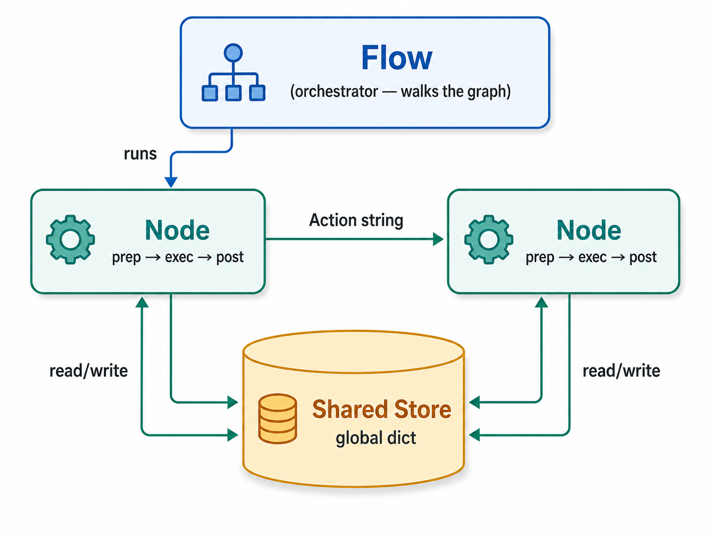
</p>


From these four primitives, PocketFlow can express every common LLM design pattern — Agents, Multi-Agents, Workflows, Retrieval-Augmented Generation (RAG), Map-Reduce, and more — without adding any new framework code. Everything specific to *your* app (the LLM client, the database, the tools) is code *you* bring; the framework only orchestrates the graph.

A second pillar of the project is **Agentic Coding**: the framework is intentionally small and intuitive enough that AI coding assistants (like Cursor) can read it and help build complete LLM applications, with humans handling high-level design and the AI writing the node logic.

This report recovers PocketFlow's architecture using a structured, multi-view approach (inspired by the "4+1" and DESOSA models). The goal is to explain not just *what* the framework does, but *why* it is built the way it is.


<a id="2-architecture-views-and-viewpoints-selected"></a>

## 2. Architecture Views and Viewpoints Selected

| View | Stakeholders addressed | Concerns addressed | Modeling technique |
|---|---|---|---|
| Context View | Developers, maintainers, users of PocketFlow-based apps | System boundary, external systems, integration responsibilities | Context diagram |
| Logical View | Developers, maintainers, port contributors | Core abstractions, responsibilities, relationships | Class diagram and explanatory text |
| Process View | Developers, testers, maintainers | Runtime behavior, branching, retries, flow execution | Sequence diagram and flowcharts |
| Development / Implementation View | Maintainers, contributors, port communities | Repository structure, code organization, maintainability | Directory tree and module description |
| Deployment View | Application developers, DevOps users | How PocketFlow is embedded into CLI, web, Streamlit, and voice apps | Deployment diagram |

---

<a id="3-stakeholder-analysis-and-concerns"></a>

## 3. Stakeholder Analysis and Concerns

Understanding who cares about PocketFlow clarifies the trade-offs in its design. The main stakeholders are:

**Framework maintainers.** A small core team (led by the primary author, Zachary Huang) plus an open-source community of 20+ contributors. Their main concern is keeping the core tiny and readable. The "100-line" promise is itself a design constraint they must protect — any feature that bloats the core is rejected.

**Application developers.** The largest group. These are engineers building chatbots, research agents, RAG systems, and workflows on top of PocketFlow. They value low learning curve, flexibility, and the freedom to plug in any LLM provider or database without fighting the framework.

**AI coding agents.** A unique and deliberate stakeholder. Because the framework is so small, tools like Cursor can fit the whole thing in their context and reason about it. The architecture is partly optimized so that *machines* can write PocketFlow apps, not just humans.

**End users.** The people who eventually use the apps built with PocketFlow (e.g., someone chatting with a customer-support bot). They never see the framework but are affected by its reliability and responsiveness.

**LLM and infrastructure providers.** OpenAI, Anthropic, vector database vendors, etc. PocketFlow deliberately does *not* integrate with them directly; instead developers call these services inside their own node code. This keeps the framework neutral and unburdened by vendor churn.

**The wider ecosystem / language communities.** PocketFlow has been ported to TypeScript, Java, C++, Go, Rust, and PHP. Contributors in those communities are stakeholders in keeping the abstraction consistent across languages.

A key insight: the maintainers' interest (keep it minimal) and the developers' interest (have powerful features) appear to conflict, but PocketFlow resolves this by pushing features *out* of the framework and *into* user code and documentation. The "features" become reusable design patterns rather than framework classes.

The stakeholders and their competing concerns can be summarized:


| Stakeholder               | Main Concern                            | Key Trade-off They Accept              |
| ------------------------- | --------------------------------------- | -------------------------------------- |
| Framework maintainers     | Keep the core ~100 lines, readable      | Reject features that would add bloat   |
| Application developers    | Low learning curve, flexibility         | Must write their own integrations      |
| AI coding agents          | Fit whole framework in context          | Rely on convention over rich tooling   |
| End users                 | Reliable, responsive apps               | Never interact with framework directly |
| LLM / infra providers     | Be callable from any framework          | No first-party PocketFlow integration  |
| Language-port communities | Consistent abstraction across languages | Some ports lag (e.g., no async yet)    |


Placing these stakeholders by how much influence they have over the design versus how much they care about it:

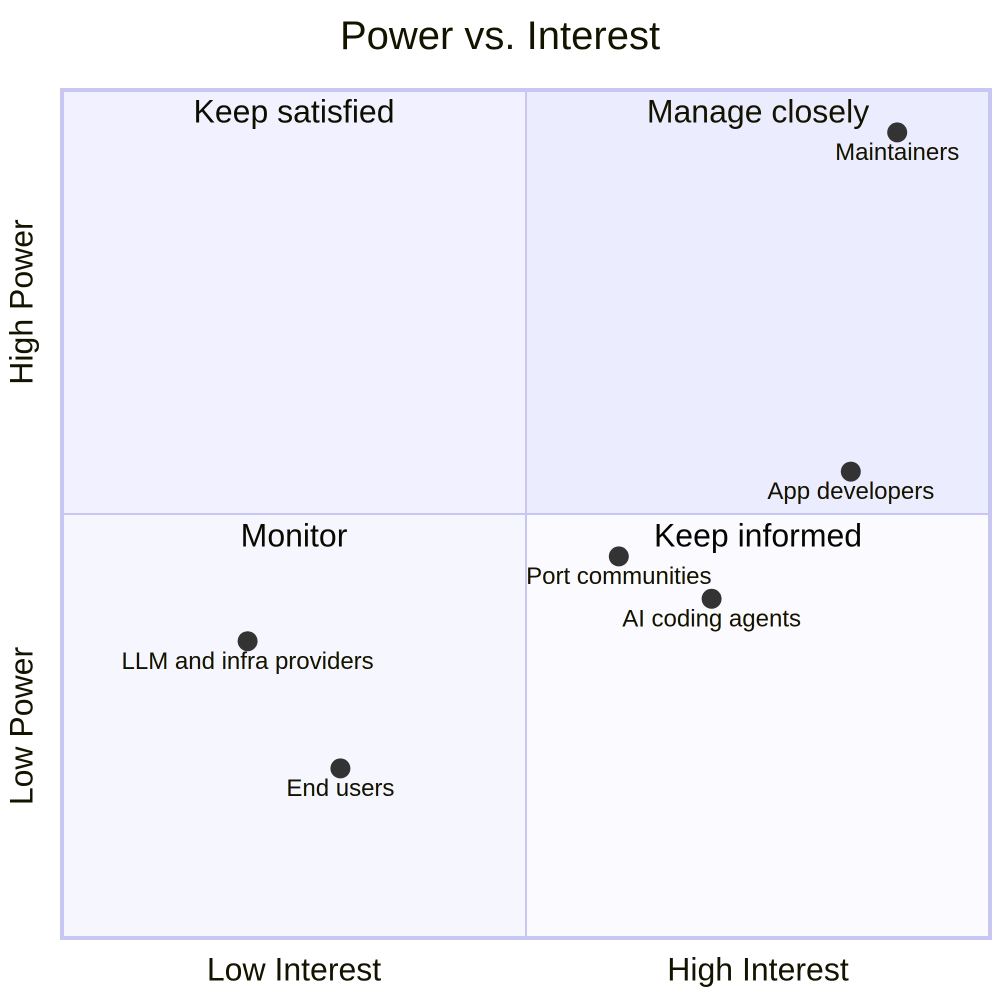

<a id="4-key-architecture-drivers"></a>

## 4. Key Architecture Drivers

The main architecture drivers of PocketFlow are:

| Driver | Description | Architectural impact |
|---|---|---|
| Minimalism | The framework promises a very small core of about 100 lines of Python | The architecture avoids heavy abstractions and keeps only Node, Flow, Action, and Shared Store |
| Zero dependencies | PocketFlow avoids external dependencies | Integration logic is pushed into user-written utility functions |
| Vendor neutrality | The framework should not depend on OpenAI, Anthropic, vector databases, or other vendors | PocketFlow uses a “bring your own integration” boundary |
| Composability | Developers should be able to build workflows, agents, RAG, and multi-agent systems from the same primitives | The architecture uses graph-based composition and nested flows |
| Reliability for LLM calls | LLM and API calls may fail due to latency, rate limits, or service errors | Nodes support retries, wait times, and fallback behavior |
| AI-assistant readability | AI coding tools should be able to understand and generate PocketFlow applications | The codebase and abstractions are kept small, regular, and convention-based |
| Portability | The same abstraction should be portable to other programming languages | The architecture avoids Python-specific complexity where possible |

<a id="5-architecture-significant-use-cases"></a>

## 5. Architecture-Significant Use Cases

| ID | Architecture-significant use case | Why it is architecturally significant |
|---|---|---|
| ASU-01 | Developer builds a sequential LLM workflow | Requires clear Node and Flow abstractions |
| ASU-02 | Developer builds an agent with branching and loops | Requires Action-based routing and graph traversal |
| ASU-03 | Developer builds a RAG pipeline | Requires composition of retrieval, embedding, and generation nodes |
| ASU-04 | LLM/API call fails temporarily | Requires retry and fallback mechanisms |
| ASU-05 | Developer replaces OpenAI with another LLM provider | Requires vendor-neutral utility functions |
| ASU-06 | Developer reuses a sub-flow inside a larger flow | Requires Flow-as-Node composition |
| ASU-07 | AI coding assistant generates a PocketFlow application | Requires a small, readable, convention-based core |

---

<a id="6-context-view"></a>

## 6. Context View

The Context View describes how PocketFlow sits within the wider world — what it depends on and what depends on it.

PocketFlow itself is a thin orchestration layer. It does **not** talk to the outside world directly. Instead, it sits between the application developer's intentions and the external services their app needs.

**What PocketFlow connects to (indirectly, through user code):**

- **LLM providers** — OpenAI, Anthropic, local models via Ollama, etc. The framework never imports these; the developer writes a small `call_llm()` utility and calls it inside a node's compute step.
- **Vector databases & embedding services** — used in RAG applications, again called from within node code.
- **External tools and APIs** — web search, databases, file systems, Model Context Protocol (MCP) servers — all invoked inside nodes.
- **Host applications** — PocketFlow flows can be embedded in command-line tools, FastAPI/WebSocket servers, Streamlit apps, and background job systems.

**What depends on PocketFlow:**

- Applications built on top of it (chatbots, agents, RAG pipelines).
- The official "cookbook" examples and tutorial projects.
- The language ports (TypeScript, Go, etc.) that mirror its abstraction.

The crucial architectural decision visible at this level is the **"bring your own everything" boundary**. The framework draws a hard line: orchestration logic lives inside PocketFlow; all integration logic (which LLM, which database, which API) lives in *utility functions* written by the developer. This is why the dependency list is empty and the install size is tiny (~56 KB versus tens or hundreds of MB for competitors).

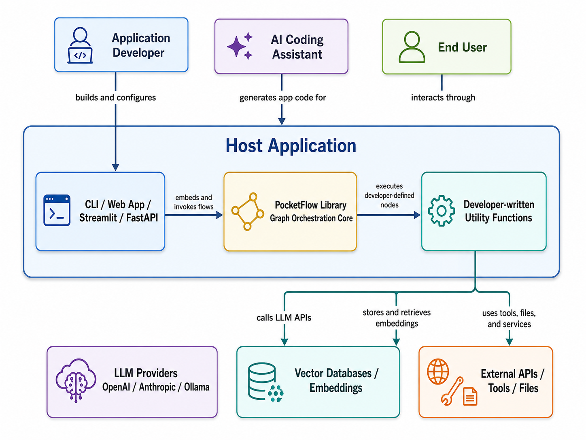

The main components in the context model are:

- **Host Application** — the application that embeds PocketFlow, such as a CLI, web app, Streamlit app, or FastAPI service.
- **PocketFlow Library** — the orchestration core that runs flows and developer-defined nodes.
- **Developer-written Utility Functions** — the boundary layer where application code calls LLM providers, vector databases, APIs, tools, and files.
- **External Services** — systems PocketFlow applications may use indirectly, including LLM providers, embedding/vector stores, and other APIs.
- **Stakeholders** — developers, AI coding assistants, and end users who build, generate, or interact with PocketFlow-based applications.

The context view shows PocketFlow as an embedded library inside a host application built by developers, possibly with AI coding assistance. End users interact with the host UI, which invokes PocketFlow flows. PocketFlow executes developer-defined Nodes, while developer-written utility functions handle external LLM, vector database, API, tool, and file access. This keeps PocketFlow dependent only on the host runtime and preserves its zero-dependency, vendor-neutral boundary.

---


<a id="7-logical-view"></a>

## 7. Logical View

PocketFlow’s logical architecture is built around four core abstractions, with `BaseNode` acting as the common implementation base for executable graph elements:

1. Node — unit of work
2. Action — routing result
3. Flow — graph orchestrator
4. Shared Store — communication state

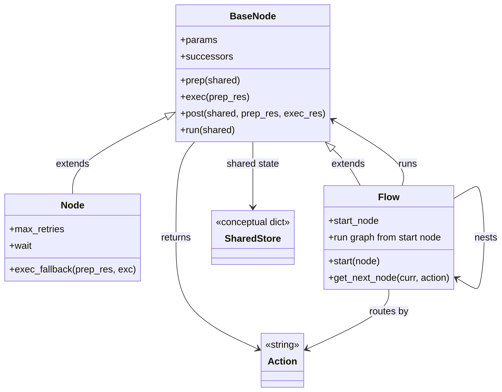


The most important relationship to notice is that **`Node` and `Flow` both inherit from `BaseNode`**. A `Node` performs work, while a `Flow` orchestrates a successor graph of `BaseNode` instances. This gives Flows node-like behavior and makes nested flows possible (Section 7.5), without implying that `Flow` directly extends `Node`.

### 7.1 Node — the unit of work

A **Node** is the smallest building block. Every node follows the same strict three-step lifecycle: `prep → exec → post`.

1. **`prep(shared)`** — *Read and prepare.* The node reads what it needs from the Shared Store (e.g., pulls text from `shared["data"]`), does light preprocessing, and returns a result for the next step.
2. **`exec(prep_res)`** — *Do the work.* This is the heavy compute step: calling an LLM, hitting an API, running a calculation. By design it **must not touch the Shared Store** — it only operates on what `prep` handed it. This isolation is what makes retries safe.
3. **`post(shared, prep_res, exec_res)`** — *Write and decide.* The node writes results back to the Shared Store and returns an **Action** string that tells the Flow where to go next. Returning nothing means `"default"`.

This three-step split is a deliberate enforcement of **separation of concerns**: data access (`prep`/`post`) is kept separate from pure computation (`exec`). All three steps are optional — a node that only reshapes data can implement just `prep` and `post`.

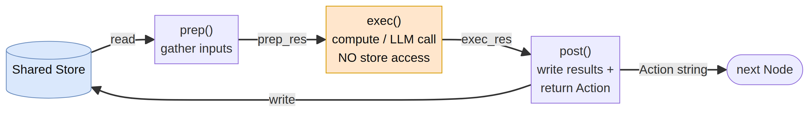


Notice that only `prep` and `post` touch the Shared Store; `exec` is sealed off in the middle. That sealing is exactly what makes retries safe.

**Fault tolerance is built into the node.** A node can be created with `max_retries` and `wait` parameters. If `exec()` throws, the node automatically retries up to the limit, optionally waiting between attempts (useful for LLM rate limits). If all retries fail, `exec_fallback()` is called; by default it raises the exception, but developers can override it to return a safe fallback result. This is why `exec()` is expected to be idempotent and free of side effects on shared state.

### 7.2 Action — the labeled edge

An **Action** is simply the string a node's `post()` returns. It is the routing signal. By making routing a plain string, branching logic becomes trivial: `"approved"`, `"needs_revision"`, `"rejected"` can each point to a different next node.

### 7.3 Flow — the orchestrator

A **Flow** walks the graph. You give it a start node (`Flow(start=node_a)`), and when you call `flow.run(shared)` it:

1. Runs the current node (`prep → exec → post`).
2. Reads the Action string the node returned.
3. Looks up which successor that Action points to.
4. Moves there and repeats — until no transition matches, at which point the flow ends.

Transitions are declared with an intentionally readable syntax:

- `node_a >> node_b` — go to `node_b` on the `"default"` action.
- `node_a - "action_name" >> node_b` — go to `node_b` only when that named action is returned.

Because transitions can point backward, **loops and branches** are natural — an agent can loop "think → act → observe → think" until it decides to stop.

For example, an expense-approval flow where one node returns one of three actions, including a loop back for revisions:

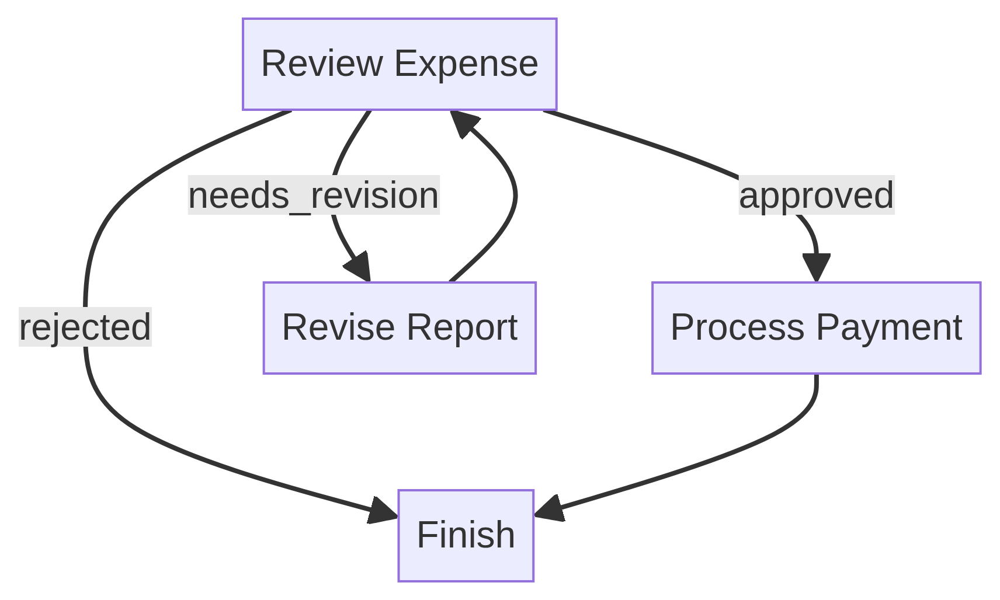


### 7.4 Shared Store — the communication channel

The **Shared Store** is not a separate framework class; it is the shared dictionary passed into a Flow or Node at runtime. It is the primary way graph elements communicate: one node writes `shared["data"]`, a later node reads it. The docs compare it to a **heap** shared across all function calls.

There is a secondary, narrower channel called **Params** — a small, immutable, per-node configuration dict set by the parent Flow, compared to a **stack**. Params are mainly "syntax sugar" for Batch processing (e.g., passing a filename to each node in a batch). For almost everything else, the Shared Store is the recommended channel because it cleanly separates the *data schema* from the *compute logic*.

### 7.5 Composition: Nested Flows

A powerful structural feature is that **a Flow has node-like behavior because it also inherits from `BaseNode`**. This means a whole Flow can be dropped into another Flow as a reusable graph component. A Flow can run its own `prep()` and `post()`, while its main work is orchestrating child graph elements from its start node. This lets developers build large pipelines out of small, reusable sub-flows — for example, an order pipeline composed of a payment sub-flow, an inventory sub-flow, and a shipping sub-flow chained together.

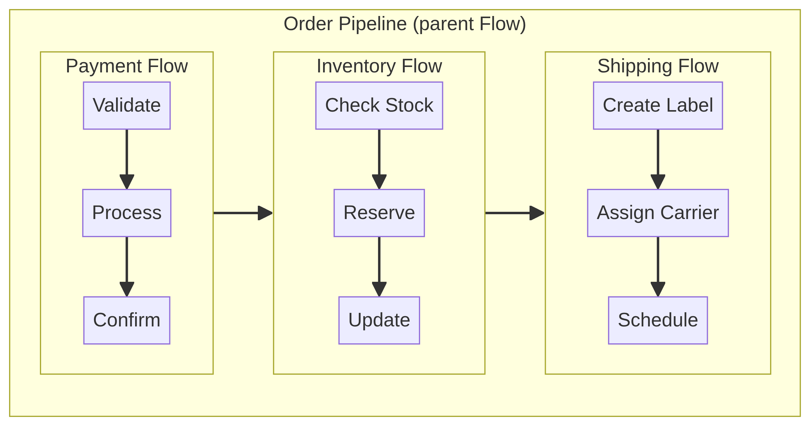


Each box that looks like a single step is actually an entire sub-flow — the same `>>` syntax wires sub-flows together exactly as it wires nodes.

In summary, the logical model is: **a nested directed graph of BaseNode elements, where Nodes perform work, Flows orchestrate successor graphs, Action strings select transitions, and the Shared Store carries communication state.**

---

<a id="8-development-view"></a>

## 8. Development View

The Development View describes how the source code is organized for the people building and maintaining it.

The repository is deliberately lean. Its key parts:

```
PocketFlow/
├── pocketflow/
│   └── __init__.py        # the ENTIRE framework (~100 lines)
├── cookbook/              # self-contained example apps (chat, RAG, agent, …)
├── docs/                  # Core Abstraction / Design Pattern / Utility Function
├── tests/                 # test suite for the core engine
├── utils/                 # helper utilities
├── .cursorrules           # rules for AI coding assistants
├── .cursor/rules/         # (Agentic Coding support)
├── setup.py
├── LICENSE                # MIT
└── README.md
```

- `pocketflow/` — the entire framework, contained in a single `__init__.py` of roughly 100 lines. This is the heart of the project; everything else is supporting material.
- `cookbook/` — a large collection of self-contained example apps (chat, RAG, agent, batch, streaming, map-reduce, multi-agent, voice chat, FastAPI/WebSocket integrations, and more). These serve as both documentation and templates.
- `docs/` — the documentation site, organized into *Core Abstraction*, *Design Pattern*, and *Utility Function* sections.
- `tests/`* — the test suite for the core engine.
- `utils/` — helper utilities.
- `.cursorrules` / `.cursor/rules` — configuration that tells AI coding assistants how to work with the framework, reflecting the "Agentic Coding" philosophy as a first-class concern.

The codebase is overwhelmingly **Python** (~~71%), with a large share of **Jupyter notebooks** (~~21%) used for tutorials and examples — a split that reflects how much of the project is *teaching material* rather than framework code:

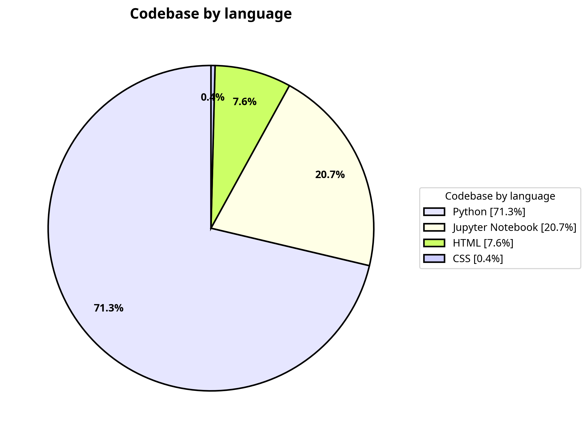


A defining structural choice is that **the framework code and the integration code are kept separate**. PocketFlow ships no vendor wrappers. Instead, utility functions (an LLM caller, an embedding function, a web-search helper) are documented as patterns the developer copies into their own project. This keeps the maintained surface area tiny and means the framework rarely needs updates when an external API changes.

The project also maintains **parallel ports** in TypeScript, Java, C++, Go, Rust, and PHP. Each mirrors the same Node/Flow/Action/Shared-Store abstraction, which is feasible precisely because the abstraction is so small.

---


<a id="9-process-view"></a>

## 9. Process View

The Process View describes what happens at runtime — the dynamic behavior.

### 9.1 The basic execution loop

When `flow.run(shared)` is called, a single sequential loop drives everything by default:

1. Start at the entry node.
2. Execute the current graph element. For a `Node`, this means `prep()` reads from `shared`, `exec()` performs the work, and `post()` writes to `shared` and returns an Action.
3. The Flow uses that Action to look up the next successor.
4. Repeat until no matching transition exists.

This is a **single-threaded, synchronous walk** of the graph by default. State is carried through the Shared Store, so the process is easy to reason about: at any moment there is one current graph element and one shared dictionary.

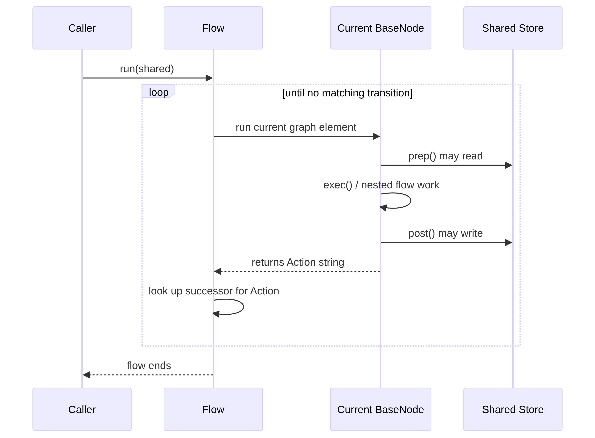


### 9.2 Failure handling at runtime

Failure handling is localized to `Node._exec()`. If `exec()` raises, the node retries up to `max_retries`, optionally waiting `wait` seconds between attempts. If all retries fail, `exec_fallback()` is called. By default, `exec_fallback()` re-raises the exception; developers can override it to return a graceful fallback result. Because `exec()` receives only `prep_res` rather than the Shared Store itself, retried calls are less likely to leave shared state half-written.

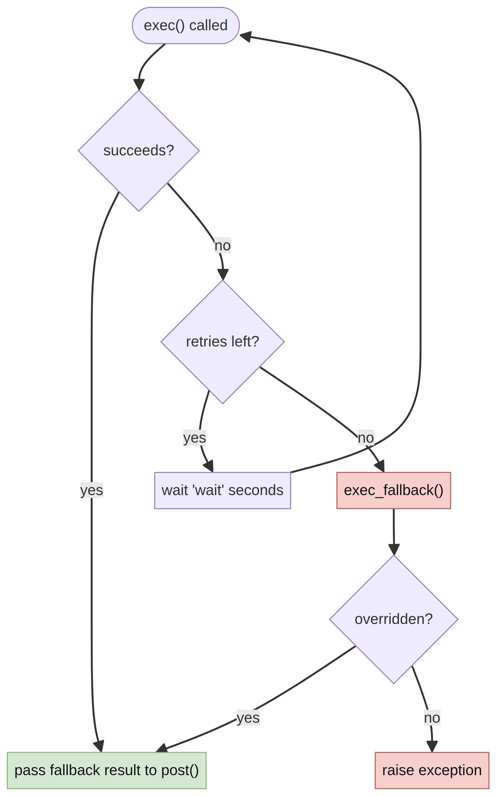


### 9.3 Branching, looping, and agents

Because routing is just a returned string, runtime behavior can branch (different actions → different nodes) and loop (an action pointing back to an earlier node). This is exactly the mechanism that turns a static graph into a dynamic **agent**: a node calls the LLM to decide what to do next, returns that decision as an action, and the flow loops until a terminal action is reached.

### 9.4 Concurrency and asynchrony (advanced)

The default model is synchronous, but PocketFlow also provides **Async**, **Batch**, and **Async Parallel Batch** variants of nodes and flows. Async nodes and flows let I/O-bound work (like slow LLM or API calls) be awaited without blocking the event loop. Batch variants process multiple items, and async parallel batch variants use concurrent async execution for independent items. Notably, several language ports launched as synchronous-only or with smaller feature sets, which makes asynchrony a real complexity frontier for the project.

---

<a id="10-deployment-view"></a>

## 10. Deployment View

The Deployment View describes how PocketFlow-based systems are run in the real world.

PocketFlow is a **library, not a service**. It does not run as a server, has no daemon, and prescribes no particular deployment topology. It is installed with `pip install pocketflow` (or literally copied as 100 lines of source) and runs inside whatever process the developer's application runs in.

Because of this, deployment is entirely determined by the host application. The cookbook demonstrates several realistic deployment shapes:

- **Command-line tools** — a flow driven from a terminal, including human-in-the-loop interactions.
- **Web backends** — flows embedded in **FastAPI** apps, exposing real-time chat over **WebSockets** or progress updates via **Server-Sent Events (SSE)** for background jobs.
- **Interactive apps** — **Streamlit** apps using a finite-state-machine pattern for human-in-the-loop image generation.
- **Voice applications** — a pipeline combining voice activity detection, speech-to-text, the LLM, and text-to-speech.

The external services a deployment depends on (LLM APIs, vector databases, tool APIs) are reached over the network from inside node code. Since the framework adds essentially no footprint (~56 KB, no dependencies), it imposes no special hardware, memory, or container requirements — the deployment cost is dominated by the external services, not by PocketFlow.

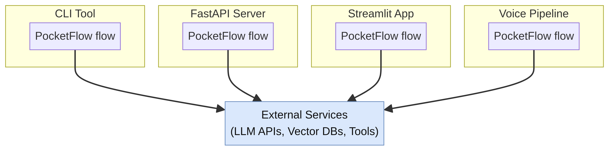

---


<a id="11-architecture-design-decisions"></a>

## 11. Architecture Design Decisions

This section documents the key architecture design decisions that shape PocketFlow. The decisions are modeled using the course design-decision template: each decision identifies the design issue, its importance, the selected decision, assumptions, alternatives, arguments, implications, and possible negative quality impacts.

The goal is not only to list what PocketFlow does, but to explain why its architecture is designed this way and what trade-offs result from these choices.

### 11.1 Decision Overview

| ID      | Architecture Design Decision                | Main Quality Attributes Affected                    |
| ------- | ------------------------------------------- | --------------------------------------------------- |
| ADD-001 | Model LLM applications as graphs            | Flexibility, composability, learnability            |
| ADD-002 | Keep the core minimal and dependency-free   | Maintainability, portability, learnability          |
| ADD-003 | Use bring-your-own integrations             | Modifiability, vendor neutrality, maintainability   |
| ADD-004 | Use the `prep → exec → post` Node lifecycle | Reliability, testability, separation of concerns    |
| ADD-005 | Use the Shared Store for Node communication | Modifiability, composability, flexibility           |
| ADD-006 | Use Action strings for routing              | Flexibility, simplicity, agent support              |
| ADD-007 | Make Flow composable as a Node              | Reusability, composability, scalability of design   |
| ADD-008 | Optimize the framework for Agentic Coding   | Learnability, AI-assistance, developer productivity |

---

### ADD-001: Model LLM Applications as Graphs

| ADD-001 | Description                                                                                                                                                                                                                                                                                                                                                                                                                                                                                                                                                                                        |
| ----------------------------------- | -------------------------------------------------------------------------------------------------------------------------------------------------------------------------------------------------------------------------------------------------------------------------------------------------------------------------------------------------------------------------------------------------------------------------------------------------------------------------------------------------------------------------------------------------------------------------------------------------- |
| Issue                               | How should PocketFlow represent different types of LLM applications, such as workflows, agents, RAG pipelines, map-reduce tasks, and multi-agent systems?                                                                                                                                                                                                                                                                                                                                                                                                                                          |
| Importance                          | High. This decision defines the core architectural model of PocketFlow and affects almost every other design decision.                                                                                                                                                                                                                                                                                                                                                                                                                                                                             |
| Decision                            | PocketFlow represents applications as directed graphs. Nodes perform units of work, Actions represent labeled transitions, and Flows execute the graph.                                                                                                                                                                                                                                                                                                                                                                                                                                            |
| Status                              | Accepted                                                                                                                                                                                                                                                                                                                                                                                                                                                                                                                                                                                           |
| Group                               | PocketFlow maintainers and open-source contributors                                                                                                                                                                                                                                                                                                                                                                                                                                                                                                                                                |
| Assumptions                         | Most LLM applications can be represented as steps, transitions, branches, loops, and shared state. Developers are willing to compose higher-level patterns from simple primitives.                                                                                                                                                                                                                                                                                                                                                                                                                 |
| Alternatives                        | Chain-based architecture; agent-specific architecture; workflow engine; microservice-style orchestration; separate framework classes for each LLM pattern                                                                                                                                                                                                                                                                                                                                                                                                                                          |
| Arguments                           | **Pros:** One abstraction can represent workflows, agents, RAG pipelines, map-reduce, and multi-agent systems; supports branching, looping, and composition naturally; reduces the need for many specialized framework classes.<br><br>**Cons:** Developers must assemble higher-level patterns themselves; large graphs may become harder to visualize and debug; beginners may need time to understand graph-based thinking.<br><br>**Summary:** The graph model wins on flexibility and conceptual generality, but shifts some pattern-construction and debugging responsibility to developers. |
| Implications                        | PocketFlow remains conceptually simple because developers only need to learn one main model. The same abstraction can support many application patterns.                                                                                                                                                                                                                                                                                                                                                                                                                                           |
| Possible negative impact on quality | Usability may suffer for beginners because PocketFlow provides fewer ready-made high-level components. Debuggability may also become harder for large graphs with many branches and loops.                                                                                                                                                                                                                                                                                                                                                                                                         |
| Related decisions                   | ADD-005 Shared Store, ADD-006 Action routing, ADD-007 Flow as Node                                                                                                                                                                                                                                                                                                                                                                                                                                                                                                                                 |

PocketFlow’s graph model is the central decision of the architecture. A simple workflow is a linear graph, an agent is a graph with loops, a RAG system is a graph that combines retrieval and generation steps, and a multi-agent system can be represented as multiple interacting nodes or sub-flows.

---

### ADD-002: Keep the Core Minimal and Dependency-Free

| ADD-002 | Description                                                                                                                                                                                                                                                                                                                                                                                                                                                                                                                          |
| ----------------------------------- | ------------------------------------------------------------------------------------------------------------------------------------------------------------------------------------------------------------------------------------------------------------------------------------------------------------------------------------------------------------------------------------------------------------------------------------------------------------------------------------------------------------------------------------ |
| Issue                               | How large and feature-rich should the PocketFlow framework core be?                                                                                                                                                                                                                                                                                                                                                                                                                                                                  |
| Importance                          | High. This decision directly affects maintainability, portability, learnability, installation cost, and long-term stability.                                                                                                                                                                                                                                                                                                                                                                                                         |
| Decision                            | PocketFlow keeps its core extremely small, around 100 lines of Python, with zero external dependencies.                                                                                                                                                                                                                                                                                                                                                                                                                              |
| Status                              | Accepted                                                                                                                                                                                                                                                                                                                                                                                                                                                                                                                             |
| Group                               | PocketFlow maintainers                                                                                                                                                                                                                                                                                                                                                                                                                                                                                                               |
| Assumptions                         | A small orchestration kernel is more valuable than a large batteries-included framework for developers who want transparency and control. Users can add application-specific functionality themselves.                                                                                                                                                                                                                                                                                                                               |
| Alternatives                        | Full-featured frameworks, such as LangChain or CrewAI; built-in LLM clients; built-in vector database wrappers; built-in observability and deployment tools; dependency-heavy plugin ecosystems                                                                                                                                                                                                                                                                                                                                      |
| Arguments                           | **Pros:** No vendor lock-in; the entire framework can be read and understood quickly; easier to audit, maintain, test, and port; avoids dependency conflicts; easy for AI coding tools to work with.<br><br>**Cons:** Fewer out-of-the-box features; more setup work for users; common utilities such as LLM wrappers, tracing, validation, and integrations must be implemented outside the core.<br><br>**Summary:** Minimalism wins on auditability, maintainability, and portability, but shifts implementation work onto users. |
| Implications                        | PocketFlow has very low installation cost and a small maintenance surface. It is easier for both humans and AI coding assistants to understand.                                                                                                                                                                                                                                                                                                                                                                                      |
| Possible negative impact on quality | Functionality and usability may be reduced because developers must implement common integrations, tracing, validation, and helper utilities themselves.                                                                                                                                                                                                                                                                                                                                                                              |
| Related decisions                   | ADD-003 Bring-your-own integrations, ADD-008 Agentic Coding                                                                                                                                                                                                                                                                                                                                                                                                                                                                          |

This decision explains why PocketFlow is architecturally different from larger LLM frameworks. Its main product is not a large set of built-in integrations, but a small and reusable orchestration kernel.

---

### ADD-003: Use Bring-Your-Own Integrations

| ADD-003 | Description                                                                                                                                                                                                                                                                                                                                                                                                                                                                                                                                                                    |
| ----------------------------------- | ------------------------------------------------------------------------------------------------------------------------------------------------------------------------------------------------------------------------------------------------------------------------------------------------------------------------------------------------------------------------------------------------------------------------------------------------------------------------------------------------------------------------------------------------------------------------------ |
| Issue                               | Should PocketFlow include built-in integrations for LLM providers, vector databases, tools, and external APIs?                                                                                                                                                                                                                                                                                                                                                                                                                                                                 |
| Importance                          | High. This decision defines the boundary between PocketFlow and the external systems used by applications built on top of it.                                                                                                                                                                                                                                                                                                                                                                                                                                                  |
| Decision                            | PocketFlow does not include vendor-specific integrations. Developers write their own utility functions for calling LLMs, databases, APIs, tools, and other external services.                                                                                                                                                                                                                                                                                                                                                                                                  |
| Status                              | Accepted                                                                                                                                                                                                                                                                                                                                                                                                                                                                                                                                                                       |
| Group                               | PocketFlow maintainers and application developers                                                                                                                                                                                                                                                                                                                                                                                                                                                                                                                              |
| Assumptions                         | External APIs change frequently. Developers may want to use different providers, models, databases, tools, or local infrastructure.                                                                                                                                                                                                                                                                                                                                                                                                                                            |
| Alternatives                        | Include official OpenAI, Anthropic, Ollama, Pinecone, Chroma, or database wrappers; provide a plugin system; depend on third-party integration libraries                                                                                                                                                                                                                                                                                                                                                                                                                       |
| Arguments                           | **Pros:** Keeps PocketFlow vendor-neutral; external API changes do not force changes to the framework core; developers can use any LLM provider, vector database, tool, or local infrastructure; prevents dependency bloat.<br><br>**Cons:** Developers must write their own integration utilities; integration quality may vary between projects; common provider wrappers may be repeatedly reimplemented by different users.<br><br>**Summary:** Bring-your-own integrations preserve neutrality and stability, but reduce convenience and consistency across applications. |
| Implications                        | PocketFlow remains vendor-neutral and dependency-free. Applications can use any LLM provider or external tool as long as the developer can call it from a Node.                                                                                                                                                                                                                                                                                                                                                                                                                |
| Possible negative impact on quality | Developer productivity may be lower at the beginning because developers must write integration code themselves. Repeated utility code may appear across different projects, and integration quality may vary.                                                                                                                                                                                                                                                                                                                                                                  |
| Related decisions                   | ADD-002 Minimal core, ADD-004 Node lifecycle                                                                                                                                                                                                                                                                                                                                                                                                                                                                                                                                   |

This decision defines the most important architectural boundary in PocketFlow. PocketFlow owns orchestration logic, while application-specific integration logic belongs to user code.

---

### ADD-004: Use the `prep → exec → post` Node Lifecycle

| ADD-004 | Description                                                                                                                                                                                                                                                                                                                                                                                                                                                                                                                                                                                         |
| ----------------------------------- | --------------------------------------------------------------------------------------------------------------------------------------------------------------------------------------------------------------------------------------------------------------------------------------------------------------------------------------------------------------------------------------------------------------------------------------------------------------------------------------------------------------------------------------------------------------------------------------------------- |
| Issue                               | How should a Node separate data access, computation, result handling, and routing?                                                                                                                                                                                                                                                                                                                                                                                                                                                                                                                  |
| Importance                          | High. This decision affects reliability, testability, separation of concerns, and failure handling.                                                                                                                                                                                                                                                                                                                                                                                                                                                                                                 |
| Decision                            | Each Node follows a three-step lifecycle: `prep(shared)`, `exec(prep_res)`, and `post(shared, prep_res, exec_res)`.                                                                                                                                                                                                                                                                                                                                                                                                                                                                                 |
| Status                              | Accepted                                                                                                                                                                                                                                                                                                                                                                                                                                                                                                                                                                                            |
| Group                               | PocketFlow maintainers and application developers                                                                                                                                                                                                                                                                                                                                                                                                                                                                                                                                                   |
| Assumptions                         | Most node behavior can be separated into preparation, execution, and post-processing. The main computation step should be isolated to make retries safer.                                                                                                                                                                                                                                                                                                                                                                                                                                           |
| Alternatives                        | Single `run()` method; direct access to shared state from all computation logic; callback-based execution; separate input/output classes; external retry wrapper                                                                                                                                                                                                                                                                                                                                                                                                                                    |
| Arguments                           | **Pros:** Separates data preparation, computation, state update, and routing; makes Node behavior easier to test and reason about; supports safer retries because `exec()` can be isolated from Shared Store mutation.<br><br>**Cons:** Adds structure that may feel unnecessary for very simple tasks; developers must understand the lifecycle before writing effective Nodes; incorrect use of `exec()` can still introduce side effects.<br><br>**Summary:** The lifecycle improves reliability and separation of concerns, but introduces slight ceremony and depends on developer discipline. |
| Implications                        | The architecture gains better separation of concerns. Failed `exec()` calls can be retried without repeatedly modifying the Shared Store, reducing the risk of inconsistent state.                                                                                                                                                                                                                                                                                                                                                                                                                  |
| Possible negative impact on quality | Simplicity may be reduced for very small tasks because developers must understand the three-step lifecycle even when a single function might be enough.                                                                                                                                                                                                                                                                                                                                                                                                                                             |
| Related decisions                   | ADD-005 Shared Store, ADD-006 Action routing                                                                                                                                                                                                                                                                                                                                                                                                                                                                                                                                                        |

This decision is especially important because LLM calls and external API calls are often unreliable. By isolating the main computation in `exec()`, PocketFlow can support retries and fallback behavior more safely.

---

### ADD-005: Use the Shared Store for Node Communication

| ADD-005 | Description                                                                                                                                                                                                                                                                                                                                                                                                                                                                                                                                                                         |
| ----------------------------------- | ----------------------------------------------------------------------------------------------------------------------------------------------------------------------------------------------------------------------------------------------------------------------------------------------------------------------------------------------------------------------------------------------------------------------------------------------------------------------------------------------------------------------------------------------------------------------------------- |
| Issue                               | How should Nodes exchange data without becoming tightly coupled to each other?                                                                                                                                                                                                                                                                                                                                                                                                                                                                                                      |
| Importance                          | High. This decision affects composability, modifiability, state management, and the ability to build larger flows.                                                                                                                                                                                                                                                                                                                                                                                                                                                                  |
| Decision                            | PocketFlow uses a Shared Store, usually a dictionary-like data structure, as the common communication space between Nodes.                                                                                                                                                                                                                                                                                                                                                                                                                                                          |
| Status                              | Accepted                                                                                                                                                                                                                                                                                                                                                                                                                                                                                                                                                                            |
| Group                               | PocketFlow maintainers and application developers                                                                                                                                                                                                                                                                                                                                                                                                                                                                                                                                   |
| Assumptions                         | Nodes in a flow often need to share intermediate results, context, user input, retrieved documents, LLM outputs, and tool results. A simple shared data structure is sufficient for many applications.                                                                                                                                                                                                                                                                                                                                                                              |
| Alternatives                        | Pass data directly as function arguments; use typed message objects; use event messages; use a database; use explicit input/output ports between Nodes                                                                                                                                                                                                                                                                                                                                                                                                                              |
| Arguments                           | **Pros:** Loosely couples Nodes because they do not need to call each other directly; makes it easy to add, remove, reorder, or reuse Nodes; supports flexible graph structures and shared context across a Flow.<br><br>**Cons:** The Shared Store is global mutable state; large flows may suffer from unclear data ownership; key naming conflicts and implicit data dependencies can reduce maintainability.<br><br>**Summary:** The Shared Store improves composability and flexibility, but creates state-management risks that must be controlled by conventions or schemas. |
| Implications                        | Developers can add, remove, reorder, or reuse Nodes more easily. The Shared Store also supports flexible graph structures because data does not need to flow only through direct function calls.                                                                                                                                                                                                                                                                                                                                                                                    |
| Possible negative impact on quality | Maintainability and reliability may suffer in large flows because the Shared Store is global mutable state. Without naming conventions or schemas, it may become unclear which Node owns or modifies each key.                                                                                                                                                                                                                                                                                                                                                                      |
| Related decisions                   | ADD-001 Graph model, ADD-004 Node lifecycle                                                                                                                                                                                                                                                                                                                                                                                                                                                                                                                                         |

The Shared Store is one of PocketFlow’s most important trade-offs. It improves flexibility and decoupling, but it requires discipline from developers to avoid uncontrolled shared state.

---

### ADD-006: Use Action Strings for Routing

| ADD-006 | Description                                                                                                                                                                                                                                                                                                                                                                                                                                                                                                  |
| ----------------------------------- | ------------------------------------------------------------------------------------------------------------------------------------------------------------------------------------------------------------------------------------------------------------------------------------------------------------------------------------------------------------------------------------------------------------------------------------------------------------------------------------------------------------ |
| Issue                               | How should a Flow decide which Node to execute next?                                                                                                                                                                                                                                                                                                                                                                                                                                                         |
| Importance                          | High. This decision affects branching, looping, agent behavior, and runtime flexibility.                                                                                                                                                                                                                                                                                                                                                                                                                     |
| Decision                            | A Node’s `post()` method returns an Action string. The Flow uses this string to select the next transition.                                                                                                                                                                                                                                                                                                                                                                                                  |
| Status                              | Accepted                                                                                                                                                                                                                                                                                                                                                                                                                                                                                                     |
| Group                               | PocketFlow maintainers and application developers                                                                                                                                                                                                                                                                                                                                                                                                                                                            |
| Assumptions                         | Routing decisions can be represented using simple labels such as `"default"`, `"retry"`, `"approved"`, `"search"`, `"answer"`, or `"finish"`.                                                                                                                                                                                                                                                                                                                                                                |
| Alternatives                        | Boolean routing; enum-based routing; explicit conditional logic inside the Flow; separate router objects; configuration-based workflow definitions                                                                                                                                                                                                                                                                                                                                                           |
| Arguments                           | **Pros:** Simple and readable routing mechanism; supports branching and looping without complex infrastructure; enables agent behavior by allowing a Node to decide the next step dynamically.<br><br>**Cons:** String-based routing is error-prone; typos may cause incorrect transitions or premature termination; graph structure can become difficult to validate statically.<br><br>**Summary:** Action strings make dynamic control flow simple, but trade type safety and validation for flexibility. |
| Implications                        | Branching and looping become easy to express. This also enables agent behavior because an LLM-powered Node can decide which Action to return next.                                                                                                                                                                                                                                                                                                                                                           |
| Possible negative impact on quality | Reliability and maintainability may suffer because string-based routing can be error-prone. A typo in an Action string may cause incorrect routing or premature termination.                                                                                                                                                                                                                                                                                                                                 |
| Related decisions                   | ADD-001 Graph model, ADD-004 Node lifecycle                                                                                                                                                                                                                                                                                                                                                                                                                                                                  |

This decision turns PocketFlow from a simple pipeline executor into a dynamic graph orchestrator. The same mechanism supports workflows, conditional branches, loops, and agents.

---

### ADD-007: Make Flow Composable as a Node

| ADD-007 | Description                                                                                                                                                                                                                                                                                                                                                                                                                                                                                                                                                          |
| ----------------------------------- | -------------------------------------------------------------------------------------------------------------------------------------------------------------------------------------------------------------------------------------------------------------------------------------------------------------------------------------------------------------------------------------------------------------------------------------------------------------------------------------------------------------------------------------------------------------------- |
| Issue                               | How can PocketFlow support larger applications while keeping the core abstraction small?                                                                                                                                                                                                                                                                                                                                                                                                                                                                             |
| Importance                          | Medium to high. This decision affects reusability, hierarchical decomposition, and architectural scalability.                                                                                                                                                                                                                                                                                                                                                                                                                                                        |
| Decision                            | PocketFlow treats a Flow as a kind of Node, allowing one Flow to be nested inside another Flow.                                                                                                                                                                                                                                                                                                                                                                                                                                                                      |
| Status                              | Accepted                                                                                                                                                                                                                                                                                                                                                                                                                                                                                                                                                             |
| Group                               | PocketFlow maintainers and application developers                                                                                                                                                                                                                                                                                                                                                                                                                                                                                                                    |
| Assumptions                         | Large LLM applications can be decomposed into smaller reusable sub-flows. Developers benefit from hierarchical composition.                                                                                                                                                                                                                                                                                                                                                                                                                                          |
| Alternatives                        | Keep Flows and Nodes completely separate; introduce a special SubFlow abstraction; use external workflow composition tools; duplicate graph logic for larger workflows                                                                                                                                                                                                                                                                                                                                                                                               |
| Arguments                           | **Pros:** Supports hierarchical composition; allows sub-flows to be reused like ordinary Nodes; enables larger applications to be built from smaller graph modules without adding a separate SubFlow abstraction.<br><br>**Cons:** The mental model becomes slightly more complex because a Flow both orchestrates Nodes and can itself behave like a Node; nested flows may make debugging and visualization harder.<br><br>**Summary:** Flow-as-Node improves reuse and architectural scalability, but adds conceptual and debugging complexity in larger systems. |
| Implications                        | Sub-flows can be reused, tested, and composed into larger flows. This supports hierarchical architecture and reduces duplication in complex applications.                                                                                                                                                                                                                                                                                                                                                                                                            |
| Possible negative impact on quality | Learnability may be affected because the concept is slightly subtle: a Flow both orchestrates Nodes and can itself be used as a Node in another Flow.                                                                                                                                                                                                                                                                                                                                                                                                                |
| Related decisions                   | ADD-001 Graph model, ADD-002 Minimal core                                                                                                                                                                                                                                                                                                                                                                                                                                                                                                                            |

This decision supports architectural scalability. PocketFlow remains small, but applications built with it can grow through nested composition.

---

### ADD-008: Optimize the Framework for Agentic Coding

| ADD-008 | Description                                                                                                                                                                                                                                                                                                                                                                                                                                                                                                                                                                                                            |
| ----------------------------------- | ---------------------------------------------------------------------------------------------------------------------------------------------------------------------------------------------------------------------------------------------------------------------------------------------------------------------------------------------------------------------------------------------------------------------------------------------------------------------------------------------------------------------------------------------------------------------------------------------------------------------- |
| Issue                               | How can PocketFlow support development with AI coding assistants as well as human developers?                                                                                                                                                                                                                                                                                                                                                                                                                                                                                                                          |
| Importance                          | Medium to high. This decision affects developer productivity, learnability, documentation style, and the organization of examples.                                                                                                                                                                                                                                                                                                                                                                                                                                                                                     |
| Decision                            | PocketFlow keeps the framework small, regular, and convention-based so that AI coding assistants can understand the whole framework and generate applications using it.                                                                                                                                                                                                                                                                                                                                                                                                                                                |
| Status                              | Accepted                                                                                                                                                                                                                                                                                                                                                                                                                                                                                                                                                                                                               |
| Group                               | PocketFlow maintainers, application developers, and AI coding assistant users                                                                                                                                                                                                                                                                                                                                                                                                                                                                                                                                          |
| Assumptions                         | AI coding assistants are more effective when the framework code and abstractions are small enough to fit into context and easy to reason about.                                                                                                                                                                                                                                                                                                                                                                                                                                                                        |
| Alternatives                        | Build a large framework with many specialized APIs; optimize only for human developers; rely on complex configuration files; provide many high-level wrappers instead of a small core                                                                                                                                                                                                                                                                                                                                                                                                                                  |
| Arguments                           | **Pros:** Small and regular abstractions are easier for AI coding assistants to understand; supports fast prototyping; examples and conventions make generated applications more consistent; improves developer productivity.<br><br>**Cons:** The framework may rely too heavily on documentation and conventions; fewer rich built-in APIs or tools; AI-generated code may reproduce weak patterns if examples are incomplete or outdated.<br><br>**Summary:** Agentic Coding optimization improves AI-assisted development, but increases dependence on high-quality examples, documentation, and developer review. |
| Implications                        | PocketFlow supports fast prototyping and AI-assisted application development. The repository’s examples and conventions become important architectural assets.                                                                                                                                                                                                                                                                                                                                                                                                                                                         |
| Possible negative impact on quality | Tooling and usability may be weaker than in larger frameworks because the architecture relies on conventions, examples, and documentation rather than rich built-in APIs.                                                                                                                                                                                                                                                                                                                                                                                                                                              |
| Related decisions                   | ADD-002 Minimal core, ADD-003 Bring-your-own integrations                                                                                                                                                                                                                                                                                                                                                                                                                                                                                                                                                              |

This is a distinctive architectural concern of PocketFlow. The framework is designed not only for runtime execution, but also for understandability during development by both humans and AI coding agents.

---

### 11.2 Relationship Between Architecture Design Decisions

The architecture design decisions are related rather than independent. Some decisions enable others, while some decisions introduce trade-offs that must be managed elsewhere in the architecture.

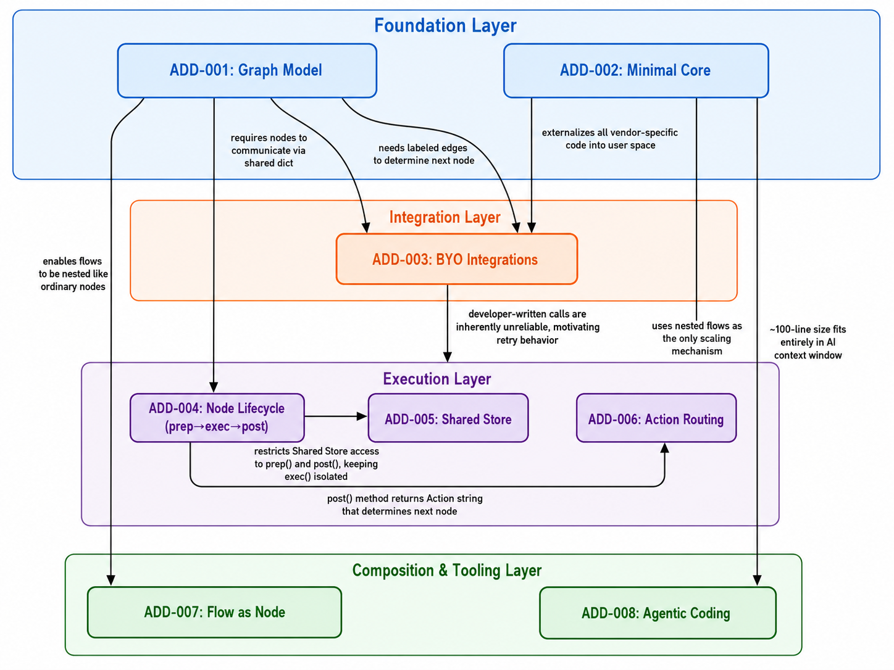

The small gray nodes name the relationship between decisions. Graph-based orchestration needs shared data, routing, and composition. The minimal core externalizes integrations, preserves low dependency cost, and enables Agentic Coding. The `prep → exec → post` lifecycle connects state access and routing by controlling Shared Store use and returning Action strings.

---

### 11.3 Decision Trade-Off Summary

| Decision                               | Main Benefit                                                                      | Main Trade-off                                       |
| -------------------------------------- | --------------------------------------------------------------------------------- | ---------------------------------------------------- |
| ADD-001 Graph-based orchestration      | One model can express workflows, agents, RAG, map-reduce, and multi-agent systems | Developers must compose high-level patterns manually |
| ADD-002 Minimal core                   | Easy to understand, maintain, audit, and port                                     | Fewer built-in features                              |
| ADD-003 Bring-your-own integrations    | Vendor neutrality and low dependency risk                                         | More integration work for developers                 |
| ADD-004 `prep → exec → post` lifecycle | Clear separation of concerns and safer retries                                    | Slightly more ceremony for simple Nodes              |
| ADD-005 Shared Store                   | Loose coupling between Nodes                                                      | Risk of unmanaged global mutable state               |
| ADD-006 Action-string routing          | Simple branching, looping, and agent behavior                                     | Possible errors from string typos                    |
| ADD-007 Flow as Node                   | Reusable and hierarchical composition                                             | Slightly more complex mental model                   |
| ADD-008 Agentic Coding optimization    | Easier AI-assisted development                                                    | Relies on conventions and examples                   |

Overall, PocketFlow’s architecture is shaped by a consistent design philosophy: keep the framework core small, general, and composable, while pushing application-specific complexity to user-defined Nodes, utility functions, and examples. The result is a minimal orchestration kernel that is flexible enough to express many LLM application patterns, but disciplined use is required to manage state, routing, integrations, and observability in larger applications.

---

<a id="12-architecture-patterns-and-llm-application-patterns"></a>

## 12. Architecture Patterns and LLM Application Patterns

PocketFlow should be understood at two different pattern levels:

1. **Architecture patterns used inside the framework architecture** — these describe how PocketFlow’s core abstractions are structured.
2. **LLM application patterns expressed using PocketFlow** — these are not separate framework mechanisms, but recurring LLM application structures that can be built by composing Nodes, Actions, Flows, and the Shared Store.

This distinction is important because PocketFlow does not implement many high-level patterns as built-in framework classes. Instead, it provides a minimal graph-based orchestration kernel from which these patterns can be composed.

### 12.1 Architecture Patterns Used

| Architecture Pattern | Used in PocketFlow? | How it appears in PocketFlow | Quality impact |
|---|---:|---|---|
| Template Method | Strong match | Every Node follows the same lifecycle: `prep → exec → post`, while developers override the individual steps | Improves consistency, reliability, and testability |
| Composite | Strong match | A Flow has node-like behavior through `BaseNode` and can be nested inside another Flow | Supports reuse, hierarchical decomposition, and composition |
| Blackboard / Shared Repository | Strong match | Nodes communicate through the Shared Store, a shared data space used across the Flow | Improves loose coupling, but introduces shared-state risks |
| Pipe and Filter | Partial match | A Flow can connect Nodes as a chain or graph of processing steps | Improves modularity and workflow composition, but PocketFlow is not a pure pipe-and-filter system |
| Separation of Concerns / Layered Boundary | Design principle / tactic | PocketFlow separates orchestration logic from developer-written utility functions for LLMs, vector databases, tools, and APIs | Improves modifiability and vendor neutrality |

### Template Method Pattern

PocketFlow strongly uses the Template Method pattern through the Node lifecycle. Every Node follows the same high-level execution structure:

```text
prep → exec → post
```

The framework defines the overall execution skeleton, while developers customize the behavior by implementing or overriding the individual lifecycle methods.

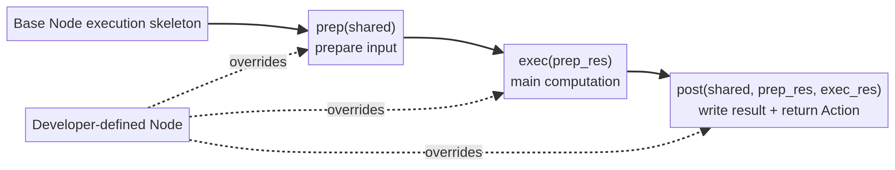

This pattern supports reliability and testability. Since `prep()` handles preparation, `exec()` performs the main computation, and `post()` writes results and returns the next Action, each responsibility is separated. This also makes retry handling safer because the main computation can be isolated inside `exec()`.

### Composite Pattern

PocketFlow strongly uses the Composite pattern because a Flow has node-like behavior through `BaseNode`. This allows developers to build a large Flow out of smaller sub-flows.

For example, a complex application can be decomposed into separate sub-flows for retrieval, reasoning, tool use, and final generation. Each sub-flow can then be reused or nested inside another Flow.

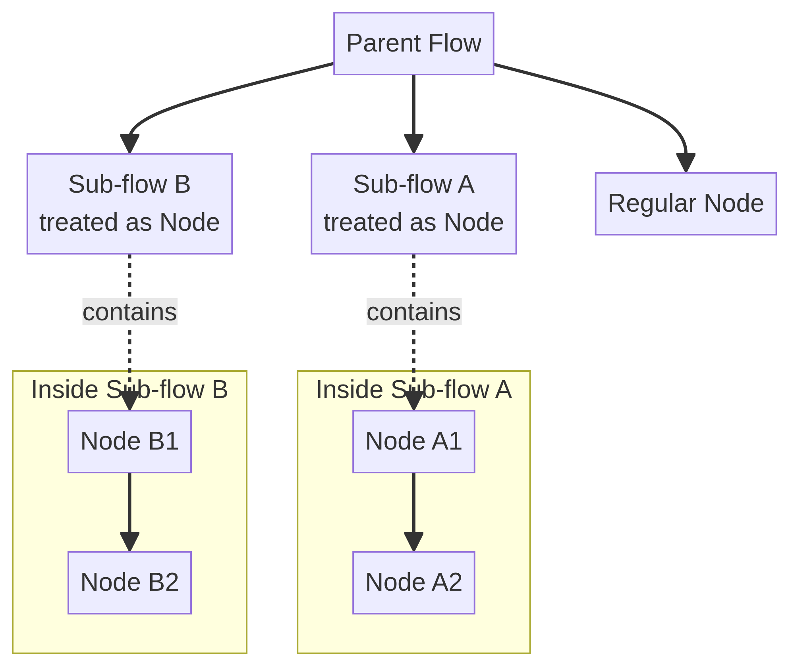

The benefit is hierarchical reuse and composability. The trade-off is that deeply nested flows may become harder to visualize and debug.

### Blackboard / Shared Repository Pattern

PocketFlow strongly follows the Blackboard or Shared Repository pattern. The Shared Store acts as the common data space, while Nodes read from and write to it.

This means Nodes do not need to call each other directly. Instead, they cooperate through shared state. One Node can write an intermediate result, and another Node can read it later.

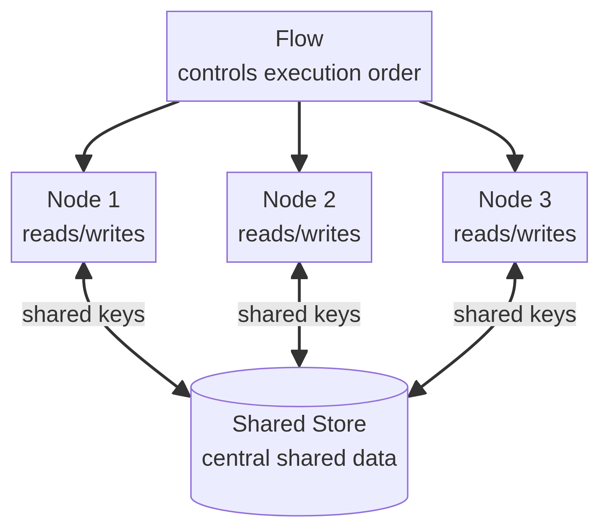

The benefit is loose coupling and flexible composition. The trade-off is that the Shared Store can become global mutable state if developers do not manage key names, data ownership, and schemas carefully.

### Pipe and Filter Pattern

PocketFlow partially follows the Pipe and Filter pattern. In a simple workflow, Nodes can act like filters or processing steps, and the Flow connects them in a sequence or graph.

This pattern is visible in workflows, RAG pipelines, and map-reduce tasks, where data moves through several processing stages.

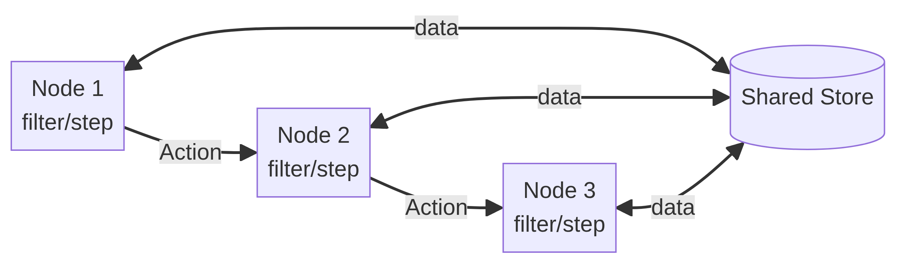

However, PocketFlow is not a pure Pipe and Filter architecture. In a pure pipe-and-filter system, data is usually passed directly through pipes between filters. In PocketFlow, Nodes often communicate through the Shared Store, and routing is controlled by Action strings. Therefore, Pipe and Filter should be described as a partial match rather than the main architectural pattern.

### Separation of Concerns / Layered Boundary

PocketFlow also applies separation of concerns between the framework core and application-specific integration code.

The framework core handles orchestration: Nodes, Actions, Flows, and Shared Store. Developer-written utility functions handle external concerns such as LLM calls, vector database access, web search, file access, and other APIs.

This is not necessarily a full Layered Architecture pattern in the traditional sense. It is better described as an architectural boundary or design tactic. Its main benefit is modifiability: changes in LLM providers or external APIs usually affect utility functions rather than the PocketFlow core.

### 12.2 LLM Application Patterns Expressed by PocketFlow

PocketFlow’s official design philosophy is that high-level LLM patterns are not implemented as heavy built-in framework classes. Instead, they are expressed by composing the four core primitives: Node, Action, Flow, and Shared Store.

| LLM Application Pattern | Expressed in PocketFlow as |
|---|---|
| Workflow | A sequence or graph of Nodes, each performing one step |
| Agent | A looping Flow where a Node decides the next Action |
| RAG | A retrieval Flow combined with a generation Flow |
| Map-Reduce | Batch processing Nodes followed by an aggregation step |
| Structured Output | A Node prompts or parses output into a fixed structure |
| Multi-Agent | Multiple agent-like Nodes or sub-flows coordinate through shared state |

### Workflow

A Workflow is represented as a chain or graph of Nodes. Each Node performs one step, and the Flow determines the execution order.

This is one of the most natural uses of PocketFlow because the graph model directly supports sequential and branching workflows.

### Agent

An Agent is represented as a Flow with branching and looping behavior. A Node can call an LLM, decide what should happen next, and return an Action string such as `"search"`, `"retry"`, `"answer"`, or `"finish"`.

The Flow then follows the corresponding transition. This means agent behavior emerges from ordinary graph execution rather than from a separate Agent class.

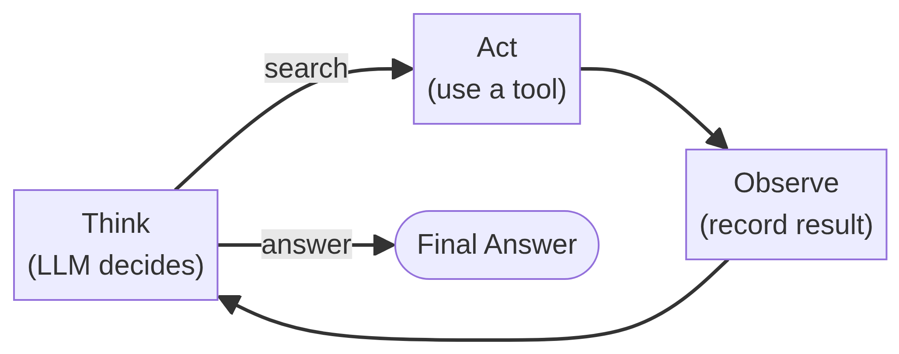

### RAG

RAG can be represented as a combination of retrieval and generation Nodes. One part of the Flow retrieves relevant information, while another Node uses that information to generate an answer.

PocketFlow does not need a special RAG framework class. The RAG pattern is expressed as a graph of retrieval, embedding, search, and generation steps.

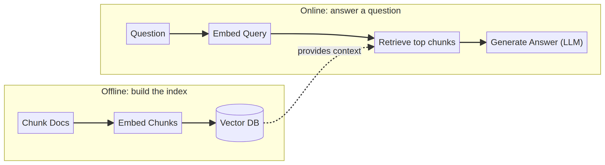

### Map-Reduce

Map-Reduce can be expressed using batch processing and aggregation. The map phase processes many items independently, while the reduce phase combines the results.

This pattern fits PocketFlow’s Batch and Parallel execution variants, especially for document processing, summarization, or multi-item LLM workloads.

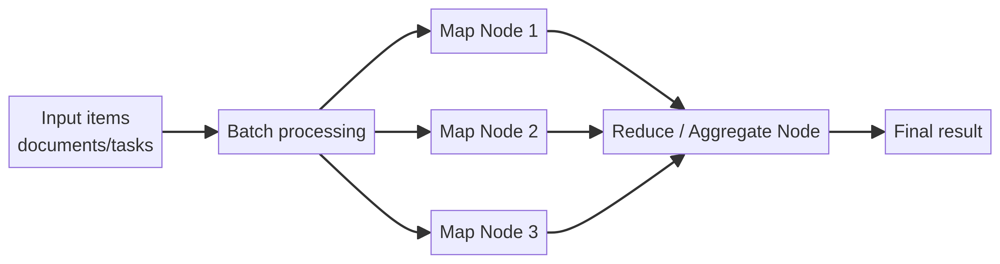

### Structured Output

Structured Output is implemented inside a Node. The Node prompts the LLM to return a fixed format or parses the LLM response into a defined structure.

This is an application-level pattern rather than a separate framework-level architecture pattern.

### Multi-Agent

Multi-Agent systems can be represented as multiple agent-like Nodes or nested Flows. Each agent can make decisions, return Actions, and communicate through the Shared Store or through explicitly designed message structures.

This pattern is supported by the same underlying graph and Shared Store model.

---


<a id="13-quality-attribute-scenarios-and-tactics"></a>

## 13. Quality Attribute Scenarios & Tactics

Quality attributes describe how well the architecture satisfies important non-functional requirements. Following the SMART scenario style introduced in the course, each scenario is described using a concrete source, stimulus, environment, artifact, response, and measurable response criterion.

The scenarios below focus on the quality attributes most relevant to PocketFlow: modifiability, reliability, learnability, portability, performance, testability, maintainability, and debuggability.

| ID    | Quality Attribute | Source                      | Stimulus                                                                                                             | Environment                                                                   | Artifact                                            | Response                                                                                                                          | Response Measure                                                                                                            | Architectural Tactic                                                                               |
| ----- | ----------------- | --------------------------- | -------------------------------------------------------------------------------------------------------------------- | ----------------------------------------------------------------------------- | --------------------------------------------------- | --------------------------------------------------------------------------------------------------------------------------------- | --------------------------------------------------------------------------------------------------------------------------- | -------------------------------------------------------------------------------------------------- |
| QA-01 | Modifiability     | Application developer       | The LLM provider changes its API, or the developer replaces OpenAI with another provider such as Anthropic or Ollama | Existing PocketFlow application using developer-written utility functions     | Utility function and Node implementation            | Developer updates only the provider-specific utility function while keeping the PocketFlow core and Flow structure unchanged      | No modification is required in `pocketflow/__init__.py`; only provider-specific user code changes                           | Encapsulate external integrations outside the framework core; use bring-your-own utility functions |
| QA-02 | Reliability       | External LLM or API service | A temporary API failure, timeout, or rate-limit error occurs during a Node’s `exec()` step                           | Flow is running and executing an LLM/API call                                 | Node lifecycle and retry mechanism                  | Node retries the failed `exec()` call according to `max_retries`; if all retries fail, `exec_fallback()` can return a safe result | Failed execution does not corrupt the Shared Store; retry/fallback behavior is handled locally inside the Node              | Retry, fallback, and side-effect isolation in `exec()`                                             |
| QA-03 | Learnability      | New application developer   | Developer needs to understand how to build a basic PocketFlow application                                            | First-time use of PocketFlow                                                  | Core abstractions: Node, Action, Flow, Shared Store | Developer studies the small framework core and basic examples to understand the programming model                                 | Developer only needs to understand four core abstractions to build a basic workflow                                         | Minimal core, small conceptual model, example-based learning                                       |
| QA-04 | Portability       | Language-port contributor   | Contributor reimplements PocketFlow in another programming language                                                  | New language ecosystem such as TypeScript, Go, Java, Rust, or PHP             | Node/Flow/Action/Shared Store abstraction           | Contributor preserves the same architectural model while adapting syntax to the target language                                   | The target-language version can express Nodes, Actions, Flows, and Shared Store without requiring a different architecture  | Keep abstractions small, language-independent, and dependency-free                                 |
| QA-05 | Performance       | Application developer       | Application needs to process many independent LLM/API calls, such as multiple documents or batch items               | Batch, async, or parallel workload                                            | Async, Batch, or Parallel Nodes/Flows               | Independent tasks are executed concurrently instead of strictly sequentially                                                      | Throughput improves compared with a purely sequential Flow for independent I/O-bound tasks                                  | Use asynchronous execution, batching, and parallelization                                          |
| QA-06 | Testability       | Developer or tester         | Developer needs to verify one processing step without running the whole application                                  | Unit testing environment with mock Shared Store and mocked external API calls | Individual Node                                     | Developer tests `prep()`, `exec()`, `post()`, or `node.run(shared)` independently                                                 | A Node can be tested without executing the entire Flow or calling real external services                                    | Separate computation from state access using `prep → exec → post`; isolate Nodes as testable units |
| QA-07 | Maintainability   | Framework maintainer        | A new feature request proposes adding built-in provider integrations or high-level framework wrappers                | Open-source maintenance and review process                                    | PocketFlow core                                     | Maintainer evaluates whether the feature belongs in the core or should remain as documentation, utility code, or cookbook example | The core remains small and dependency-free; feature growth does not significantly increase the maintained framework surface | Preserve minimal core; push application-specific features to examples and utilities                |
| QA-08 | Debuggability     | Application developer       | A Flow stops unexpectedly because no transition matches the returned Action string                                   | Runtime execution of a branching or looping Flow                              | Action routing and Flow transitions                 | Developer inspects returned Actions and declared transitions to identify the missing or misspelled route                          | The failure can be localized to the Node’s returned Action or the Flow’s transition definition                              | Keep routing explicit through Action strings; document transition paths clearly                    |

### 13.1 Quality Attribute Tactics Summary

| Quality Attribute | Supporting Architecture Decisions                            | Main Tactics                                                           |
| ----------------- | ------------------------------------------------------------ | ---------------------------------------------------------------------- |
| Modifiability     | ADD-002 Minimal core, ADD-003 Bring-your-own integrations    | Encapsulation of vendor-specific code, dependency avoidance            |
| Reliability       | ADD-004 Node lifecycle, ADD-005 Shared Store                 | Retry, fallback, side-effect isolation                                 |
| Learnability      | ADD-001 Graph model, ADD-002 Minimal core                    | Small conceptual model, uniform abstractions                           |
| Portability       | ADD-002 Minimal core, ADD-007 Flow as Node                   | Language-independent abstractions, dependency-free implementation      |
| Performance       | ADD-004 Node lifecycle, Process View async/parallel variants | Async execution, batching, parallel processing                         |
| Testability       | ADD-004 Node lifecycle                                       | Separation of `prep`, `exec`, and `post`; isolated Node execution      |
| Maintainability   | ADD-002 Minimal core, ADD-003 Bring-your-own integrations    | Small maintenance surface, application-specific logic outside the core |
| Debuggability     | ADD-006 Action-string routing                                | Explicit transitions, localized routing inspection                     |

The quality scenarios show that PocketFlow’s quality attributes mainly come from its deliberate minimalism and strict separation of responsibilities. Modifiability and maintainability are supported by keeping external integrations outside the framework core. Reliability and testability are supported by the `prep → exec → post` lifecycle, which separates state access from computation and enables safer retries. Learnability and portability are supported by the small set of core abstractions: Node, Action, Flow, and Shared Store.

However, these quality benefits also introduce trade-offs. Because PocketFlow avoids built-in integrations and rich tooling, developers must manage provider utilities, Shared Store schemas, observability, and graph validation themselves. Therefore, the same decisions that improve simplicity and portability can reduce convenience and built-in safety in larger applications.


<a id="14-technical-debt-analysis"></a>

## 14. Technical Debt Analysis

Even a deliberately minimal framework carries trade-offs that act as technical debt.

**Under-abstraction / pushed-out complexity.** The clearest debt: by refusing to ship integrations, PocketFlow moves recurring work (LLM wrappers, retries on the integration side, vector DB access) into every user's project. This is intentional, but it means common logic gets re-implemented across projects, with no shared, tested standard. The "debt" is paid by developers, not the framework.

**Global mutable shared state.** The Shared Store is a single mutable dictionary with no enforced schema. In small apps this is fine; in large flows with many nodes it can become an untyped grab-bag where it is hard to know which node wrote which key, risking subtle bugs. The framework relies on developer discipline rather than tooling to manage this.

**Implicit, decentralized graph structure.** Because transitions are declared separately (`node_a - "x" >> node_b`) and routing is string-based, there is no single place that shows the whole graph, and a typo in an action string fails silently (the flow just stops). Larger flows become harder to visualize and debug.

**Incomplete concurrency in ports.** Several language ports (Go, Java, C++) shipped as synchronous-only, explicitly listing async/parallel execution as a "contributions welcome" gap. This is feature debt: the abstraction promises patterns that not all implementations fully support yet.

**Documentation-as-implementation.** Many capabilities exist as documented patterns and cookbook examples rather than as tested framework code. This keeps the core clean but means the "real" surface area a developer must trust is larger than 100 lines, and the quality of that surface depends on examples staying current.

**Limited built-in observability.** There is minimal native support for logging, tracing, or debugging complex agentic loops. The docs offer visualization/debug utilities as patterns, but again this is left to the developer.

Overall, PocketFlow's technical debt is the mirror image of its strengths: the same minimalism that makes it elegant also offloads responsibility — for integrations, state hygiene, graph visibility, and observability — onto the people who use it.


| Debt Item                       | Root Cause                              | Impact                                      | Who Pays         |
| ------------------------------- | --------------------------------------- | ------------------------------------------- | ---------------- |
| Pushed-out complexity           | No bundled integrations                 | Re-implemented logic, no shared standard    | Developers       |
| Global mutable Shared Store     | Single untyped dict                     | Hard to track writers; subtle bugs at scale | Developers       |
| Implicit graph structure        | String-based, decentralized transitions | No whole-graph view; typos fail silently    | Developers       |
| Incomplete concurrency in ports | Sync-first implementations              | Promised patterns unavailable in some langs | Port communities |
| Documentation-as-implementation | Patterns live in docs, not core         | Trusted surface > 100 lines; can go stale   | Developers       |
| Limited observability           | No native logging/tracing               | Hard to debug long agent loops              | Developers       |


Ranking these by how likely they are to bite versus how much they hurt:

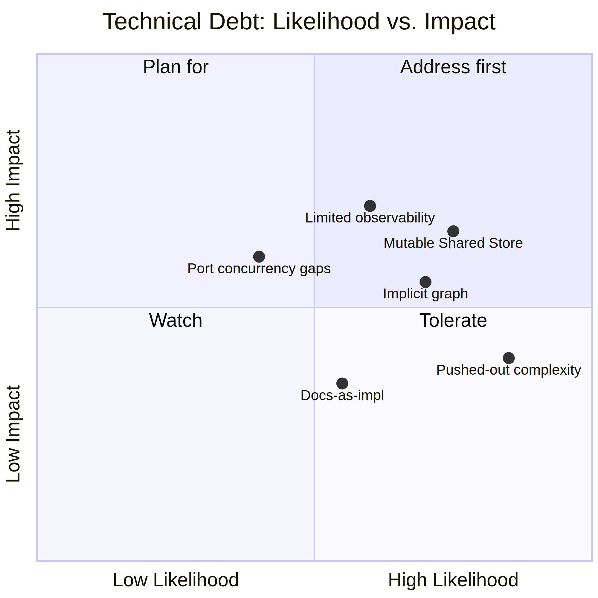


---

<a id="15-revision-summary-and-weekly-progress-log"></a>

## 15. Revision Summary and Weekly Progress Log


| Week | Tasks |
| ---- | ----- |
| Week 1 | [x] Table of Contents<br/> [x] Introduction |
| Week 2 | [x] Stakeholder Analysis<br/> [x] Context View |
| Week 3 | [x] Architecture Design Decisions<br/> [x] Decision Relationship Graph<br/> [x] Development View |
| Week 4 | [x] Process View |
| Week 5 | [x] Design Patterns |
| Week 6 — Midterm | [x] Quality Attribute Scenarios |
| Week 7 | [x] Technical Debt Analysis |
| Week 8 — Final | [x] Logical View<br/> [x] Deployment View<br/> [x] Architecture Tactics<br/> [x] Decision Relationship Graph<br/> [x] Conclusion |


---


<a id="16-conclusion"></a>

## 16. Conclusion

PocketFlow is a study in deliberate minimalism. By reducing the sprawling world of LLM frameworks to a single idea — a **nested directed graph of Nodes connected by Action edges, orchestrated by Flows, communicating through a Shared Store** — it captures in ~100 lines what competitors express in tens of thousands.

The architecture is coherent because every decision serves the same goal. Zero dependencies and a "bring your own integration" boundary keep the framework neutral and durable. The `prep → exec → post` lifecycle enforces separation of concerns and makes retries safe. Action-string routing makes branching and looping (and therefore agents) trivial. Treating a Flow as a Node enables unlimited composition. And the whole thing is small enough that AI coding assistants can build with it — a genuinely novel architectural target.

These strengths come with honest trade-offs. The complexity of integrations, state management, graph visibility, and observability is not eliminated; it is *relocated* into user code and documentation. For small-to-medium applications and for teams that value transparency and control, this is an excellent bargain. For very large systems that need strong typing, rich tooling, and built-in observability, the discipline PocketFlow demands of its users grows.

Recovered at a deeper level, PocketFlow's architecture is best understood not as a feature-rich platform but as a **minimal, composable orchestration kernel**. Its real product is an *abstraction* — and the bet that, with the right four primitives, everything else is just composition.

---

<a id="17-references"></a>

## 17. References

### Primary Sources
- PocketFlow GitHub: https://github.com/The-Pocket/PocketFlow
- PocketFlow Documentation: https://the-pocket.github.io/PocketFlow/

### Course Materials
- Prof. Peng Liang — *软件体系结构描述,设计,模式* (Architecture Description, Design, and Patterns), Wuhan University, 2026

### Reference Architecture Projects
- DESOSA 2019 — Delft Students on Software Architecture: https://se.ewi.tudelft.nl/desosa2019/

### Books and Standards
- Rozanski, N. & Woods, E. (2012). *Software Systems Architecture: Working with Stakeholders Using Viewpoints and Perspectives*, 2nd Ed. Addison-Wesley.
- Bass, L., Clements, P. & Kazman, R. (2022). *Software Architecture in Practice*, 4th Ed. Addison-Wesley.
- Kruchten, P. (1995). The 4+1 View Model of Architecture. *IEEE Software*, 12(6), 42–50.
- Tyree, J. & Ackerman, A. (2005). Architecture Decisions: Demystifying Architecture. *IEEE Software*, 22(2), 19–27.
- Kruchten, P., Lago, P. & van Vliet, H. (2006). Building Up and Reasoning about Architectural Knowledge. *QoSA 2006*.
- Buschmann, F. et al. (1996). *Pattern-Oriented Software Architecture: A System of Patterns*. Wiley.
- ISO/IEC/IEEE 42010:2011 — *Systems and Software Engineering — Architecture Description*.
